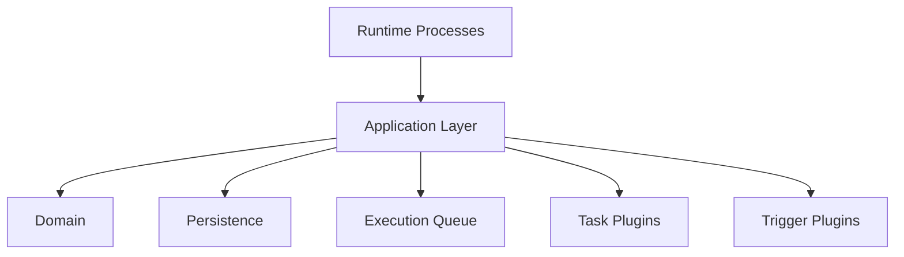
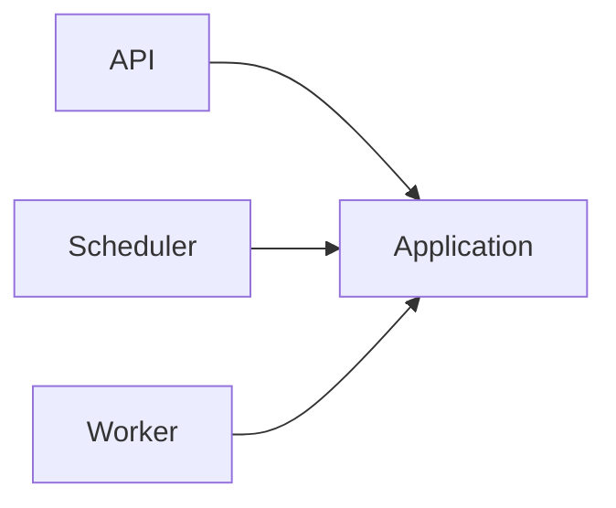
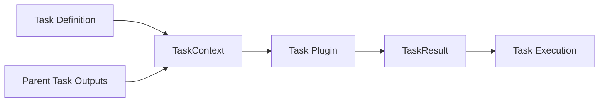

# Application Layer

## Purpose

The Application Layer implements the business capabilities of the Automation Platform.

It serves as the boundary between runtime processes (such as the API, Scheduler, and Workers) and the underlying infrastructure of the system.

The Application Layer is responsible for orchestrating workflows, enforcing business rules, coordinating persistence, and interacting with supporting infrastructure such as the execution queue and plugin systems.

It intentionally contains no transport-specific logic and no infrastructure-specific implementation details.

---

# Responsibilities

The Application Layer is responsible for:

- Implementing business capabilities.
- Coordinating workflow execution.
- Enforcing business rules.
- Managing execution state.
- Coordinating persistence.
- Determining when work should be queued.
- Constructing task execution context.
- Resolving task and trigger implementations.
- Interpreting task execution results.

The Application Layer should answer the question:

> **"What should happen?"**

It should not concern itself with how requests arrive or how infrastructure is implemented.

---

# Architectural Role

The Application Layer sits between runtime processes and infrastructure.



Runtime processes invoke application capabilities.

The Application Layer coordinates the necessary business operations.

Supporting infrastructure performs the requested work.

---

# Runtime Interaction

Every runtime process communicates exclusively with the Application Layer.



Runtime processes should never directly interact with:

- Persistence
- Queue implementations
- Database models
- Task plugins
- Trigger plugins

This keeps runtime processes thin while centralizing business logic.

---

# Public Capabilities

The Application Layer exposes a small set of business capabilities.

These represent operations that external runtime processes may invoke.

## Workflow Definitions

Responsible for maintaining reusable workflow definitions.

Public capabilities include:

- Create Workflow Definition
- Update Workflow Definition
- Delete Workflow Definition

Business validation occurs internally during creation and update.

---

## Workflow Executions

Responsible for managing workflow execution.

Public capabilities include:

- Start Workflow
- Cancel Workflow

Workflow completion occurs automatically as a consequence of successful task processing rather than as an independently callable operation.

---

## Task Executions

Responsible for progressing workflow execution.

Public capabilities include:

- Claim Task Execution
- Process Task Execution

Processing a task includes:

- Loading the task definition.
- Loading outputs from completed dependency tasks.
- Constructing TaskContext.
- Resolving the appropriate task plugin.
- Executing the task plugin.
- Interpreting TaskResult.
- Persisting task output.
- Updating execution state.
- Determining newly runnable tasks.
- Queueing newly runnable work.
- Completing the workflow if appropriate.
- Handling failures and retries.

These responsibilities are treated as one cohesive business capability.

---

## Trigger Evaluation

Responsible for determining whether a trigger should start a workflow.

Public capabilities include:

- Evaluate Trigger

Trigger evaluation does not execute workflows directly.

Instead, it determines whether the Application Layer should begin a new Workflow Execution.

---

# Internal Implementation

The Application Layer intentionally hides implementation details behind its public capabilities.

Examples of internal implementation include:

- Workflow validation
- Task Execution creation
- Queue initialization
- Workflow completion
- TaskContext construction
- TaskResult interpretation
- Retry calculations
- Dependency updates

These operations support larger business capabilities but are not independently accessible.

As complexity grows, these implementation details may be factored into private helper modules while remaining internal to their respective packages.

---

# Design Principles

The Application Layer follows several design principles.

## Business Capabilities

Modules are organized around business capabilities rather than technical layers.

Public operations should represent meaningful actions within the system.

---

## Encapsulation

Only externally meaningful operations are exposed.

Implementation details remain private to preserve flexibility and reduce coupling.

---

## Orchestration

The Application Layer coordinates work but does not perform infrastructure-specific operations itself.

It assembles execution context from persisted domain state, delegates execution to task plugins, interprets the returned TaskResult, and determines the resulting business actions.

Infrastructure components provide services.

The Application Layer decides when those services should be used.

---

## Dependency Direction

The Application Layer depends upon abstractions rather than concrete implementations whenever practical.

It coordinates:

- Domain
- Persistence
- Queue
- Task Plugins
- Trigger Plugins

without exposing those implementation details to runtime processes.

---

# Task Execution Flow

Task processing follows a consistent orchestration model.



Application services construct TaskContext from persisted workflow state.

Task plugins execute without knowledge of persistence, queueing, or workflow orchestration.

The Application Layer interprets TaskResult and updates workflow execution accordingly.

---

# Package Organization

Application modules are organized by the business concepts they operate upon.

```text
application/

    workflow_definitions/

    workflow_executions/

    task_executions/

    triggers/
```

Each package exposes only the business capabilities that should be callable by runtime processes.

Supporting implementation may be divided into private helper modules as complexity increases.

---

# What Does Not Belong Here

The Application Layer should not contain:

- HTTP request handling
- API routing
- Worker loops
- Scheduler loops
- SQLAlchemy models
- Database queries
- Queue implementations
- Task implementation logic
- Trigger implementation logic

These responsibilities belong to other architectural layers.

---

# Future Evolution

As the platform grows, additional application capabilities may be introduced without changing the overall architecture.

Examples include:

- Pause Workflow
- Resume Workflow
- Recover Stale Tasks
- Retry Failed Workflows
- Workflow Versioning

New capabilities should represent complete business operations rather than exposing implementation details.

The public surface area of the Application Layer should remain intentionally small while allowing its internal implementation to evolve.
