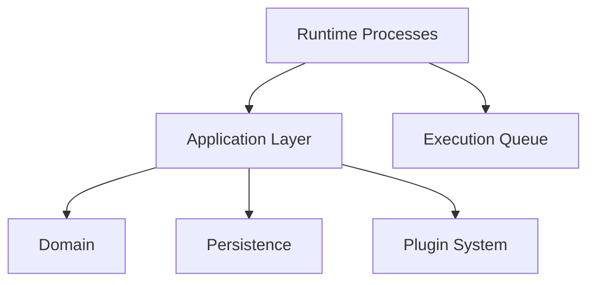
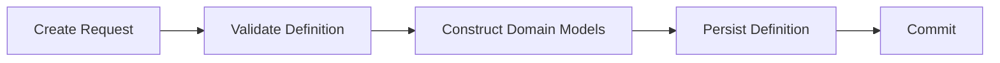
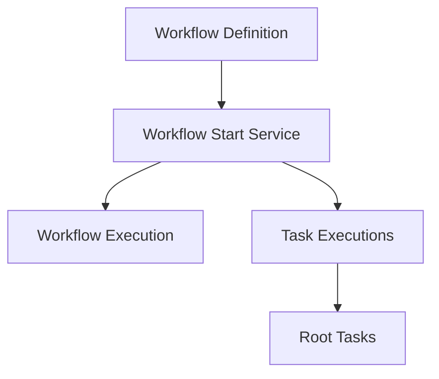
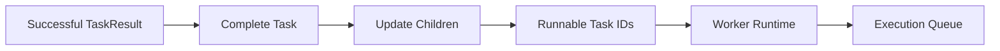
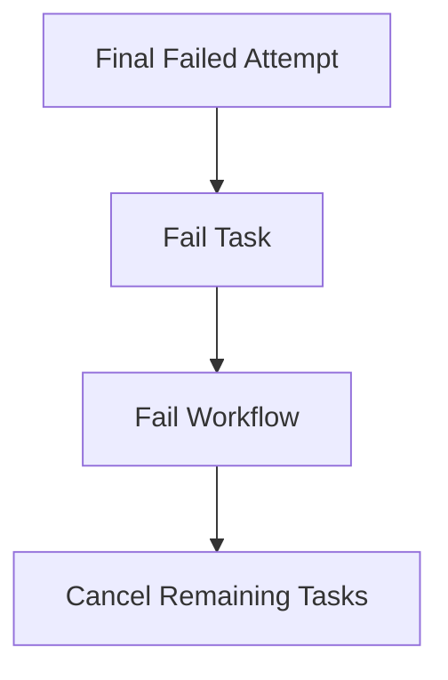
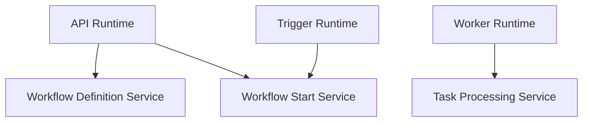

# Application Layer

## Purpose

The Application Layer implements the business use cases of the Automation Platform.

It serves as the boundary between runtime processes and the core behavior of the system. Runtimes invoke application services to perform meaningful operations without needing to understand persistence, domain state transitions, or plugin orchestration.

The Application Layer coordinates:

* Domain models
* Persistence
* Plugin registries and implementations

It intentionally contains no transport-specific logic, runtime loops, database queries, or infrastructure implementations.

The Application Layer answers the question:

> **"What business operation should happen?"**

---

# Architectural Role

The Application Layer sits between runtime processes and the lower-level components required to perform business operations.


```mermaid
flowchart TD

    Runtime["Runtime Processes"]
    Application["Application Layer"]
    Domain["Domain"]
    Persistence["Persistence"]
    Plugins["Plugin System"]
    Queue["Execution Queue"]

    Runtime --> Application

    Application --> Domain
    Application --> Persistence
    Application --> Plugins

    Runtime --> Queue
```

Application services coordinate business operations.

Persistence provides transactional state operations.

Plugins provide extensible task and trigger behavior.

Queue lifecycle operations remain outside the Application Layer when they are runtime concerns such as claiming work, maintaining leases, heartbeats, and finishing claims.

---

# Design Principles

## Organize Around Business Use Cases

Application packages are organized around cohesive business use cases rather than CRUD operations or individual domain entities.

A use case may create, read, or modify multiple domain objects and persistence structures as necessary to accomplish one business operation.

This keeps related orchestration together and allows runtimes to depend only on the capabilities they require.

---

## Thin Runtimes

Runtime processes should contain minimal business logic.

A runtime is primarily responsible for:

1. Receiving or detecting an event.
2. Invoking the appropriate application capability.
3. Performing runtime-specific infrastructure operations around that capability.

Examples include:

* An API route invoking workflow definition creation.
* A trigger-specific runtime invoking workflow start.
* A worker invoking task processing after claiming queue work.

Runtime-specific concerns such as polling, queue claims, leases, heartbeats, HTTP transport, and process lifecycle do not belong in application services.

---

## Transaction Boundaries Around Persistence

Application services define business-level transaction boundaries using the Unit of Work abstraction.

Persistence operations within a business state transition are committed atomically where necessary.

Long-running or arbitrary external work must not occur inside database transactions.

In particular, task plugin execution occurs outside a persistence transaction.

---

## Infrastructure Independence

Application services depend on abstractions or stable interfaces rather than infrastructure implementations.

They do not contain:

* SQLAlchemy queries
* ORM models
* PostgreSQL-specific behavior
* Queue implementation details
* HTTP handling
* Worker loops
* Scheduler loops

---

# Package Organization

The Application Layer is organized by implemented business use cases.

```text
application/

    workflow_definitions/
        __init__.py
        models.py
        services.py

    workflow_start/
        __init__.py
        services.py

    task_processing/
        __init__.py
        models.py
        services.py

    exceptions.py
```

Packages should remain small until additional complexity justifies further decomposition.

Private helpers may be extracted later without changing the public application API.

---

# Workflow Definition Management

The `workflow_definitions` package manages reusable workflow definitions.

Its primary service is responsible for creating and deleting workflow definitions.

## Creation

Workflow definition creation accepts an application request model describing:

* Workflow metadata
* Task definitions
* Trigger definitions
* Enabled state

The Application Layer validates the requested definition before persistence.

Validation includes:

* Registered task plugin types
* Registered trigger plugin types
* Plugin configuration validity
* Unique task keys
* Valid dependency references
* No self-dependencies
* No dependency cycles

After validation, application-level task keys are translated into generated task definition identifiers and the complete domain representation is persisted through a Unit of Work.


```mermaid
flowchart LR

    Request["Create Request"]
    Validation["Validate Definition"]
    Domain["Construct Domain Models"]
    Persistence["Persist Definition"]
    Commit["Commit"]

    Request --> Validation
    Validation --> Domain
    Domain --> Persistence
    Persistence --> Commit
```

Task dependency keys exist at the application boundary because they provide a convenient definition format.

Persisted and domain task dependencies use task definition identifiers.

---

# Workflow Start

The `workflow_start` package creates a new execution from an existing workflow definition.

The use case accepts a workflow definition identifier.

The Application Layer:

1. Loads the workflow definition.
2. Verifies that it exists and may be started.
3. Creates a new `WorkflowExecution`.
4. Creates a corresponding `TaskExecution` for every task definition.
5. Reconstructs the execution dependency graph.
6. Initializes dependency and retry state.
7. Identifies root tasks.
8. Persists the complete workflow execution.
9. Commits the transaction.
10. Returns the information required for the caller to make root tasks available for processing.

Each execution receives its own task execution graph so runtime state is independent of the reusable workflow definition.


```mermaid
flowchart TD

    Definition["Workflow Definition"]
    Start["Workflow Start Service"]
    Execution["Workflow Execution"]
    Tasks["Task Executions"]
    Roots["Root Tasks"]

    Definition --> Start
    Start --> Execution
    Start --> Tasks
    Tasks --> Roots
```

A workflow begins in the `RUNNING` state.

Root task executions begin as `PENDING` with zero remaining dependencies and are given to execution queue to enqueue.

Non-root tasks begin as `PENDING` with their dependency counts initialized from the workflow graph.

---

# Task Processing

The `task_processing` package orchestrates one logical task processing attempt.

Task processing is intentionally divided into multiple phases so plugin execution does not hold a database transaction open.

## Phase 1: Start or Resume

The Application Layer opens a Unit of Work and requests that persistence start the task execution.

Persistence atomically implements these semantics:

```text
PENDING
    -> RUNNING
    -> record initial started_at
    -> processable

RUNNING
    -> remain RUNNING
    -> preserve original started_at
    -> processable

COMPLETED / FAILED / CANCELLED / missing
    -> not processable
```

For a processable task, persistence returns the execution data required by the Application Layer:

* Plugin type
* Configuration
* Parent task outputs keyed by parent task key

The transaction is committed before plugin execution begins.

---

## Phase 2: Construct Task Context

The Application Layer converts the returned persistence data into a `TaskContext`.

```text
TaskContext
    configuration
    inputs
        parent_key -> TaskOutput
```

Persistence does not construct `TaskContext`.

`TaskContext` belongs to the task plugin execution contract, so construction remains an Application Layer responsibility.

---

## Phase 3: Execute Plugin

The task plugin implementation is resolved from the task registry using the persisted plugin type.

The Application Layer invokes:

```text
Task.execute(TaskContext) -> TaskResult
```

A `TaskResult` represents a normal plugin execution outcome.

It contains:

* Whether execution succeeded
* Task output
* An optional explanatory message

Normal task failure is represented explicitly through an unsuccessful `TaskResult`.

Unexpected exceptions are not converted into normal task failures by the Application Layer. They propagate to the runtime so runtime recovery mechanisms can handle interrupted processing.

---

# Successful Task Completion

When a plugin succeeds, the Application Layer opens a new Unit of Work and requests task completion.

Persistence atomically:

1. Transitions the task from `RUNNING` to `COMPLETED`.
2. Stores its output.
3. Records its completion time.
4. Updates dependency counts for child tasks.
5. Determines which child tasks have become runnable.
6. Completes the workflow if no unfinished tasks remain.

The Application Layer returns newly runnable task identifiers to the runtime.

The runtime may then make those tasks available through the execution queue.


```mermaid
flowchart LR

    Plugin["Successful TaskResult"]
    Complete["Complete Task"]
    Children["Update Children"]
    Runnable["Runnable Task IDs"]
    Runtime["Worker Runtime"]
    Queue["Execution Queue"]

    Plugin --> Complete
    Complete --> Children
    Children --> Runnable
    Runnable --> Runtime
    Runtime --> Queue
```

Application task processing therefore determines **what work became runnable** without owning queue claim or lease mechanics.

---

# Failed Task Attempts

When a plugin returns an unsuccessful `TaskResult`, the Application Layer records the failed attempt through persistence.

If additional tries remain:

```text
RUNNING
    -> RUNNING

remaining tries decrease
```

The task remains logically running because worker retries and queue redelivery are physical execution concerns rather than new logical task executions.

The task-processing result indicates that the current task should be retried.

The runtime determines how the current queue item should be released or made available for another processing attempt.

---

# Terminal Task Failure

When a task exhausts its available tries, persistence atomically:

1. Transitions the failing task to `FAILED`.
2. Transitions the workflow to `FAILED`.
3. Cancels every other `PENDING` or `RUNNING` task belonging to the workflow.
4. Records terminal timestamps.


```mermaid
flowchart TD

    Failure["Final Failed Attempt"]
    Task["Fail Task"]
    Workflow["Fail Workflow"]
    Remaining["Cancel Remaining Tasks"]

    Failure --> Task
    Task --> Workflow
    Workflow --> Remaining
```

Only the task that actually exhausted its tries is marked `FAILED`.

Other unfinished tasks are marked `CANCELLED`, distinguishing actual task failure from work that was terminated because the workflow could no longer continue.

These changes occur in the same database transaction.

---

# Concurrency Model

Task processing is designed to tolerate duplicate processing caused by queue lease expiration, worker failure, or redelivery.

## Logical Execution State

A `TaskExecution` represents the logical task, not an individual worker attempt.

```text
PENDING
    = logical task has never begun

RUNNING
    = logical task has begun and has no terminal result

COMPLETED
FAILED
CANCELLED
    = terminal
```

A recovered worker may therefore process a task that is already `RUNNING`.

The original `started_at` timestamp is preserved.

---

## Conditional State Transitions

Persistence uses conditional updates to ensure stale or duplicate workers cannot overwrite terminal results.

Completion is valid only while the task remains `RUNNING`.

Failure handling is valid only while the task remains `RUNNING`.

Once a task becomes:

* `COMPLETED`
* `FAILED`
* `CANCELLED`

later stale processing results cannot transition it again.

---

## Workflow Failure

Workflow failure and cancellation of remaining work occur atomically.

Therefore, once a failed workflow transaction commits, it has no remaining `PENDING` or `RUNNING` tasks.

A worker that later receives a queued cancelled task attempts to start it, receives a non-processable result, and does not execute its plugin.

This avoids coupling workflow persistence to a particular queue implementation.

---

## Known Concurrency Boundary

Queue ownership and database execution state intentionally remain separate concerns.

The system therefore does not attempt to provide fencing between two workers concurrently executing the same logical task after a lease recovery.

A narrow race remains possible when one concurrent worker records terminal failure while another concurrent worker is about to report success.

Eliminating this completely would require introducing an execution-attempt generation or fencing token shared between queue ownership and persisted execution state.

That complexity is intentionally deferred until system requirements justify it.

---

# Queue Boundary

The execution queue is not owned by task-processing persistence.

Queue-specific concepts include:

* Claims
* Claim tokens
* Worker ownership
* Leases
* Heartbeats
* Claim expiration
* Finishing queue entries
* Queue implementation technology

These remain outside the persistence repositories and task-processing application service.

The worker runtime coordinates queue lifecycle around the application capability:

```text
claim task
    |
    v
TaskProcessingService.process(task_execution_id)
    |
    +--> newly runnable task IDs
    |
    +--> whether current task should retry
    |
    v
finish/release queue claim
```

This separation allows the execution queue implementation to evolve independently from workflow persistence and application logic.

For example, replacing a PostgreSQL-backed queue with an external broker should not require redesigning task execution persistence.

---

# Trigger Architecture

Triggers determine **when a workflow should be started**.

Different trigger types may require fundamentally different runtime mechanisms.

Examples include:

```text
Time-based trigger
    -> scheduler/polling runtime

Webhook trigger
    -> HTTP/webhook runtime

Manual trigger
    -> API runtime

Future event-based trigger
    -> event-specific runtime
```

There is therefore no requirement for one generic runtime that continuously evaluates every trigger type.

Trigger-specific runtimes detect the relevant external condition and invoke the workflow-start application capability when appropriate.

Trigger plugins provide extensible trigger-specific behavior and configuration while the Application Layer remains responsible for the workflow-start business operation itself.

Trigger types that require additional persisted runtime state may introduce persistence structures appropriate to that trigger implementation.

---

# Runtime Interaction

Runtime processes consume narrowly scoped application services.

Conceptually:


```mermaid
flowchart TD

    API["API Runtime"]
    TriggerRuntime["Trigger Runtime"]
    Worker["Worker Runtime"]

    Definitions["Workflow Definition Service"]
    Start["Workflow Start Service"]
    Processing["Task Processing Service"]

    API --> Definitions
    API --> Start

    TriggerRuntime --> Start

    Worker --> Processing
```

A runtime only needs dependencies for the business capabilities it invokes.

There is no single global `Application` object required to expose every capability.

Application services are independently constructed with their required dependencies and injected into the runtime that uses them.

---

# Dependency Direction

The intended dependency direction is:

```text
Runtime
    |
    v
Application
    |
    +----> Domain
    |
    +----> Persistence abstractions
    |
    +----> Plugin abstractions/registries
```

Runtime code should not contain business state-transition logic.

Application code should not contain SQL or runtime loops.

Persistence should not depend on plugin execution concepts such as `TaskContext`.

Plugins should not know about persistence, workflow orchestration, or queueing.

---

# What Does Not Belong Here

The Application Layer should not contain:

* HTTP request or response handling
* FastAPI routes
* Worker polling loops
* Queue claims
* Queue heartbeats
* Queue lease management
* Scheduler loops
* SQLAlchemy models
* SQL queries
* Database sessions
* Queue implementations
* Task implementation logic
* Trigger-specific runtime loops

These responsibilities belong to runtime, persistence, queue, or plugin components.

---

# Testing Strategy

Application services should primarily be unit tested with mocked external dependencies.

Unit tests verify orchestration such as:

* Correct persistence operations are invoked.
* Correct plugin implementations are resolved.
* `TaskContext` is constructed correctly.
* Successful results invoke completion.
* Failed results invoke retry handling.
* Newly runnable tasks are returned.
* Unexpected plugin exceptions propagate.
* Appropriate transaction boundaries are used.

Cross-component integration tests should additionally verify Application Layer behavior against real persistence.

Important integration scenarios include:

* Starting a workflow creates the correct execution graph.
* Completing a parent makes its children runnable.
* Parent outputs are supplied to child task plugins.
* Complete task chains complete their workflow.
* Failed attempts retry correctly.
* Exhausted tries fail the workflow and cancel remaining work.
* Multi-parent tasks become runnable only after all dependencies complete.

Queue/worker lifecycle integration is tested separately once runtime components are introduced.

---

# Future Evolution

The Application Layer should remain organized around meaningful business capabilities as the platform grows.

Potential future capabilities include:

* Workflow cancellation
* Workflow definition updates
* Workflow versioning
* Pause and resume
* Explicit execution retry
* Administrative recovery
* Execution inspection
* Trigger management

New packages should be introduced when a genuinely distinct business capability emerges rather than preemptively creating abstractions for possible future behavior.

The public Application Layer should remain intentionally small while its internal implementation is allowed to evolve.
