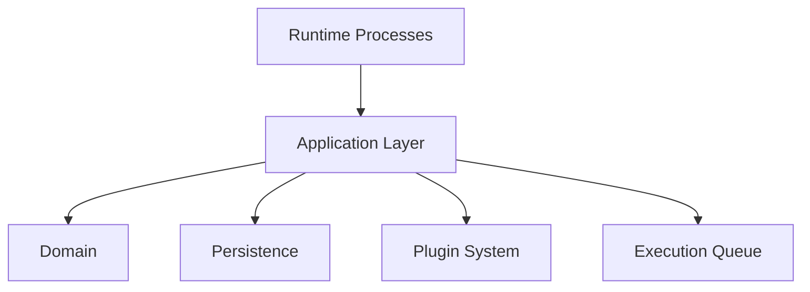
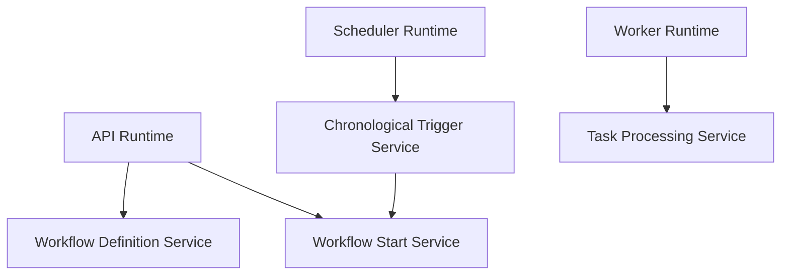

# Application Layer

## Purpose

The Application Layer implements the business use cases of the Automation Platform.

It sits between runtime processes and the lower-level components that perform the work. A runtime should be able to ask the Application Layer to perform a meaningful operation without knowing how domain objects are persisted, how plugins are resolved, or how transactions are coordinated.

The Application Layer coordinates:

* Domain models
* Persistence
* Plugin registries and implementations
* Application-level interactions with the Execution Queue

It does not contain transport logic, runtime loops, SQL queries, database models, or infrastructure implementations.

A useful way to think about the boundary is:

> **Runtime decides when to invoke a capability. Application decides what that business operation means.**

---

# Architectural Role


```mermaid
flowchart TD

    Runtime["Runtime Processes"]
    Application["Application Layer"]
    Domain["Domain"]
    Persistence["Persistence"]
    Plugins["Plugin System"]
    Queue["Execution Queue"]

    Runtime --> Application

    Application --> Domain
    Application --> Persistence
    Application --> Plugins
    Application --> Queue
```

Application services coordinate business operations.

Persistence provides durable state, transactions, and database concurrency primitives.

Plugins provide extensible task and trigger behavior.

The Execution Queue remains separate from Persistence. Application services may publish runnable work through the queue, but queue lifecycle concerns such as claims, leases, heartbeats, and worker ownership remain outside the Application Layer.

---

# Design Principles

## Organize Around Business Capabilities

Application packages are organized around meaningful business capabilities rather than CRUD operations or database tables.

Current capabilities include:

```text
workflow_definitions
workflow_start
task_processing
chronological_triggers
trigger_initialization
```

A single capability may coordinate several lower-level components.

For example, chronological trigger processing coordinates Persistence, the trigger registry, a trigger plugin, and workflow start.

This keeps orchestration in one place and prevents runtimes from needing to understand internal platform behavior.

---

## Keep Runtimes Thin

Runtime processes should contain as little business logic as possible.

A runtime generally:

1. Determines that work may need to happen.
2. Invokes an Application capability.
3. Handles process-level concerns such as polling, shutdown, and queue claim lifecycle.

For example:

```text
Scheduler Runtime
        |
        v
ChronologicalTriggerService.process_next_due()
```

The Scheduler does not:

* Query trigger repositories.
* Resolve trigger plugins.
* Calculate schedule advancement.
* Create workflow executions.
* Manage database transactions.

Similarly, the Worker owns queue claim lifecycle but delegates logical task processing to `TaskProcessingService`.

---

## Application Owns Business Transactions

Application services define business-level transaction boundaries through the Unit of Work.

Operations that must succeed or fail together use the same Unit of Work.

For chronological scheduling:

```text
advance trigger schedule
        +
create WorkflowExecution
        =
one persistence transaction
```

The Application Layer decides that these changes form one business operation.

Persistence provides the transaction and locking primitives needed to implement it safely.

---

## Keep Transactions Short

Long-running or arbitrary external work should not occur inside database transactions.

Task plugins therefore execute outside persistence transactions because they may perform arbitrary or long-running work.

Chronological trigger calculation is deliberately different.

```text
ChronologicalTrigger.next_occurrence(...)
```

must be:

* Fast
* Deterministic
* Local
* I/O-free

This makes it safe to calculate the next occurrence while the corresponding scheduling row remains locked.

---

## Make Unit of Work Ownership Explicit

Most top-level Application capabilities create and manage their own Unit of Work.

Nested Application operations may instead participate in an existing Unit of Work when several operations must form one transaction.

For example:

```text
ChronologicalTriggerService.process_next_due()
        |
        | owns UoW
        |
        +-- update chronological state
        |
        v
WorkflowStartService.start_and_commit(...)
        |
        | same UoW
        |
        +-- create WorkflowExecution
        +-- create TaskExecutions
        +-- commit
        +-- enqueue root tasks
```

`start_and_commit()` is intentionally a terminal operation on the supplied Unit of Work.

Once it has been called, the caller should not perform additional persistence operations through that Unit of Work.

---

## Remain Infrastructure-Independent

Application services depend on platform abstractions rather than infrastructure implementations.

Application code does not contain:

* SQLAlchemy queries
* ORM models
* PostgreSQL-specific SQL
* HTTP handling
* Worker loops
* Scheduler loops
* Queue implementation details

Application code may depend on abstractions such as:

```text
UnitOfWork
ExecutionQueue
TaskRegistry
TriggerRegistry
```

It does not know how those abstractions are implemented.

---

# Package Organization

```text
application/
│
├── workflow_definitions/
│   ├── __init__.py
│   ├── models.py
│   └── service.py
│
├── workflow_start/
│   ├── __init__.py
│   └── service.py
│
├── task_processing/
│   ├── __init__.py
│   ├── models.py
│   └── service.py
│
├── chronological_triggers/
│   ├── __init__.py
│   └── service.py
│
├── trigger_initialization/
│   ├── __init__.py
│   └── service.py
│
└── exceptions.py
```

Packages should remain small until additional complexity justifies further decomposition.

A package does not need a `models.py` simply because other packages have one. Application models should exist only when a real Application-level data structure is required.

---

# Workflow Definition Management

The `workflow_definitions` capability manages reusable workflow definitions.

Its primary service currently supports creating and deleting definitions.

## Creation

Workflow definition creation accepts Application-level input describing:

* Workflow metadata
* Task definitions
* Trigger definitions
* Enabled state

The service validates the complete definition before persistence.

Task validation includes:

* At least one task exists.
* Task keys are unique.
* Task plugin types are registered.
* Plugin configurations are valid.
* Retry counts are valid.
* Dependencies reference existing tasks.
* Tasks do not depend on themselves.
* Dependencies are not duplicated.
* The dependency graph contains no cycles.

Trigger validation includes:

* Trigger plugin types are registered.
* Plugin configurations are valid.

Plugin-specific validation remains the responsibility of the plugin:

```text
plugin.validate_configuration(configuration)
```

Workflow definition creation invokes that behavior and translates plugin validation failures into the appropriate Application error.

Validation answers:

> **Is this a valid workflow definition?**

It is separate from initializing any runtime state that a trigger mechanism may require.

---

## Trigger Resolution During Creation

Trigger plugins are resolved during validation.

The resolved plugin remains associated with the `TriggerDefinition` created from that input so initialization does not need to perform another registry lookup.

Conceptually:

```text
CreateTriggerDefinition
        |
        +-- resolve plugin
        |
        +-- validate configuration
        |
        v
TriggerDefinition + resolved plugin
```

This association is then used during trigger initialization.

---

## Persistence and Initialization

After validation and domain-object construction, workflow definition creation performs:

```text
BEGIN UoW
    |
    +-- save WorkflowDefinition
    |       |
    |       +-- TaskDefinitions
    |       +-- TriggerDefinitions
    |
    +-- flush
    |
    +-- initialize trigger runtime state
    |
    +-- commit
```

The flush makes persisted trigger definitions available for foreign-key references without committing the transaction.

Trigger initialization still participates in the same transaction.

Therefore:

```text
WorkflowDefinition
TriggerDefinitions
required trigger runtime state
```

either all persist or all roll back.

---

# Trigger Initialization

Different trigger mechanisms may require different state when their definitions are created.

`TriggerInitializationService` provides the Application-level dispatch point for that behavior.

It receives:

* The already-resolved trigger plugin class.
* Its `TriggerDefinition`.
* The existing Unit of Work.

It does not:

* Resolve the plugin again.
* Validate its configuration again.
* Open another Unit of Work.
* Commit the transaction.

---

## Mechanism-Based Dispatch

Initialization is dispatched according to trigger mechanism interfaces rather than individual plugin names.

For example:

```text
IntervalTrigger
        |
        | subclass of
        v
ChronologicalTrigger
        |
        v
ChronologicalTriggerService.initialize()
```

Conceptually, the dispatcher maps a supported mechanism interface to its initialization capability:

```text
ChronologicalTrigger
        ->
ChronologicalTriggerService.initialize
```

This means another chronological plugin can use the same initialization infrastructure automatically:

```text
CronTrigger
        |
        +-- inherits ChronologicalTrigger
        |
        +-- automatically uses chronological initialization
```

The dispatcher does not contain entries for individual chronological plugins such as `interval`, `cron`, or `daily`.

---

## Mechanisms Without Initialization

Not every trigger mechanism needs durable initialization.

If a valid trigger plugin does not match a mechanism requiring initialization, the dispatcher simply performs no operation.

There is no artificial:

```text
NoInitializationTrigger
```

and no trigger-mechanism enum representing this case.

---

# Chronological Trigger Capability

The `chronological_triggers` package owns the Application behavior required to activate workflows according to time.

It exposes two operations:

```text
initialize()
process_next_due()
```

The chronological plugin defines schedule-specific behavior.

The Application service defines how the platform hosts that behavior.

---

## Initialization

Chronological initialization occurs during workflow definition creation.

The service receives:

* A resolved `ChronologicalTrigger` implementation.
* Its `TriggerDefinition`.
* The caller's Unit of Work.

It calculates the first scheduled occurrence:

```text
TriggerDefinition.configuration
        |
        v
ChronologicalTrigger.next_occurrence()
        |
        v
first next_run_at
        |
        v
ChronologicalTriggerRepository.create()
```

The service uses the current UTC time as the point after which the first occurrence is calculated.

If the plugin returns `None`, no chronological runtime state is required.

Otherwise, the calculated occurrence is persisted.

The service does not commit.

This establishes the invariant:

> **A successfully created chronological trigger definition has the durable scheduling state required to execute it.**

If initialization fails, the entire workflow-definition creation transaction rolls back.

---

# Processing Chronological Triggers

`process_next_due()` is the runtime-facing chronological scheduling capability.

Each invocation processes at most one due occurrence.

Conceptually:

```text
BEGIN UoW
    |
    +-- get earliest due chronological trigger
    |       |
    |       +-- Persistence locks scheduling row
    |
    +-- resolve trigger plugin
    |
    +-- calculate next occurrence
    |
    +-- update or delete scheduling state
    |
    +-- WorkflowStartService.start_and_commit()
            |
            +-- create WorkflowExecution
            +-- create TaskExecutions
            +-- COMMIT
            +-- enqueue root tasks
```

The operation returns:

```text
True
    one occurrence was processed

False
    no chronological occurrence is currently due
```

Processing one occurrence per call keeps transactions short and allows the Scheduler runtime to naturally drain available work.

---

## Resolving the Trigger

Persistence returns the information required to process the due occurrence, including:

```text
trigger definition ID
workflow definition ID
plugin type
configuration
scheduled occurrence
```

The Application service resolves the plugin through `TriggerRegistry`.

The plugin is expected to implement `ChronologicalTrigger` because chronological runtime state is created only for chronological trigger definitions.

The service then invokes:

```text
next_occurrence(
    configuration,
    persisted_next_run_at,
)
```

The persisted scheduled occurrence is deliberately used rather than the current wall-clock time.

---

## Advancing the Schedule

If the plugin returns another occurrence:

```text
next_occurrence(...) -> datetime
```

the chronological state is advanced to that value.

If it returns:

```text
None
```

the chronological runtime state is deleted.

The reusable `TriggerDefinition` remains persisted.

This allows finite chronological plugins, such as a future one-time trigger, to finish without deleting their definitions.

---

# Catch-Up Behavior

Recurring chronological triggers advance relative to their persisted scheduled occurrence.

Suppose:

```text
interval:      1 hour
next_run_at:   09:00
current time:  11:30
```

Processing the 09:00 occurrence calculates:

```text
09:00 -> 10:00
```

not:

```text
09:00 -> 12:00
```

Because 10:00 remains due, the Scheduler can immediately process another occurrence:

```text
09:00 -> 10:00
10:00 -> 11:00
11:00 -> 12:00
```

At 12:00, the schedule is finally ahead of the current time.

This provides deterministic catch-up behavior and prevents missed occurrences from being silently skipped.

Alternative missed-run policies can be introduced later if concrete requirements justify them.

---

# Scheduling Concurrency

Chronological scheduling supports multiple Scheduler processes.

Persistence selects due chronological state using PostgreSQL:

```sql
FOR UPDATE SKIP LOCKED
```

Application does not implement this SQL or manipulate the row lock directly.

From the Application Layer's perspective:

```text
Scheduler A
        |
        +-- process_next_due()
                |
                +-- receives Trigger A

Scheduler B
        |
        +-- process_next_due()
                |
                +-- receives Trigger B
```

Persistence ensures that the second transaction skips state already locked by the first.

The Application Layer can therefore process the returned occurrence without introducing its own scheduler-claim mechanism.

---

## Atomic Scheduling

The scheduling row remains locked while the Application Layer:

1. Resolves the trigger plugin.
2. Calculates the next occurrence.
3. Advances or removes scheduling state.
4. Creates the workflow execution.
5. Commits the transaction.

The central guarantee is:

> **Schedule advancement and WorkflowExecution creation are committed atomically for a chronological occurrence.**

The system cannot commit:

```text
schedule advanced
but
WorkflowExecution missing
```

or:

```text
WorkflowExecution created
but
schedule not advanced
```

for that persistence transaction.

---

## Failure Behavior

The shared transaction gives chronological processing straightforward failure semantics.

### Trigger calculation fails

```text
lock occurrence
        |
        v
next_occurrence() raises
        |
        v
transaction rolls back
        |
        v
occurrence remains due
```

### Workflow start fails

```text
lock occurrence
        |
        v
advance schedule
        |
        v
workflow creation fails
        |
        v
transaction rolls back
        |
        v
schedule advancement is undone
```

### Scheduler crashes before commit

```text
transaction terminates
        |
        v
PostgreSQL rolls back
        |
        v
row lock released
        |
        v
occurrence remains due
```

No Scheduler lease, heartbeat, claim token, or global lock is required.

Those mechanisms are appropriate for long-running task execution, not short scheduling transactions.

---

# Workflow Start

The `workflow_start` capability owns what it means to start a workflow.

Starting a workflow includes:

1. Loading the workflow definition.
2. Verifying that it exists.
3. Verifying that it is enabled.
4. Creating a `WorkflowExecution`.
5. Creating a `TaskExecution` for each task definition.
6. Translating definition dependencies into execution dependencies.
7. Initializing dependency counts and retry state.
8. Identifying root tasks.
9. Persisting the execution.
10. Committing the transaction.
11. Enqueueing the root tasks.

Each workflow execution receives its own task-execution graph so runtime state remains independent of the reusable definition.

---

## Normal Workflow Start

The normal public operation is:

```text
start(workflow_definition_id)
```

It owns its Unit of Work:

```text
start()
    |
    +-- create UoW
    |
    +-- load and validate definition
    |
    +-- create execution state
    |
    +-- persist
    |
    +-- commit
    |
    +-- enqueue root tasks
```

This is appropriate for callers that do not already have persistence changes that must commit with workflow creation.

---

## Workflow Start Within an Existing Transaction

Some Application capabilities need workflow creation to complete a larger transaction.

Chronological scheduling is the first example.

For this purpose, workflow start also exposes:

```text
start_and_commit(workflow_definition_id, uow)
```

The supplied Unit of Work may already contain persistence changes.

`start_and_commit()` then:

```text
existing UoW
    |
    +-- load workflow definition
    +-- validate start
    +-- create WorkflowExecution
    +-- create TaskExecutions
    +-- persist execution
    +-- COMMIT supplied UoW
    +-- enqueue root tasks
```

For chronological scheduling, the commit therefore contains:

```text
schedule advancement
        +
WorkflowExecution creation
```

`start_and_commit()` is a terminal operation on the supplied Unit of Work.

This keeps workflow-start business logic centralized rather than duplicating execution compilation inside every capability that can start a workflow.

---

# Queue Boundary During Workflow Start

`WorkflowStartService` owns publication of initially runnable tasks.

This means callers such as chronological scheduling do not need to know how newly created workflows become available to Workers.

The ordering is:

```text
persist execution
        |
        v
COMMIT
        |
        +-- persistence durable
        +-- database locks released
        |
        v
enqueue root tasks
```

The SQLAlchemy session may remain alive until the Unit of Work context exits, but the transaction and its database locks end at commit.

Persistence and the Execution Queue remain separate transactional systems.

A process failure can therefore occur between:

```text
database commit
        |
        X process failure
        |
queue enqueue
```

leaving runnable persisted work temporarily absent from the queue.

This is an intentional architectural boundary.

Recovery relies on reconciliation and idempotent enqueueing rather than coupling queue storage to the Persistence transaction.

---

# Task Processing

The `task_processing` capability owns the logical processing of a task execution after a Worker has obtained it from the Execution Queue.

The Worker owns queue claim lifecycle.

The Application service owns the task's business transition.

Conceptually:

```text
Worker
    |
    +-- claim queue item
    |
    v
TaskProcessingService.process(task_execution_id)
    |
    +-- start/resume task in Persistence
    +-- resolve task plugin
    +-- construct TaskContext
    +-- execute plugin
    +-- persist success or failure
    |
    v
Processing result
    |
    v
Worker
    |
    +-- finish/release queue claim
```

Task plugin execution occurs outside the database transaction because plugins may perform arbitrary or long-running work.

---

## Starting or Resuming a Task

The service asks Persistence whether the task can be processed.

A logical task may be processable when it is:

```text
PENDING
```

or already:

```text
RUNNING
```

Allowing `RUNNING` tasks to resume supports recovery after queue lease expiration or redelivery.

Terminal tasks are not processed again.

---

## Task Plugin Execution

Once Persistence returns the data required for execution, Application:

1. Resolves the task plugin.
2. Constructs the plugin's `TaskContext`.
3. Invokes the plugin.
4. Interprets the resulting `TaskResult`.

Plugins do not receive repositories, database sessions, or queue implementations.

---

## Successful Completion

When a task succeeds, the service asks Persistence to complete it.

Persistence returns any child task identifiers that became runnable because of that completion.

Those identifiers are returned to the Worker/runtime path for queue publication according to the existing execution architecture.

---

## Retryable Failure

A plugin failure does not necessarily mean the logical task has failed permanently.

If tries remain:

```text
RUNNING
    |
    +-- record failed attempt
    +-- decrement remaining tries
    |
    v
RUNNING
```

The task remains unresolved and can be retried.

---

## Terminal Failure

If no tries remain, the task becomes `FAILED`.

The workflow then fails and its remaining nonterminal tasks are cancelled through Persistence.

The Application service coordinates this business outcome while Persistence implements the atomic database transitions.

---

# Trigger Architecture

Triggers determine **when a workflow should start**.

Different trigger families may require fundamentally different platform infrastructure, so trigger mechanisms are represented through interfaces.

```text
Trigger
    |
    +-- ChronologicalTrigger
    |       |
    |       +-- IntervalTrigger
    |       +-- CronTrigger          [future]
    |       +-- DailyTimeTrigger     [future]
    |       +-- OneTimeTrigger       [future]
    |
    +-- WebhookTrigger               [future]
    +-- FilesystemTrigger            [future]
```

The class hierarchy itself identifies the mechanism.

There is no separate trigger-mechanism enum or persisted mechanism category.

For example:

```text
IntervalTrigger
        is a
ChronologicalTrigger
```

is sufficient for the Application Layer to know that the plugin uses chronological initialization and scheduling infrastructure.

---

## Trigger Plugin Responsibilities

Every trigger plugin validates its own configuration.

A chronological trigger additionally implements:

```text
next_occurrence(configuration, after)
```

Trigger plugins own trigger-specific behavior only.

They do not:

* Open database sessions.
* Access repositories.
* Create workflow executions.
* Enqueue tasks.
* Commit transactions.
* Control runtime processes.

Chronological `next_occurrence()` implementations must remain fast, deterministic, local, and I/O-free because the Application Layer may invoke them while scheduling state is locked.

---

## Adding a Chronological Plugin

Adding another chronological trigger should require implementing the existing chronological contract.

For example:

```text
CronTrigger
    |
    +-- validate_configuration()
    +-- next_occurrence()
```

Because `CronTrigger` inherits `ChronologicalTrigger`, it automatically participates in:

```text
TriggerInitializationService
        +
ChronologicalTriggerService
        +
Scheduler Runtime
```

No Scheduler, Persistence, or Application orchestration changes should be required.

---

## Adding a New Trigger Mechanism

A fundamentally different trigger mechanism may require new platform infrastructure.

For example, a webhook trigger may require:

```text
WebhookTrigger
        +
Webhook Application capability
        +
HTTP-facing runtime
```

rather than chronological polling.

That does not violate the plugin architecture.

Plugin extensibility means implementations belonging to an already-supported mechanism can be added without changing that mechanism's hosting infrastructure.

It does not require every possible trigger mechanism to share one artificial runtime contract.

---

# Runtime Interaction

Runtime processes consume narrowly scoped Application capabilities.


```mermaid
flowchart TD

    API["API Runtime"]
    Scheduler["Scheduler Runtime"]
    Worker["Worker Runtime"]

    Definitions["Workflow Definition Service"]
    Start["Workflow Start Service"]
    Chronological["Chronological Trigger Service"]
    Processing["Task Processing Service"]

    API --> Definitions
    API --> Start

    Scheduler --> Chronological

    Worker --> Processing

    Chronological --> Start
```

The Scheduler invokes chronological scheduling rather than workflow start directly because scheduled activation involves more than creating an execution.

It must first safely process and advance a persisted occurrence.

The Worker invokes task processing rather than manipulating task execution state itself.

A runtime only receives the Application dependencies required for its responsibilities.

There is no requirement for a single global `Application` object.

---

# Scheduler Interaction

The Scheduler runtime is deliberately small.

Conceptually:

```text
while running:

    processed =
        chronological_trigger_service.process_next_due()

    if processed:
        immediately check again

    else:
        wait poll_interval
```

The Scheduler therefore drains currently due work without sleeping between successful occurrences.

It waits only when no chronological occurrence is available.

The Scheduler does not know about:

```text
TriggerDefinition
ChronologicalTriggerState
TriggerRegistry
UnitOfWork
Repositories
WorkflowExecution
PostgreSQL row locks
```

Those concerns remain behind the Application and Persistence boundaries.

Multiple Scheduler processes may run concurrently because Persistence safely distributes due occurrences using row locking.

---

# Dependency Direction

The intended dependency direction is:

```text
Runtime
    |
    v
Application
    |
    +----> Domain
    |
    +----> Persistence abstractions
    |
    +----> Plugin abstractions / registries
    |
    +----> Execution Queue abstraction
```

Runtime code should not contain business state-transition logic.

Application code should not contain SQL or runtime loops.

Persistence should not depend on plugin execution contracts.

Plugins should not know about Persistence, workflow orchestration, or queueing.

---

# What Does Not Belong Here

The Application Layer should not contain:

* HTTP request or response handling.
* FastAPI routes.
* Worker polling loops.
* Scheduler polling loops.
* Queue claim ownership.
* Queue heartbeats.
* Queue lease management.
* SQLAlchemy models.
* SQL queries.
* Database sessions.
* Queue implementations.
* Task implementation logic.
* Trigger-specific runtime loops.

Application services may coordinate abstractions such as `UnitOfWork`, plugin registries, and `ExecutionQueue`, but implementation-specific behavior remains in the appropriate lower-level component.

---

# Testing Strategy

Application tests should focus on orchestration and business behavior rather than SQL implementation details.

## Workflow Definition Tests

Important scenarios include:

* Invalid task definitions are rejected.
* Invalid trigger definitions are rejected.
* Plugin configuration validation is invoked.
* Dependency cycles are rejected.
* Trigger initialization uses the same Unit of Work as definition creation.
* Initialization failure prevents definition creation from committing.

---

## Chronological Trigger Tests

Important Application-level scenarios include:

* Initialization calculates and persists the first occurrence.
* Initialization uses the caller's Unit of Work.
* Initialization does not commit.
* Non-chronological triggers do not create chronological state.
* A due trigger resolves the correct plugin.
* `next_occurrence()` receives the persisted scheduled occurrence.
* A future occurrence advances scheduling state.
* `None` removes completed chronological state.
* No due trigger returns without starting a workflow.
* Plugin calculation failure prevents the transaction from committing.
* Workflow-start failure prevents schedule advancement from committing.
* Successful processing advances the schedule and creates an execution atomically.
* Overdue recurring triggers follow deterministic catch-up behavior.

PostgreSQL-specific locking behavior belongs primarily to Persistence integration testing.

Cross-layer integration tests should still verify the resulting scheduling guarantee:

```text
one due occurrence
        +
concurrent Scheduler processing
        =
one committed WorkflowExecution for that occurrence
```

---

## Workflow Start Tests

Important scenarios include:

* A valid definition produces a complete execution graph.
* Disabled definitions cannot be started.
* Missing definitions cannot be started.
* Root tasks are identified correctly.
* `start()` owns and commits its transaction.
* `start_and_commit()` participates in and commits the supplied transaction.
* Root tasks are published only after persistence commits.

---

## Task Processing Tests

Important scenarios include:

* Pending tasks can begin processing.
* Running tasks can resume after redelivery.
* Terminal tasks are not processed again.
* Parent outputs reach dependent task plugins.
* Successful completion advances dependencies.
* Retryable failures remain unresolved.
* Terminal failures fail the workflow.
* Remaining tasks are cancelled after terminal workflow failure.

---

# Future Evolution

The Application Layer should continue to be organized around meaningful business capabilities as the platform grows.

Potential future capabilities include:

* Workflow cancellation.
* Workflow definition updates.
* Workflow versioning.
* Pause and resume.
* Explicit execution retry.
* Administrative recovery.
* Execution inspection.
* Additional trigger mechanisms.
* Additional chronological trigger plugins.
* Configurable missed-run policies.

New packages and abstractions should be introduced when a concrete capability requires them rather than preemptively modeling possible future behavior.

For chronological scheduling, the current architecture intentionally does not introduce:

* Scheduler leases.
* Scheduler heartbeats.
* Scheduler claim tokens.
* Trigger-mechanism enums.
* Persisted mechanism categories.
* Generic trigger runtime-state frameworks.
* Batch scheduling.
* Distributed locks.
* A separate scheduling queue.
* Scheduling-specific outbox infrastructure.

The current division of responsibility is deliberately simple:

> **Plugins define mechanism-specific behavior. Application orchestrates business operations. Persistence owns durable state and database concurrency. Workflow start owns execution creation and initial queue publication. Runtime drives the appropriate Application capability.**
