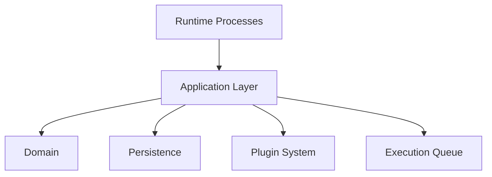
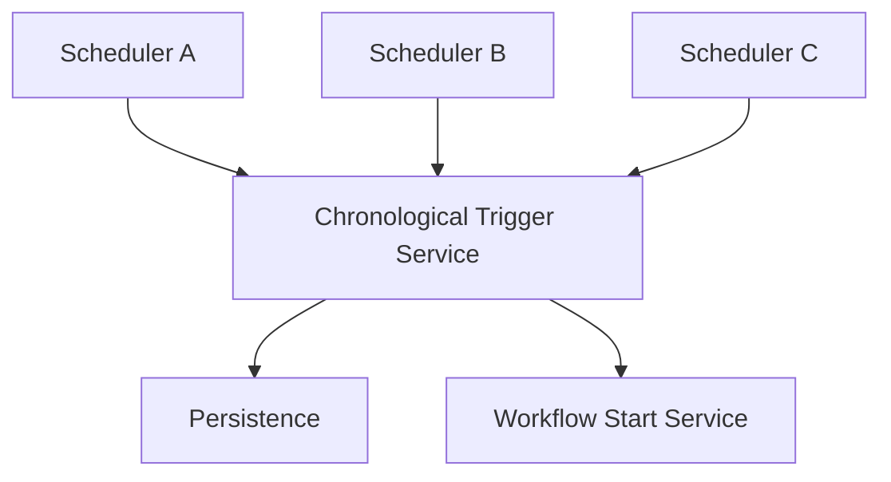
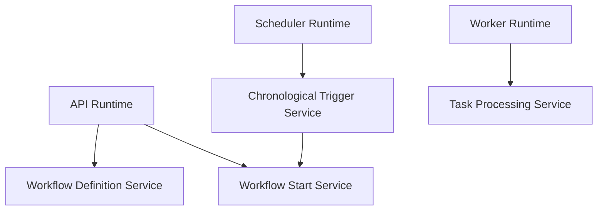

# Application Layer

## Purpose

The Application Layer implements the business use cases of the Automation Platform.

It sits between runtime processes and the lower-level parts of the system. A runtime should be able to ask the Application Layer to perform a meaningful operation without knowing how domain objects are persisted, how plugins are resolved, or how a transaction is coordinated.

The Application Layer coordinates:

* Domain models
* Persistence
* Plugin registries and implementations
* Application-level use cases involving the execution queue

It does not contain transport logic, runtime loops, SQL queries, database models, or infrastructure implementations.

A useful way to think about the Application Layer is:

> **Runtime decides when to invoke a capability. Application decides what the business operation means.**

---

# Architectural Role

The Application Layer sits between runtime processes and the components required to perform business operations.


```mermaid
flowchart TD

    Runtime["Runtime Processes"]
    Application["Application Layer"]
    Domain["Domain"]
    Persistence["Persistence"]
    Plugins["Plugin System"]
    Queue["Execution Queue"]

    Runtime --> Application

    Application --> Domain
    Application --> Persistence
    Application --> Plugins
    Application --> Queue
```

Application services coordinate business operations.

Persistence provides durable state, transactions, and database concurrency primitives.

Plugins provide extensible task and trigger behavior.

The Execution Queue remains a separate abstraction from Persistence. Application services may make work available through the queue when doing so is part of a business operation, but queue lifecycle concerns such as claims, leases, heartbeats, and worker ownership remain runtime concerns.

---

# Design Principles

## Organize Around Business Capabilities

Application packages are organized around cohesive business capabilities rather than CRUD operations or individual database tables.

For example:

```text
workflow_definitions
workflow_start
task_processing
chronological_triggers
trigger_initialization
```

A single capability may coordinate several lower-level components.

This keeps orchestration in one place and prevents runtimes from needing to understand internal system behavior.

---

## Thin Runtimes

Runtime processes should contain as little business logic as possible.

A runtime generally:

1. Detects that some work may need to happen.
2. Invokes an Application capability.
3. Handles process-level concerns such as polling, shutdown, or queue claim lifecycle.

For example:

```text
Scheduler Runtime
        |
        v
ChronologicalTriggerService.process_next_due()
```

The Scheduler does not query trigger repositories, resolve plugins, create workflow executions, or manipulate scheduling state itself.

Similarly, the worker runtime owns queue claim lifecycle but delegates logical task processing to the Application Layer.

---

## Transaction Boundaries

Application services define business-level transaction boundaries through the Unit of Work.

Operations that must succeed or fail together should use the same Unit of Work.

For chronological scheduling, this means:

```text
advance trigger schedule
        +
create WorkflowExecution
        =
one persistence transaction
```

Long-running or arbitrary external work should not occur inside database transactions.

Chronological trigger calculation is an intentional exception to the general preference for minimizing work while holding locks: `next_occurrence()` is explicitly required to be fast, deterministic, local, and I/O-free.

Task plugin execution remains outside persistence transactions because task implementations may perform arbitrary or long-running work.

---

## Unit of Work Ownership

Most top-level Application capabilities create and manage their own Unit of Work.

Some operations also support participating in an existing Unit of Work when another Application capability needs a larger atomic transaction.

Transaction ownership must remain explicit.

For example, chronological trigger processing creates a Unit of Work and updates the trigger's scheduling state. It then asks `WorkflowStartService` to finish starting the workflow using that same Unit of Work.

The workflow-start operation acts as the terminal operation on that transaction:

```text
ChronologicalTriggerService
        |
        | existing UoW
        v
WorkflowStartService.start_and_commit()
        |
        +-- create WorkflowExecution
        +-- create TaskExecutions
        +-- commit supplied UoW
        +-- enqueue root tasks
```

Once `start_and_commit()` is called, the caller must not perform additional persistence operations through that Unit of Work.

---

## Infrastructure Independence

Application services depend on abstractions rather than infrastructure implementations.

They do not contain:

* SQLAlchemy queries
* ORM models
* PostgreSQL-specific SQL
* HTTP handling
* Worker loops
* Scheduler loops
* Queue implementation details

Application code may depend on the `ExecutionQueue` abstraction when making runnable work available is part of the application operation.

It does not know whether that queue is implemented with PostgreSQL, an external broker, or another technology.

---

# Package Organization

The Application Layer is organized around implemented business capabilities.

```text
application/

    workflow_definitions/
        __init__.py
        models.py
        service.py

    workflow_start/
        __init__.py
        service.py

    task_processing/
        __init__.py
        models.py
        service.py

    chronological_triggers/
        __init__.py
        service.py

    trigger_initialization/
        __init__.py
        service.py

    exceptions.py
```

Packages should remain small until additional complexity justifies further decomposition.

A package does not need a `models.py` merely because other Application packages have one. Application models should only be introduced when a real Application-level data structure is needed.

---

# Workflow Definition Management

The `workflow_definitions` package manages reusable workflow definitions.

Its primary service is responsible for creating and deleting workflow definitions.

## Creation

Workflow definition creation accepts an Application request describing:

* Workflow metadata
* Task definitions
* Trigger definitions
* Enabled state

The Application Layer validates the requested definition before persistence.

Validation includes:

* Registered task plugin types
* Registered trigger plugin types
* Plugin configuration validity
* Unique task keys
* Valid dependency references
* No self-dependencies
* No dependency cycles

Trigger configuration validation remains part of workflow definition creation.

For each trigger definition, the service resolves its plugin and invokes:

```text
plugin.validate_configuration(configuration)
```

Validation answers:

> **Is this a valid definition for this plugin?**

It is separate from mechanism-specific initialization.

After the definition has been persisted into the current Unit of Work, trigger initialization is dispatched using the already-resolved trigger plugin.

```text
WorkflowDefinitionService
        |
        +-- resolve trigger plugin
        |
        +-- validate configuration
        |
        +-- persist WorkflowDefinition
        |
        +-- TriggerInitializationService
                |
                +-- mechanism-specific initialization
```

The complete operation uses the workflow-definition creation Unit of Work.

Therefore definition creation and any required trigger runtime-state initialization are atomic.

---

# Trigger Initialization

Different trigger mechanisms may require different durable state when their definitions are created.

`TriggerInitializationService` provides the Application-level dispatch point for this initialization.

It receives:

* The resolved trigger plugin class
* The persisted `TriggerDefinition`
* The existing Unit of Work

It does not resolve the plugin a second time and does not commit the transaction.

Dispatch is based on trigger mechanism interfaces rather than individual plugin names.

For example:

```text
IntervalTrigger
        |
        | subclass of
        v
ChronologicalTrigger
        |
        v
ChronologicalTriggerService.initialize()
```

This means future plugins such as `CronTrigger` or `DailyTimeTrigger` can use the existing chronological initialization infrastructure simply by implementing `ChronologicalTrigger`.

A valid trigger mechanism that requires no initialization is simply ignored by the initialization dispatcher.

No artificial "no initialization" mechanism is required.

---

# Chronological Triggers

The `chronological_triggers` package owns the Application behavior required to activate workflows according to time.

A chronological trigger plugin defines how its own schedule behaves.

The Application service defines how the platform hosts that behavior.

The primary operations are:

```text
initialize()
process_next_due()
```

---

## Initialization

Chronological initialization occurs during workflow definition creation.

The service receives an already-validated chronological trigger definition and calculates its first scheduled occurrence:

```text
TriggerDefinition.configuration
        |
        v
ChronologicalTrigger.next_occurrence()
        |
        v
first next_run_at
        |
        v
chronological trigger persistence
```

The service uses the Unit of Work supplied by workflow definition creation.

It does not create or commit its own transaction.

This establishes an important invariant:

> **A successfully created chronological trigger definition also has the durable scheduling state required to execute it.**

If initialization fails, the surrounding workflow-definition transaction rolls back.

---

## Processing Due Triggers

`process_next_due()` processes at most one scheduled occurrence per call.

Conceptually:

```text
BEGIN UoW
    |
    +-- get earliest due chronological trigger
    |       |
    |       +-- row locked by Persistence
    |
    +-- resolve trigger plugin
    |
    +-- calculate next occurrence
    |
    +-- update next_run_at
    |
    +-- WorkflowStartService.start_and_commit()
            |
            +-- create WorkflowExecution
            +-- create TaskExecutions
            +-- COMMIT
            +-- enqueue root tasks
```

If no trigger is currently due, the service returns without starting a workflow.

Processing only one occurrence per call keeps transactions short and allows multiple Scheduler processes to naturally divide available work.

---

## Catch-Up Behavior

Recurring chronological triggers advance relative to their persisted scheduled occurrence rather than directly from the current wall-clock time.

For example:

```text
interval:        1 hour
next_run_at:     09:00
current time:    11:30
```

Processing the 09:00 occurrence advances the schedule to:

```text
10:00
```

not 12:00.

Because 10:00 is still due, another call can process that occurrence.

Repeated calls therefore produce:

```text
09:00 -> 10:00
10:00 -> 11:00
11:00 -> 12:00
```

This provides deterministic catch-up behavior.

Alternative missed-run policies may be introduced later if requirements justify them.

---

# Workflow Start

The `workflow_start` package owns what it means to start a workflow execution.

Starting a workflow includes:

1. Loading the workflow definition.
2. Verifying that it exists.
3. Verifying that it is enabled.
4. Creating a new `WorkflowExecution`.
5. Creating a `TaskExecution` for every task definition.
6. Reconstructing execution dependencies.
7. Initializing dependency and retry state.
8. Identifying root tasks.
9. Persisting the complete execution.
10. Committing the transaction.
11. Enqueueing the initially runnable root tasks.

Each execution receives its own task-execution graph so runtime state remains independent of the reusable definition.

---

## Starting With a New Transaction

The normal public workflow-start operation is:

```text
start(workflow_definition_id)
```

It creates its own Unit of Work and performs the complete workflow-start operation.

Conceptually:

```text
start()
    |
    +-- create UoW
    |
    +-- create execution state
    |
    +-- commit
    |
    +-- enqueue root tasks
```

---

## Starting Within an Existing Transaction

Some Application operations need workflow creation to participate in a larger transaction.

Chronological scheduling is the first example.

For these cases, workflow start also provides:

```text
start_and_commit(workflow_definition_id, uow)
```

The supplied Unit of Work may already contain persistence changes made by the caller.

`start_and_commit()`:

```text
existing UoW
    |
    +-- load workflow definition
    +-- validate start
    +-- create WorkflowExecution
    +-- create TaskExecutions
    +-- persist execution
    +-- COMMIT supplied UoW
    +-- enqueue root tasks
```

The commit therefore includes both the caller's previous persistence changes and the newly created workflow execution.

For chronological scheduling, this gives:

```text
next_run_at advanced
        +
WorkflowExecution created
        =
same commit
```

`start_and_commit()` is intentionally a terminal operation on the supplied Unit of Work.

---

## Queue Boundary During Workflow Start

Workflow start owns enqueueing the initially runnable tasks.

This prevents every trigger mechanism or other workflow-starting capability from needing to understand how a workflow becomes available to workers.

The queue operation occurs only after the persistence transaction has committed.

The Unit of Work's SQLAlchemy session may still exist until its context manager exits, but the database transaction and its locks end at `commit()`.

Therefore:

```text
COMMIT
    |
    +-- persistence durable
    +-- database locks released
    |
    v
enqueue root tasks
```

is a valid ordering.

Persistence and the Execution Queue remain separate transactional systems.

A process failure between database commit and queue enqueue can therefore leave persisted runnable work temporarily absent from the queue.

This is an intentional architectural boundary. Recovery relies on reconciliation and idempotent enqueueing rather than coupling queue storage to the persistence transaction.

---

# Chronological Scheduling Concurrency

Chronological scheduling is designed to support multiple Scheduler processes.

Persistence selects the earliest due chronological trigger using PostgreSQL row locking with `FOR UPDATE SKIP LOCKED`.

Conceptually:

```text
Scheduler A
    |
    +-- locks Trigger A

Scheduler B
    |
    +-- skips locked Trigger A
    +-- locks Trigger B

Scheduler C
    |
    +-- skips A and B
    +-- locks Trigger C
```

The lock is held for the scheduling transaction.

While the row is locked, the Application Layer:

1. Resolves the chronological trigger plugin.
2. Calculates the next occurrence.
3. Updates the persisted schedule.
4. Creates the workflow execution.
5. Commits the transaction.

The commit releases the row lock.

This provides the central scheduling guarantee:

> **A chronological occurrence cannot be concurrently committed by multiple schedulers, and schedule advancement is atomic with creation of its WorkflowExecution.**

No scheduler lease, heartbeat, claim token, or global scheduler lock is required.

If the Scheduler crashes before commit, PostgreSQL rolls back the transaction and releases the row lock. The occurrence remains due and can be processed by another Scheduler.

---

# Trigger Architecture

Triggers determine **when a workflow should start**.

Different families of triggers may require fundamentally different infrastructure.

These families are represented through trigger mechanism interfaces.

For example:

```text
Trigger
    |
    +-- ChronologicalTrigger
    |       |
    |       +-- IntervalTrigger
    |       +-- CronTrigger          [future]
    |       +-- DailyTimeTrigger     [future]
    |
    +-- WebhookTrigger               [future]
    +-- FilesystemTrigger            [future]
```

The class hierarchy itself identifies the mechanism.

There is no separate trigger-mechanism enum or persisted mechanism field.

For example, because:

```text
IntervalTrigger is a ChronologicalTrigger
```

the Application Layer knows that it should use chronological initialization and scheduling infrastructure.

---

## Trigger Plugin Responsibilities

Trigger plugins own only trigger-specific behavior.

All trigger plugins validate their configuration.

A chronological trigger additionally implements:

```text
next_occurrence(configuration, after)
```

This operation must be:

* Fast
* Deterministic
* Local
* I/O-free
* Independent of Persistence and runtime infrastructure

Trigger plugins do not:

* Open database sessions
* Access repositories
* Create workflow executions
* Enqueue tasks
* Commit transactions
* Control runtime processes

---

## Adding New Trigger Plugins

Adding another chronological plugin should require only implementing the chronological trigger contract.

For example:

```text
CronTrigger
    |
    +-- validate_configuration()
    +-- next_occurrence()
```

Because it inherits `ChronologicalTrigger`, it automatically participates in the existing:

```text
TriggerInitializationService
        +
ChronologicalTriggerService
        +
Scheduler Runtime
```

No Scheduler, Persistence, or Application orchestration changes should be necessary.

A completely new trigger mechanism may legitimately require new Application and runtime infrastructure.

For example, a webhook trigger may require an HTTP-facing runtime rather than chronological polling.

That does not violate the plugin architecture. Plugin extensibility applies within the infrastructure provided for a supported mechanism.

---

# Scheduler Runtime Interaction

The Scheduler runtime is intentionally thin.

Conceptually:

```text
while running:
    processed = chronological_trigger_service.process_next_due()

    if not processed:
        sleep(poll_interval)
```

The Scheduler does not know about:

```text
TriggerDefinition
ChronologicalTriggerState
TriggerRegistry
UnitOfWork
Repositories
WorkflowExecution
```

It simply asks the Application Layer to process one available chronological occurrence.

Multiple Scheduler processes may run concurrently because Persistence handles due-trigger claiming through PostgreSQL row locks.


```mermaid
flowchart TD

    SchedulerA["Scheduler A"]
    SchedulerB["Scheduler B"]
    SchedulerC["Scheduler C"]

    Chronological["Chronological Trigger Service"]
    Persistence["Persistence"]
    Start["Workflow Start Service"]

    SchedulerA --> Chronological
    SchedulerB --> Chronological
    SchedulerC --> Chronological

    Chronological --> Persistence
    Chronological --> Start
```

---

# Runtime Interaction

Runtime processes consume narrowly scoped Application capabilities.

Conceptually:


```mermaid
flowchart TD

    API["API Runtime"]
    Scheduler["Scheduler Runtime"]
    Worker["Worker Runtime"]

    Definitions["Workflow Definition Service"]
    Start["Workflow Start Service"]
    Chronological["Chronological Trigger Service"]
    Processing["Task Processing Service"]

    API --> Definitions
    API --> Start

    Scheduler --> Chronological

    Worker --> Processing

    Chronological --> Start
```

The Scheduler invokes the chronological scheduling capability rather than directly invoking workflow start.

This is important because chronological scheduling involves more than simply starting a workflow: it must atomically claim and advance a scheduled occurrence.

A runtime only receives the Application dependencies required for the operations it performs.

There is no requirement for a single global `Application` object.

---

# Dependency Direction

The intended dependency direction is:

```text
Runtime
    |
    v
Application
    |
    +----> Domain
    |
    +----> Persistence abstractions
    |
    +----> Plugin abstractions / registries
    |
    +----> Execution Queue abstraction
```

Runtime code should not contain business state-transition logic.

Application code should not contain SQL or runtime loops.

Persistence should not depend on plugin execution contracts.

Plugins should not know about Persistence, workflow orchestration, or queueing.

---

# What Does Not Belong Here

The Application Layer should not contain:

* HTTP request or response handling
* FastAPI routes
* Worker polling loops
* Scheduler polling loops
* Queue claim ownership
* Queue heartbeats
* Queue lease management
* SQLAlchemy models
* SQL queries
* Database sessions
* Queue implementations
* Task implementation logic
* Trigger-specific runtime loops

Application services may coordinate abstractions such as `UnitOfWork`, plugin registries, and `ExecutionQueue`, but implementation-specific behavior remains in the corresponding lower-level component.

---

# Testing Strategy

Application services should primarily be unit tested with mocked external dependencies.

Tests should verify orchestration rather than SQL implementation details.

Important chronological-trigger Application tests include:

* Initialization calculates and persists the first occurrence.
* Initialization uses the caller's Unit of Work.
* Initialization does not commit the workflow-definition transaction.
* Non-chronological triggers do not create chronological state.
* A due trigger resolves the correct plugin.
* `next_occurrence()` receives the persisted scheduled occurrence.
* Schedule advancement occurs before workflow start is finalized.
* No due trigger results in a no-op.
* Plugin calculation failure leaves the transaction uncommitted.
* Workflow-start failure leaves schedule advancement uncommitted.
* Successful processing advances the schedule and creates an execution in one transaction.

Cross-component PostgreSQL integration tests should verify the concurrency guarantees that cannot be meaningfully proven with mocks.

Important scheduling integration scenarios include:

```text
one due trigger
+
two concurrent schedulers
=
exactly one committed WorkflowExecution
```

and:

```text
multiple due triggers
+
multiple schedulers
=
different due rows can be processed concurrently
```

Catch-up behavior should also be tested using an overdue recurring trigger.

---

# Future Evolution

The Application Layer should remain organized around meaningful business capabilities as the platform grows.

Potential future capabilities include:

* Workflow cancellation
* Workflow definition updates
* Workflow versioning
* Pause and resume
* Explicit execution retry
* Administrative recovery
* Execution inspection
* Additional trigger mechanisms
* Additional chronological trigger plugins
* Configurable missed-run policies

New packages and abstractions should be introduced when an actual capability requires them rather than preemptively modeling possible future behavior.

For chronological scheduling specifically, the initial architecture intentionally does **not** introduce:

* Scheduler leases
* Scheduler heartbeats
* Scheduler claim tokens
* Trigger-mechanism enums
* Persisted mechanism categories
* Generic trigger runtime-state frameworks
* Batch scheduling
* Distributed locks
* A separate scheduling queue
* Scheduling-specific outbox infrastructure

The initial implementation relies on a simpler model:

> **Chronological plugins calculate time. Application orchestrates scheduling. Persistence owns durable state and row locking. Workflow start owns execution creation and initial queue publication. Runtime only drives the Application capability.**
