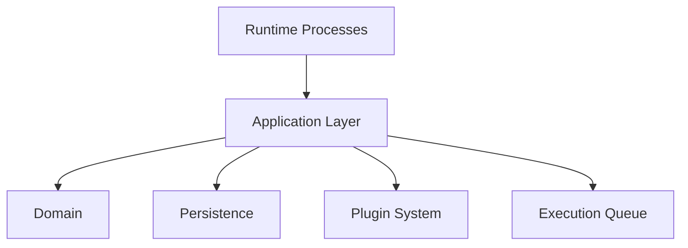
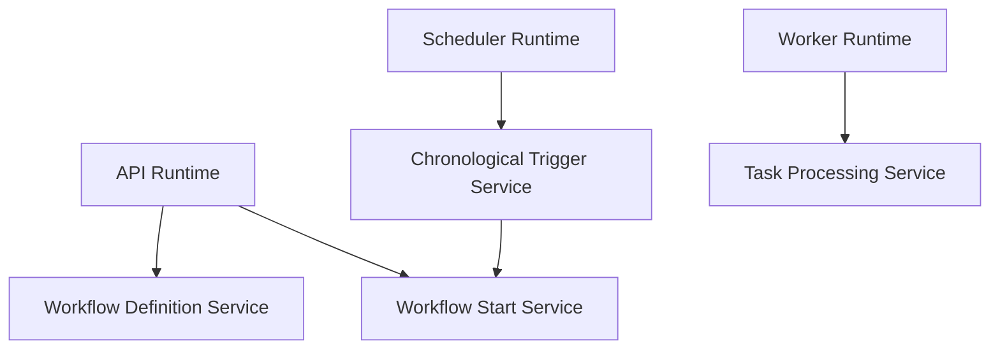

# Application Layer

## Purpose

The Application Layer implements the Automation Platform's business use cases. It sits between runtime processes and the lower-level components that perform the work.

A runtime should be able to request a meaningful operation without knowing how domain objects are persisted, plugins are resolved, or transactions are coordinated.

> **Runtime decides when to invoke a capability. Application decides what that business operation means.**

The Application Layer coordinates:

- Domain models
- Persistence
- Plugin registries and implementations
- Application-level interactions with the Execution Queue

It does **not** contain transport logic, runtime loops, SQL queries, database models, or infrastructure implementations.

## Architectural Role



Responsibilities remain distinct:

| Component | Owns |
| --- | --- |
| Application | Business orchestration and transaction boundaries |
| Persistence | Durable state, transactions, and database concurrency primitives |
| Plugins | Extensible task and trigger behavior |
| Execution Queue | Delivery, claims, leases, heartbeats, and worker ownership |
| Runtime | Polling, shutdown, transport, and process lifecycle |

The Execution Queue remains separate from Persistence. Application may publish runnable work, but queue lifecycle concerns remain outside the Application Layer.

## Design Principles

### Organize Around Business Capabilities

Application packages represent meaningful business capabilities rather than CRUD operations or database tables:

```text
workflow_definitions
workflow_start
task_processing
chronological_triggers
trigger_initialization
```

A capability may coordinate several lower-level components. For example, chronological trigger processing coordinates Persistence, the trigger registry, a trigger plugin, and workflow start. Keeping that orchestration in Application prevents runtimes from needing to understand platform internals.

### Keep Runtimes Thin

A runtime generally:

1. Determines that work may need to happen.
2. Invokes an Application capability.
3. Handles process-level concerns such as polling, shutdown, or queue claim lifecycle.

For example:

```text
Scheduler Runtime
        |
        v
ChronologicalTriggerService.process_next_due()
```

The Scheduler does not query trigger repositories, resolve plugins, calculate schedule advancement, create workflow executions, or manage database transactions.

Similarly, the Worker owns queue claim lifecycle but delegates logical task processing to `TaskProcessingService`.

### Application Owns Business Transactions

Application services decide which persistence changes must succeed or fail together and place those changes in the same Unit of Work.

For chronological scheduling:

```text
advance trigger schedule
        +
create WorkflowExecution
        =
one persistence transaction
```

Persistence supplies the transaction and concurrency primitives; Application defines the business transaction.

### Keep Transactions Short

Arbitrary or long-running external work must not occur inside database transactions. Task plugins therefore execute outside persistence transactions because they may perform network, filesystem, or other long-running work.

Chronological calculation is intentionally different. `ChronologicalTrigger.next_occurrence(...)` must be:

- Fast
- Deterministic
- Local
- I/O-free

That contract makes it safe to calculate the next occurrence while the scheduling row remains locked.

### Make Unit of Work Ownership Explicit

Most top-level Application capabilities create and manage their own Unit of Work. Nested operations may participate in an existing Unit of Work when multiple changes must form one transaction.

```text
ChronologicalTriggerService.process_next_due()
        | owns UoW
        +-- update chronological state
        |
        v
WorkflowStartService.start_and_commit(...)
        | same UoW
        +-- create WorkflowExecution
        +-- create TaskExecutions
        +-- commit
        +-- enqueue root tasks
```

`start_and_commit()` is a terminal operation on the supplied Unit of Work. After calling it, the caller must not perform additional persistence operations through that Unit of Work.

### Keep Persistence and Queue Transactions Separate

Persistence commits before runnable work is published to the Execution Queue. This prevents Workers from receiving identifiers for execution state that is not yet durable.

Because the queue is a separate transactional system, a process may fail after the database commit but before enqueue. The platform accepts this window and repairs it through the Reconciler and idempotent queue publication rather than coupling queue implementation to Persistence.

### Remain Infrastructure-Independent

Application services depend on abstractions such as:

```text
UnitOfWork
ExecutionQueue
TaskRegistry
TriggerRegistry
```

Application code does not contain:

- SQLAlchemy queries or ORM models
- PostgreSQL-specific SQL
- HTTP handling
- Worker or Scheduler loops
- Queue implementation details

## Package Organization

```text
application/
│
├── workflow_definitions/
│   ├── __init__.py
│   ├── models.py
│   └── service.py
│
├── workflow_start/
│   ├── __init__.py
│   └── service.py
│
├── task_processing/
│   ├── __init__.py
│   ├── models.py
│   └── service.py
│
├── chronological_triggers/
│   ├── __init__.py
│   └── service.py
│
├── trigger_initialization/
│   ├── __init__.py
│   └── service.py
│
└── exceptions.py
```

Packages should remain small until additional complexity justifies decomposition. A package does not need `models.py` merely for consistency; Application models should exist only when a real Application-level data structure is required.

## Capabilities

| Capability | Responsibility |
| --- | --- |
| [Workflow Definition Management](workflow-definitions.md) | Creates, validates, persists, and deletes reusable workflow definitions; coordinates trigger initialization. |
| [Workflow Start](workflow-start.md) | Compiles a reusable definition into executable state, persists it, commits, and publishes initially runnable tasks. |
| [Task Processing](task-processing.md) | Processes a claimed Task Execution, including plugin execution, completion, retries, workflow failure, and dependency progression. |
| [Trigger Initialization](trigger-initialization.md) | Dispatches definition-time initialization according to trigger mechanism interfaces. |
| [Chronological Triggers](chronological-triggers.md) | Processes time-based trigger occurrences, including scheduling state, concurrency, workflow creation, and transaction boundaries. |

## Runtime Interaction



The Scheduler invokes chronological scheduling rather than workflow start directly because scheduled activation must first safely process and advance a persisted occurrence. The Worker invokes task processing rather than manipulating Task Execution state itself.

A runtime receives only the Application dependencies it needs. There is no requirement for a single global `Application` object.

## Dependency Direction

```text
Runtime
    |
    v
Application
    |
    +----> Domain
    +----> Persistence abstractions
    +----> Plugin abstractions / registries
    +----> Execution Queue abstraction
```

The boundaries imply:

- Runtime code contains no business state-transition logic.
- Application code contains no SQL or runtime loops.
- Persistence does not depend on plugin execution contracts.
- Plugins do not know about Persistence, workflow orchestration, or queueing.

## What Does Not Belong Here

The Application Layer should not contain:

- HTTP request or response handling or FastAPI routes
- Worker or Scheduler polling loops
- Queue claim ownership, heartbeats, or lease management
- SQLAlchemy models, SQL queries, or database sessions
- Queue implementations
- Task implementation logic
- Trigger-specific runtime loops

Application may coordinate abstractions such as `UnitOfWork`, plugin registries, and `ExecutionQueue`; implementation-specific behavior remains in its owning component.

## Testing Strategy

Application tests focus on orchestration and business behavior:

- Validation and business rules
- Service coordination
- Transaction ownership
- Plugin interaction
- Correct success and failure behavior

Persistence integration tests own database-specific behavior such as SQL transitions, row locking, and transaction/concurrency correctness. Runtime tests own process loops and queue claim lifecycle.

## Future Evolution

The Application Layer should evolve in response to concrete business capabilities rather than speculative abstractions.

Future capabilities may introduce new trigger mechanisms, execution policies, scheduling behavior, or coordination requirements. When they do, existing application boundaries should be extended where they remain appropriate and new abstractions introduced only when they represent a real shared concept.

In particular:

* Do not generalize a capability solely because another implementation might exist later.
* Reuse an existing mechanism when a new plugin shares its lifecycle and transactional semantics.
* Introduce a new mechanism when its state, infrastructure, or execution model is fundamentally different.
* Preserve explicit transaction ownership and infrastructure-independent application services as the system evolves.

The goal is not to predict every future requirement, but to keep the current architecture easy to extend without embedding unnecessary complexity.
