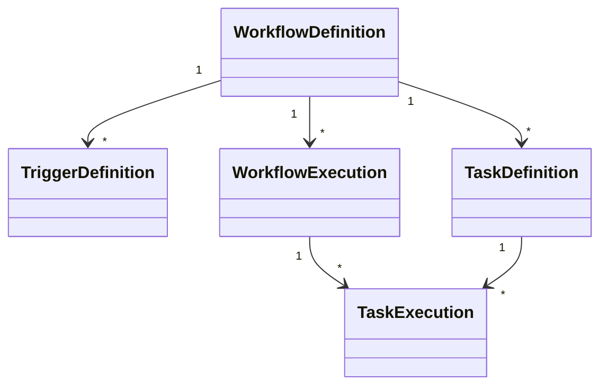

# Data Model

## Purpose

This document describes the conceptual data model of the Automation Platform.

The focus is on the relationships between business concepts rather than database implementation details.

Database schemas and ORM mappings are intentionally documented separately.

---

# Design Principles

The data model is designed around several principles.

- Separate immutable definitions from mutable execution state.
- Represent reusable workflow templates independently from runtime executions.
- Preserve complete execution history.
- Support multiple concurrent executions of the same workflow.
- Model execution independently from storage implementation.

---

# Conceptual Model



---

# Workflow Definition

A Workflow Definition describes a reusable automation.

It specifies:

- Trigger configuration
- Task definitions
- Workflow structure

Workflow Definitions are immutable once created.

A single Workflow Definition may produce many Workflow Executions.

---

# Trigger Definition

A Trigger Definition specifies how a workflow begins.

Examples include:

- Manual
- Scheduled
- Webhook
- File System

Trigger Definitions contain configuration only.

They contain no runtime state.

---

# Task Definition

A Task Definition describes an individual unit of work.

Examples include:

- HTTP Request
- Send Email
- Generate CSV
- Delay

Task Definitions specify:

- Task type
- Configuration
- Parameters

Task Definitions contain no execution state.

---

# Workflow Execution

A Workflow Execution represents one execution of a workflow.

Each execution tracks runtime information such as:

- Status
- Start time
- Finish time
- Progress
- Execution history

Multiple Workflow Executions may exist simultaneously for the same Workflow Definition.

---

# Task Execution

A Task Execution represents the runtime state of one task within a Workflow Execution.

Each Task Execution references its corresponding Task Definition.

Task Executions maintain execution-specific information such as:

- Status
- Runtime timestamps
- Retry information
- Runtime metadata

Task Executions never modify the underlying Task Definition.

---

# Definition vs Execution

The platform intentionally separates reusable definitions from runtime state.

| Definition | Execution |
|------------|-----------|
| Workflow Definition | Workflow Execution |
| Task Definition | Task Execution |
| Immutable | Mutable |
| Reused many times | Created for each run |

This separation preserves execution history while allowing workflows to be executed repeatedly.

---

# Ownership Relationships

The following ownership relationships exist.

```text
Workflow Definition

├── Trigger Definitions

└── Task Definitions
```

```text
Workflow Execution

└── Task Executions
```

Definitions describe what should happen.

Executions describe what is currently happening.

---

# Runtime State

Only execution objects maintain mutable runtime state.

Examples include:

- Current status
- Execution timestamps
- Retry information
- Failure information
- Progress

Definitions remain unchanged throughout execution.

---

# Future Evolution

The conceptual model intentionally supports future enhancements.

Potential future additions include:

- Workflow versioning
- Parallel execution
- DAG workflows
- Retry policies
- Execution metrics
- Audit history
- Workflow cancellation

These capabilities can be introduced while preserving the distinction between immutable definitions and mutable execution state.
