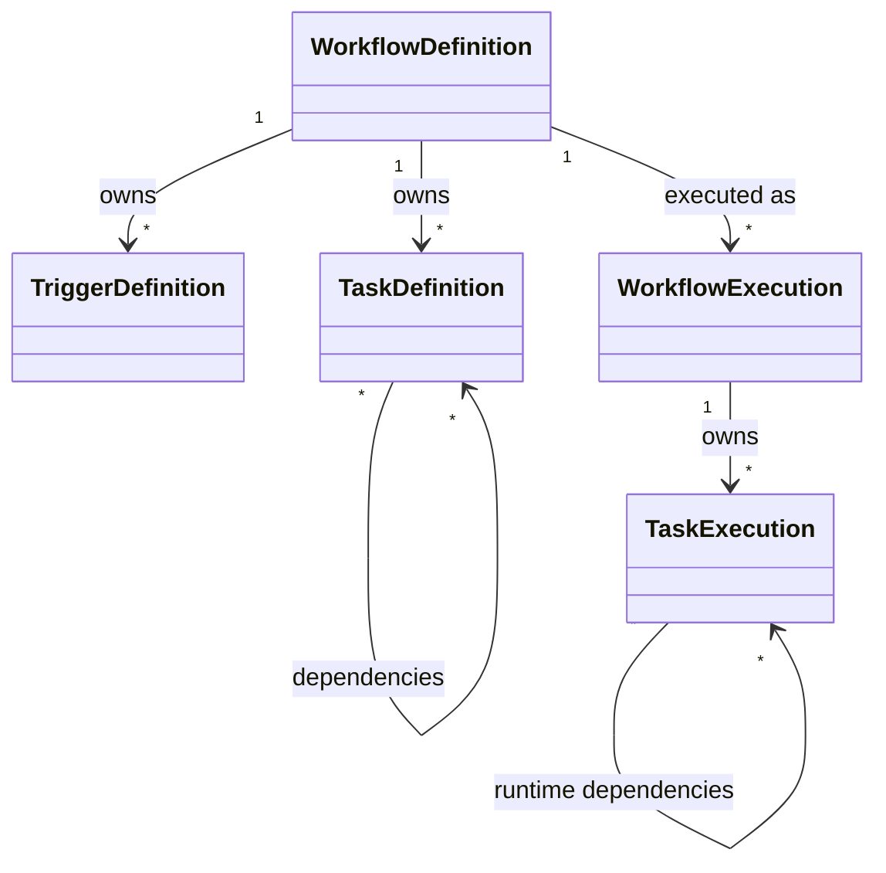

# Data Model

## Purpose

This document describes the conceptual relationships between the Automation Platform's core workflow concepts.

It sits between:

- [Domain Architecture](domain.md), which defines the business objects and their responsibilities.
- [Execution Model](execution-model.md), which explains how definitions become and progress through runtime executions.
- [Database Schema](persistence/database-schema.md), which describes their physical persistence representation.

The conceptual model is intentionally independent of database tables, ORM models, and mechanism-specific operational state.

---

# Conceptual Model


```mermaid
classDiagram

    class WorkflowDefinition
    class TriggerDefinition
    class TaskDefinition

    class WorkflowExecution
    class TaskExecution

    WorkflowDefinition "1" --> "*" TriggerDefinition : owns
    WorkflowDefinition "1" --> "*" TaskDefinition : owns
    WorkflowDefinition "1" --> "*" WorkflowExecution : executed as

    WorkflowExecution "1" --> "*" TaskExecution : owns

    TaskDefinition "*" --> "*" TaskDefinition : dependencies
    TaskExecution "*" --> "*" TaskExecution : runtime dependencies
```

The model separates two kinds of state:

```text
Definitions
    reusable workflow structure and configuration

Executions
    independent state for one workflow run
```

---

# Definitions

A `WorkflowDefinition` represents one reusable automation.

It owns:

```text
WorkflowDefinition
├── TriggerDefinitions
└── TaskDefinitions
```

A `TriggerDefinition` describes reusable configuration for a mechanism capable of starting the workflow.

A `TaskDefinition` describes one reusable unit of work, including its Task Plugin configuration, retry policy, and dependency relationships.

Task Definitions form the reusable workflow DAG:

```text
       A
      / \
     B   C
      \ /
       D
```

Definitions do not contain execution progress and may be reused by many independent executions.

A workflow may also be started explicitly through an Application capability without requiring a Trigger Definition.

---

# Executions

A `WorkflowExecution` represents one run of a `WorkflowDefinition`.

It owns the `TaskExecution` objects for that run:

```text
WorkflowExecution
└── TaskExecutions
```

A `TaskExecution` represents the execution-specific state of one Task Definition, including:

- Status.
- Execution timestamps.
- Retry state.
- Dependency state.
- Runtime task relationships.
- Output.

Multiple Workflow Executions may reference the same Workflow Definition concurrently without sharing mutable execution state.

---

# Definition-to-Execution Relationship

Starting a workflow compiles its reusable definition into independent execution state:

```text
WorkflowDefinition
        │
        │ compile
        ▼
WorkflowExecution
        │
        └── TaskExecutions
```

Each Task Definition produces a corresponding Task Execution.

Definition-level dependencies and execution policy required at runtime are snapshotted into execution-specific state, including information such as:

```text
remaining_dependencies
parent task execution IDs
child task execution IDs
retry state
```

This allows each Workflow Execution to progress independently from the reusable definition and from other executions.

The compilation and progression algorithm is documented in [Execution Model](execution-model.md).

---

# Definition vs. Execution

| Definitions                 | Executions                 |
| --------------------------- | -------------------------- |
| `WorkflowDefinition`        | `WorkflowExecution`        |
| `TaskDefinition`            | `TaskExecution`            |
| Reusable                    | Created for each run       |
| Configuration and structure | Runtime state              |
| No execution progress       | Mutable execution progress |
| Shared across executions    | Isolated to one execution  |

In short:

```text
Definitions
    describe what should happen

Executions
    describe what is happening or happened
```

---

# Operational State Outside the Core Model

Not every durable record is a core Domain concept.

Some mechanisms require infrastructure-specific operational state.

Chronological scheduling is one example:

```text
TriggerDefinition
    reusable trigger configuration

ChronologicalTriggerState
    durable scheduling progress
```

`ChronologicalTriggerState` tracks information such as:

```text
trigger_definition_id
next_run_at
```

but is intentionally not part of the core conceptual model.

The same principle applies to Queue entries and future mechanism-specific state.

This keeps infrastructure concerns from becoming Domain concepts merely because they are persisted.

---

# Persistence Independence

The conceptual model does not map one-to-one to database tables.

Persistence may introduce additional representations for:

- Normalized relationships.
- Efficient querying.
- Concurrency control.
- Scheduling state.
- Queue coordination.

These representations do not automatically become Domain concepts.

Likewise, the conceptual model does not expose SQLAlchemy or PostgreSQL details.

See [Persistence Architecture](persistence/README.md) and [Database Schema](persistence/database-schema.md) for the durable representation.

---

# Summary

The core model is:

```text
REUSABLE DEFINITIONS

WorkflowDefinition
├── TriggerDefinitions
└── TaskDefinitions
        │
        │ compiled
        ▼

INDEPENDENT EXECUTIONS

WorkflowExecution
└── TaskExecutions


SEPARATE OPERATIONAL STATE

ChronologicalTriggerState
Queue entries
future mechanism-specific state
```

The central distinction is:

> **Definitions describe reusable workflow structure, executions contain independent runtime state, and mechanism-specific operational state remains outside the core model.**
