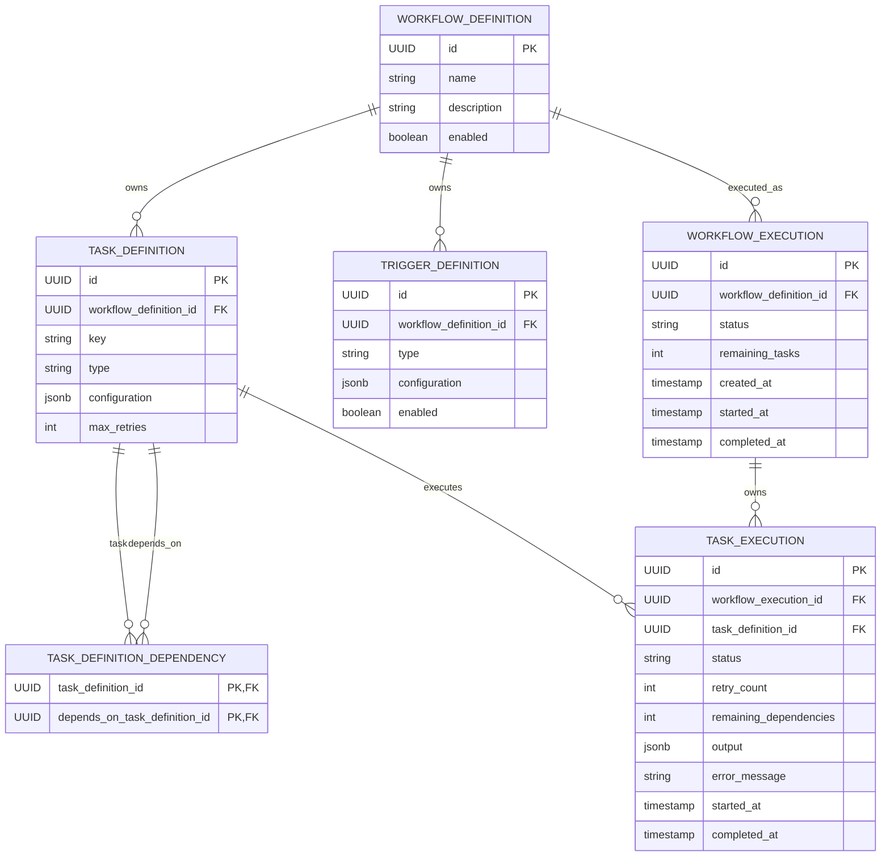

# Database Schema

## Purpose

The database stores the durable state of the Automation Platform.

Its schema persists the platform's domain model while remaining independent of business logic and runtime implementation details.

The database stores:

- Workflow definitions
- Task definitions
- Task dependencies
- Trigger definitions
- Workflow executions
- Task executions

The database intentionally does **not** persist transient runtime objects such as `TaskContext` or `TaskResult`.

---

# Design Principles

The schema follows several architectural principles.

- Aggregate ownership is represented using foreign keys.
- Workflow definitions and workflow executions are stored independently.
- Relationships are normalized.
- UUIDs are used for all entity identifiers.
- Plugin-defined configuration is stored using JSONB.
- Execution history remains immutable once created.

---

# Entity Relationship Diagram



---

# Table Specifications

---

## Workflow Definition

Represents a reusable workflow.

| Column | Description |
|---------|-------------|
| id | Unique workflow identifier. |
| name | User-visible workflow name. |
| description | Optional workflow description. |
| enabled | Whether new executions may be started. |

### Relationships

Owns:

- Task Definitions
- Trigger Definitions

Referenced by:

- Workflow Executions

### Primary Key

- id

---

## Task Definition

Represents one reusable task within a workflow.

| Column | Description |
|---------|-------------|
| id | Unique task identifier. |
| workflow_definition_id | Owning workflow definition. |
| key | Workflow-local task key. |
| type | Registered task plugin type. |
| configuration | Plugin configuration (JSONB). |
| max_retries | Maximum retry attempts. |

### Primary Key

- id

### Foreign Keys

- workflow_definition_id → WorkflowDefinition.id

### Unique Constraints

```text
UNIQUE (
    workflow_definition_id,
    key
)
```

---

## Task Definition Dependency

Represents one dependency edge in the workflow graph.

| Column | Description |
|---------|-------------|
| task_definition_id | Task that owns the dependency. |
| depends_on_task_definition_id | Task that must complete first. |

### Primary Key

```text
(
    task_definition_id,
    depends_on_task_definition_id
)
```

### Foreign Keys

- task_definition_id → TaskDefinition.id
- depends_on_task_definition_id → TaskDefinition.id

---

## Trigger Definition

Represents one trigger capable of starting a workflow.

| Column | Description |
|---------|-------------|
| id | Unique trigger identifier. |
| workflow_definition_id | Owning workflow definition. |
| type | Registered trigger plugin type. |
| configuration | Plugin configuration (JSONB). |
| enabled | Whether this trigger is active. |

### Primary Key

- id

### Foreign Keys

- workflow_definition_id → WorkflowDefinition.id

---

## Workflow Execution

Represents one execution of a workflow definition.

| Column | Description |
|---------|-------------|
| id | Unique workflow execution identifier. |
| workflow_definition_id | Workflow definition being executed. |
| status | Current workflow status. |
| remaining_tasks | Number of unfinished tasks. |
| created_at | Execution creation time. |
| started_at | Time execution began. |
| completed_at | Time execution completed. |

### Primary Key

- id

### Foreign Keys

- workflow_definition_id → WorkflowDefinition.id

---

## Task Execution

Represents one execution of a task definition.

| Column | Description |
|---------|-------------|
| id | Unique task execution identifier. |
| workflow_execution_id | Owning workflow execution. |
| task_definition_id | Task definition being executed. |
| status | Current task status. |
| retry_count | Current retry count. |
| remaining_dependencies | Number of unfinished parent tasks. |
| output | Task output (JSONB). |
| error_message | Failure information, if any. |
| started_at | Time execution began. |
| completed_at | Time execution completed. |

### Primary Key

- id

### Foreign Keys

- workflow_execution_id → WorkflowExecution.id
- task_definition_id → TaskDefinition.id

---

# Explicit Indexes

Primary keys and unique constraints automatically create indexes.

Additional indexes are defined for:

- task_definition.workflow_definition_id
- trigger_definition.workflow_definition_id
- workflow_execution.workflow_definition_id
- task_execution.workflow_execution_id
- task_execution.task_definition_id

Additional indexes may be introduced as query patterns evolve.

---

# Cascade Rules

Workflow Definition owns:

- Task Definitions
- Trigger Definitions

Deleting a workflow definition cascades to:

- Task Definitions
- Trigger Definitions
- Task Definition Dependency rows

Workflow Executions remain independent and preserve execution history.

---

# JSONB Usage

Plugin-defined data is intentionally stored using JSONB.

Current JSONB columns:

- TaskDefinition.configuration
- TriggerDefinition.configuration
- TaskExecution.output

Persistence stores these values without interpreting their structure.

---

# Runtime Objects

The following domain objects are intentionally not persisted:

- TaskContext
- TaskResult

The Application Layer reconstructs these objects from persisted workflow state during execution.

---

# Design Decisions

## Workflow Structure

Workflow structure exists only within workflow definitions.

Task executions never duplicate dependency relationships.

Execution relationships are reconstructed from:

- Workflow Definition
- Task Definition Dependency
- Task Execution

---

## Dependency Representation

Task dependencies are stored using a normalized relationship table rather than UUID arrays.

Benefits include:

- Referential integrity
- Proper foreign keys
- Normalized graph representation
- Efficient graph traversal

---

## Trigger Ownership

Trigger definitions belong exclusively to one workflow definition.

Workflows with identical schedules maintain independent trigger definitions.

---

## Execution Immutability

Workflow executions permanently reference the workflow definition from which they were created.

Execution history is never rewritten.

---

# Future Evolution

Potential future enhancements include:

- Workflow versioning
- Workflow archival
- Soft deletes
- Auditing
- Optimistic locking
- Read replicas
- Additional indexes
