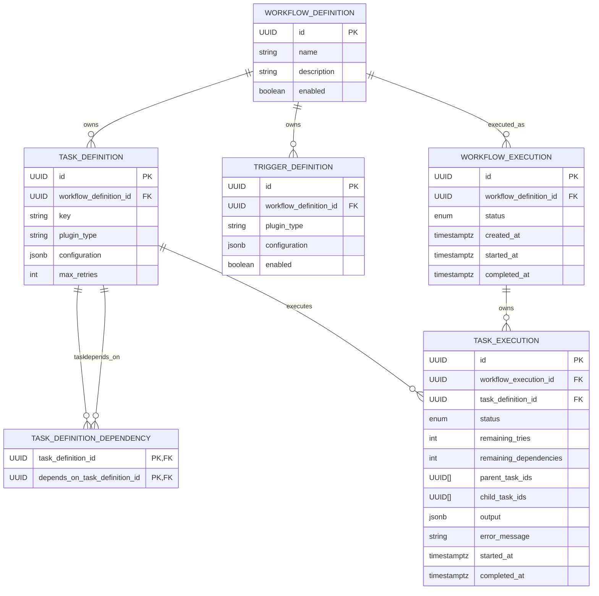

# Database Schema

## Purpose

The database stores the durable state of the Automation Platform.

Its schema persists the platform's domain model while remaining independent of business logic and runtime implementation details.

The database stores:

- Workflow definitions
- Task definitions
- Task dependencies
- Trigger definitions
- Workflow executions
- Task executions

The database intentionally does **not** persist transient runtime objects such as `TaskContext`.

---

# Design Principles

The schema follows several architectural principles.

- Aggregate ownership is represented using foreign keys.
- Workflow definitions and workflow executions are stored independently.
- Relationships are normalized.
- UUIDs are used for all entity identifiers.
- PostgreSQL-native types are used where appropriate.
- Plugin-defined configuration is stored using JSONB.
- Runtime scheduling metadata is cached within task executions.
- Execution history remains immutable once created.

---

# Entity Relationship Diagram


```mermaid
erDiagram

    WORKFLOW_DEFINITION {

        UUID id PK
        string name
        string description
        boolean enabled
    }

    TASK_DEFINITION {

        UUID id PK
        UUID workflow_definition_id FK
        string key
        string plugin_type
        jsonb configuration
        int max_retries
    }

    TASK_DEFINITION_DEPENDENCY {

        UUID task_definition_id PK,FK
        UUID depends_on_task_definition_id PK,FK
    }

    TRIGGER_DEFINITION {

        UUID id PK
        UUID workflow_definition_id FK
        string plugin_type
        jsonb configuration
        boolean enabled
    }

    WORKFLOW_EXECUTION {

        UUID id PK
        UUID workflow_definition_id FK
        enum status
        timestamptz created_at
        timestamptz started_at
        timestamptz completed_at
    }

    TASK_EXECUTION {

        UUID id PK
        UUID workflow_execution_id FK
        UUID task_definition_id FK
        enum status
        int remaining_tries
        int remaining_dependencies
        UUID[] parent_task_ids
        UUID[] child_task_ids
        jsonb output
        string error_message
        timestamptz started_at
        timestamptz completed_at
    }

    WORKFLOW_DEFINITION ||--o{ TASK_DEFINITION : owns

    WORKFLOW_DEFINITION ||--o{ TRIGGER_DEFINITION : owns

    TASK_DEFINITION ||--o{ TASK_DEFINITION_DEPENDENCY : task

    TASK_DEFINITION ||--o{ TASK_DEFINITION_DEPENDENCY : depends_on

    WORKFLOW_DEFINITION ||--o{ WORKFLOW_EXECUTION : executed_as

    WORKFLOW_EXECUTION ||--o{ TASK_EXECUTION : owns

    TASK_DEFINITION ||--o{ TASK_EXECUTION : executes
```

---

# Table Specifications

## Workflow Definition

Represents a reusable workflow.

| Column | Description |
|---------|-------------|
| id | Unique workflow identifier. |
| name | User-visible workflow name. |
| description | Optional workflow description. |
| enabled | Whether new executions may be started. |

### Relationships

Owns:

- Task Definitions
- Trigger Definitions

Referenced by:

- Workflow Executions

### Primary Key

- id

---

## Task Definition

Represents one reusable task within a workflow.

| Column | Description |
|---------|-------------|
| id | Unique task identifier. |
| workflow_definition_id | Owning workflow definition. |
| key | Workflow-local task key. |
| plugin_type | Registered task plugin type. |
| configuration | Plugin configuration (JSONB). |
| max_retries | Maximum retry attempts. |

### Primary Key

- id

### Foreign Keys

- workflow_definition_id → WorkflowDefinition.id

### Unique Constraints

```text
UNIQUE (
    workflow_definition_id,
    key
)
```

---

## Task Definition Dependency

Represents one dependency edge in the workflow graph.

| Column | Description |
|---------|-------------|
| task_definition_id | Task that owns the dependency. |
| depends_on_task_definition_id | Task that must complete first. |

### Primary Key

```text
(
    task_definition_id,
    depends_on_task_definition_id
)
```

### Foreign Keys

- task_definition_id → TaskDefinition.id
- depends_on_task_definition_id → TaskDefinition.id

---

## Trigger Definition

Represents one trigger capable of starting a workflow.

| Column | Description |
|---------|-------------|
| id | Unique trigger identifier. |
| workflow_definition_id | Owning workflow definition. |
| plugin_type | Registered trigger plugin type. |
| configuration | Plugin configuration (JSONB). |
| enabled | Whether this trigger is active. |

### Primary Key

- id

### Foreign Keys

- workflow_definition_id → WorkflowDefinition.id

---

## Workflow Execution

Represents one execution of a workflow definition.

| Column | Description |
|---------|-------------|
| id | Unique workflow execution identifier. |
| workflow_definition_id | Workflow definition being executed. |
| status | Current workflow status. |
| created_at | Time the execution was created. |
| started_at | Time the workflow began executing. |
| completed_at | Time the workflow finished. |

### Primary Key

- id

### Foreign Keys

- workflow_definition_id → WorkflowDefinition.id

---

## Task Execution

Represents one execution of a task definition.

| Column | Description |
|---------|-------------|
| id | Unique task execution identifier. |
| workflow_execution_id | Owning workflow execution. |
| task_definition_id | Task definition being executed. |
| status | Current execution state. |
| remaining_tries | Number of retry attempts remaining. |
| remaining_dependencies | Number of unfinished parent tasks. |
| parent_task_ids | Cached identifiers of parent task executions. |
| child_task_ids | Cached identifiers of child task executions. |
| output | Serialized task output (JSONB). |
| error_message | Failure information, if any. |
| started_at | Time task execution began. |
| completed_at | Time task execution finished. |

### Primary Key

- id

### Foreign Keys

- workflow_execution_id → WorkflowExecution.id
- task_definition_id → TaskDefinition.id

---

# Explicit Indexes

Primary keys and unique constraints automatically create indexes.

Additional indexes exist for:

- task_definition.workflow_definition_id
- trigger_definition.workflow_definition_id
- workflow_execution.workflow_definition_id
- task_execution.workflow_execution_id
- task_execution.task_definition_id
- task_execution.status

Additional indexes may be introduced as query patterns evolve.

---

# Cascade Rules

Workflow Definition owns:

- Task Definitions
- Trigger Definitions
- Dependency rows

Deleting a workflow definition cascades to:

- Task Definitions
- Trigger Definitions
- Task Definition Dependency rows

Workflow executions remain historical records.

Deleting a workflow definition does **not** delete existing workflow executions or task executions.

---

# PostgreSQL Usage

The persistence layer intentionally targets PostgreSQL.

Current PostgreSQL-specific types include:

- UUID
- UUID[]
- JSONB

These provide stronger typing and efficient storage than portable SQL alternatives.

---

# JSONB Usage

Plugin-defined data is intentionally stored without interpretation.

Current JSONB columns include:

- TaskDefinition.configuration
- TriggerDefinition.configuration
- TaskExecution.output

The Persistence Layer serializes and deserializes these values but never interprets their structure.

---

# Runtime Objects

The following runtime objects are intentionally not persisted:

- TaskContext

The Application Layer reconstructs runtime execution state from persisted workflow and task executions.

---

# Design Decisions

## Workflow Structure

Workflow definitions define the workflow graph.

When a workflow execution is created, scheduling metadata required during execution is copied into each task execution.

This includes:

- parent task execution identifiers
- child task execution identifiers
- remaining dependency count
- remaining retry count

This avoids repeatedly traversing workflow definitions during execution.

---

## Dependency Representation

Workflow definitions store dependencies in a normalized relationship table.

Workflow executions cache dependency information directly inside task executions.

This separates immutable workflow structure from runtime scheduling state.

---

## Workflow Completion

Workflow executions do not store a remaining task counter.

Completion is determined by checking whether any task executions remain incomplete.

This avoids synchronization issues while allowing completion to be computed atomically.

---

## Trigger Ownership

Trigger definitions belong exclusively to a single workflow definition.

Workflows with identical schedules maintain independent trigger definitions.

---

## Execution Immutability

Workflow executions permanently reference the workflow definition from which they were created.

Execution history is never rewritten.

Only execution state changes over time.

---

# Future Evolution

Potential future enhancements include:

- workflow versioning
- workflow archival
- soft deletes
- auditing
- optimistic locking
- additional indexes
- partitioned execution history
- read replicas
- execution query optimization
