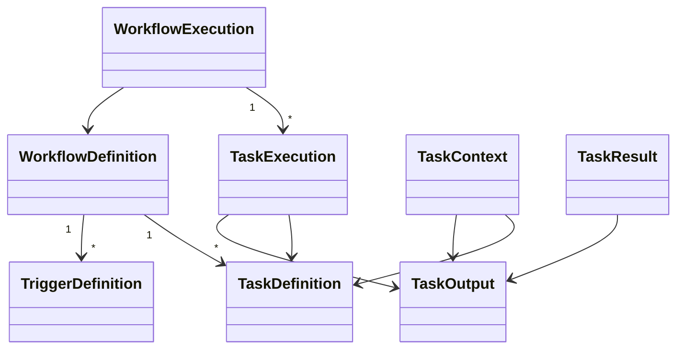

# Domain Architecture

## Purpose

The Domain Layer defines the core business concepts used throughout the Automation Platform.

It represents **what** the platform manages rather than **how** those concepts are stored, executed, or exposed through external interfaces.

The Domain Layer is intentionally independent of infrastructure concerns such as databases, queues, HTTP APIs, and plugin implementations.

---

# Responsibilities

The Domain Layer is responsible for:

- Representing workflow definitions
- Representing workflow executions
- Representing task definitions
- Representing task executions
- Representing trigger definitions
- Representing task execution context
- Representing task execution results
- Representing task outputs
- Defining shared domain concepts
- Encapsulating lightweight domain behavior

The Domain Layer is **not** responsible for:

- Business orchestration
- Database persistence
- Queue management
- Trigger evaluation
- Task execution
- HTTP communication

---

# Design Principles

The Domain Layer follows several guiding principles.

- Model business concepts rather than implementation details.
- Remain independent of infrastructure.
- Keep domain objects simple and expressive.
- Separate reusable definitions from runtime state.
- Separate persisted business entities from transient execution objects.
- Allow lightweight domain behavior while avoiding orchestration.
- Prefer composition over inheritance.

---

# High-Level Model



The platform distinguishes between reusable workflow definitions and their runtime executions.

Definitions describe **what should happen**.

Executions describe **what is currently happening**.

Execution support objects model communication between the Application Layer and task plugins.

---

# Core Domain Objects

## WorkflowDefinition

Represents a reusable automation workflow.

Owns:

- Task definitions
- Trigger definitions
- Metadata

Workflow definitions are immutable during execution and may be executed many times.

---

## TaskDefinition

Represents a reusable description of a workflow task.

Task definitions describe:

- Task key
- Plugin type
- Configuration
- Dependencies
- Retry policy

Task definitions contain no runtime state.

The task key uniquely identifies a task within a workflow and is used by downstream tasks when accessing parent outputs.

---

## TriggerDefinition

Represents reusable trigger configuration.

Trigger definitions describe when workflows should begin execution.

They do not perform trigger evaluation themselves.

---

## WorkflowExecution

Represents one runtime instance of a workflow definition.

Workflow executions own:

- Overall execution status
- Runtime timestamps
- Task executions
- Runtime metadata

Each execution progresses independently.

---

## TaskExecution

Represents the runtime state of a single task.

Task executions track:

- Current status
- Remaining dependencies
- Retry count
- Execution timestamps
- Task output

Task executions reference their corresponding TaskDefinition.

---

# Execution Support Objects

Execution support objects exist only while work is actively being processed.

They are not long-lived business entities.

## TaskContext

TaskContext represents all information required by a task plugin.

It contains:

- Task configuration
- Parent task outputs

Application services construct TaskContext immediately before plugin execution.

---

## TaskResult

TaskResult represents the outcome of task execution.

It contains:

- Terminal task status
- Task output
- Optional execution message

TaskResult exists only long enough for the Application Layer to update execution state.

---

## TaskOutput

TaskOutput represents plugin-defined output produced by a completed task.

Outputs are persisted as part of TaskExecution and supplied to downstream tasks through TaskContext.

The internal structure of TaskOutput is intentionally plugin-defined.

---

# Definitions vs Executions

| Definition | Execution |
|------------|-----------|
| WorkflowDefinition | WorkflowExecution |
| TaskDefinition | TaskExecution |
| TriggerDefinition | *(No execution object)* |

Definitions describe reusable automation templates.

Executions represent individual runtime instances.

Execution support objects exist only during task processing.

---

# Domain Behavior

Domain objects may contain lightweight behavior derived entirely from their own state.

Examples include:

- `is_finished()`
- `is_runnable()`
- `can_retry()`

Domain objects do **not**:

- Execute tasks
- Schedule workflows
- Persist themselves
- Communicate with queues
- Invoke plugins

Those responsibilities belong to the Application Layer.

---

# Relationships

Workflow definitions own task definitions and trigger definitions.

Workflow executions own task executions.

Task executions reference the task definition from which they were created.

TaskContext combines immutable task configuration with outputs produced by parent task executions.

TaskResult becomes persisted execution state after plugin execution completes.

---

# Shared Domain Concepts

Shared concepts include:

- WorkflowStatus
- TaskStatus

These shared enumerations provide a consistent language across the Application and Persistence layers.

---

# Package Organization

```text
domain/
│
├── common/
│   ├── enums.py
│   └── identifiers.py
│
├── execution_runtime/
│   ├── task_context.py
│   ├── task_result.py
│   └── task_output.py
│
├── workflow_definitions/
│   ├── workflow_definition.py
│   ├── task_definition.py
│   └── trigger_definition.py
│
└── workflow_executions/
    ├── workflow_execution.py
    └── task_execution.py
```

Each package owns a cohesive portion of the business model.

---

# Interaction with Other Layers

The Domain Layer sits at the center of the architecture.

```text
                Runtime
                    │
                    ▼
             Application
          ↙     ↓      ↘
Persistence Queue Plugins
          \      |      /
               Domain
```

Application services coordinate business operations using domain objects.

Persistence reconstructs and stores persisted domain objects.

Task plugins consume TaskContext and produce TaskResult.

Infrastructure layers depend on the domain, but the domain depends on no infrastructure.

---

# Future Evolution

Potential future additions include:

- Workflow versioning
- Richer retry policies
- Task groups
- Conditional execution
- Execution metadata
- Workflow variables

These additions can extend the domain model without changing the overall architectural boundaries.
