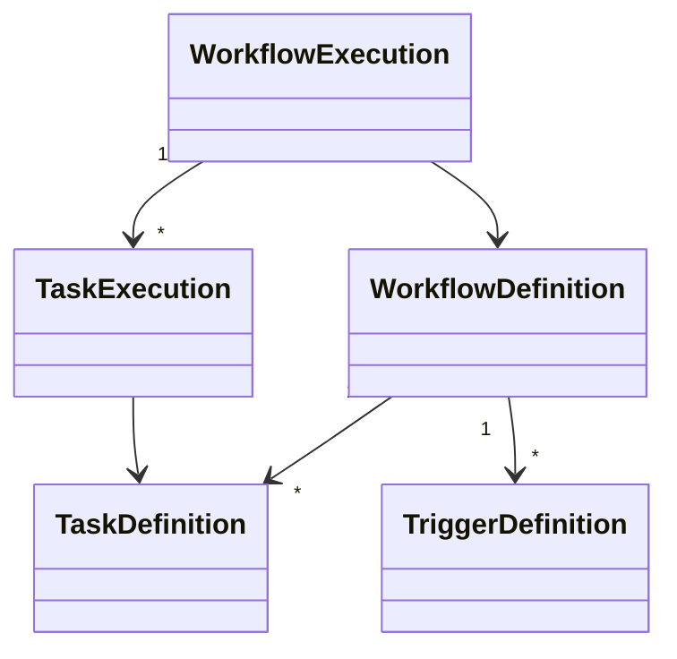

# Domain Architecture

## Purpose

The Domain Layer defines the core business concepts used throughout the Automation Platform.

It represents **what** the platform manages rather than **how** those concepts are stored, executed, or exposed through external interfaces.

The Domain Layer is intentionally independent of infrastructure concerns such as databases, queues, HTTP APIs, and task implementations.

---

# Responsibilities

The Domain Layer is responsible for:

- Representing workflow definitions
- Representing workflow executions
- Representing task definitions
- Representing task executions
- Representing trigger definitions
- Defining shared domain concepts
- Encapsulating lightweight domain behavior

The Domain Layer is **not** responsible for:

- Business orchestration
- Database persistence
- Queue management
- Trigger evaluation
- Task execution
- HTTP communication

---

# Design Principles

The Domain Layer follows several guiding principles.

- Model business concepts rather than implementation details.
- Remain independent of infrastructure.
- Keep domain objects simple and expressive.
- Separate reusable definitions from runtime state.
- Allow lightweight domain behavior while avoiding orchestration.
- Prefer composition over inheritance.

---

# High-Level Model



The platform distinguishes between reusable workflow definitions and their runtime executions.

Definitions describe **what should happen**.

Executions describe **what is currently happening**.

---

# Core Domain Objects

## WorkflowDefinition

Represents a reusable automation workflow.

Owns:

- Task definitions
- Trigger definitions
- Metadata

Workflow definitions are immutable during execution and may be executed many times.

---

## TaskDefinition

Represents a reusable description of a workflow task.

Task definitions describe:

- Task implementation type
- Configuration
- Dependencies
- Retry policy

Task definitions contain no runtime state.

---

## TriggerDefinition

Represents a reusable trigger configuration.

Trigger definitions describe when workflows should begin execution.

They do not perform trigger evaluation themselves.

---

## WorkflowExecution

Represents one runtime instance of a workflow definition.

Workflow executions own:

- Overall execution status
- Runtime timestamps
- Task executions
- Runtime metadata

Each execution progresses independently.

---

## TaskExecution

Represents the runtime state of a single task.

Task executions track:

- Current status
- Remaining dependencies
- Retry count
- Execution timestamps
- Result information

Task executions reference their corresponding TaskDefinition.

---

# Definitions vs Executions

The Domain Layer intentionally separates reusable definitions from runtime state.

| Definition | Execution |
|------------|-----------|
| WorkflowDefinition | WorkflowExecution |
| TaskDefinition | TaskExecution |
| TriggerDefinition | *(No execution object)* |

Definitions describe reusable automation templates.

Executions represent individual runtime instances.

---

# Domain Behavior

Domain objects may contain lightweight behavior derived entirely from their own state.

Examples include:

- `is_finished()`
- `is_runnable()`
- `can_retry()`

Domain objects do **not**:

- Execute tasks
- Schedule workflows
- Persist themselves
- Communicate with queues
- Invoke plugins

Those responsibilities belong to the Application Layer.

---

# Relationships

Workflow definitions own task definitions and trigger definitions.

Workflow executions own task executions.

Task executions reference the task definition from which they were created.

This separation allows:

- Multiple concurrent executions
- Complete execution history
- Immutable workflow definitions
- Future workflow versioning

---

# Shared Domain Concepts

Shared concepts used throughout the domain include:

- WorkflowStatus
- TaskStatus

These shared enumerations provide a consistent language across the Application and Persistence layers.

---

# Package Organization

```text
domain/
│
├── common/
│   └── enums.py
│
├── workflow_definitions/
│   ├── workflow_definition.py
│   ├── task_definition.py
│   └── trigger_definition.py
│
└── workflow_executions/
    ├── workflow_execution.py
    └── task_execution.py
```

Each package owns a cohesive portion of the business model.

---

# Interaction with Other Layers

The Domain Layer sits at the center of the architecture.

```text
                Runtime
                    │
                    ▼
             Application
            ↙           ↘
      Persistence      Queue
                    │
                    ▼
                 Domain
```

Application services coordinate business operations using domain objects.

Persistence reconstructs and stores domain objects.

Infrastructure layers depend on the domain, but the domain depends on no infrastructure.

---

# Future Evolution

The Domain Layer is intentionally designed to evolve without affecting higher architectural layers.

Potential future additions include:

- Workflow versioning
- Richer retry policies
- Task groups
- Conditional execution
- Execution metadata
- Workflow variables

These additions can extend the domain model without changing the overall architectural boundaries.
