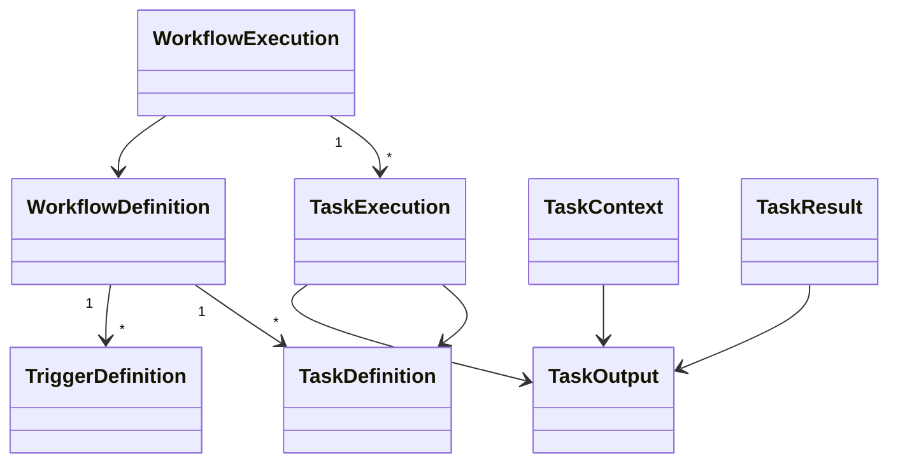

# Domain Architecture

## Purpose

The Domain Layer defines the core business concepts of the Automation Platform.

It represents **what the platform manages**, not how those concepts are persisted, scheduled, executed, queued, or exposed externally.

The Domain is independent of PostgreSQL, SQLAlchemy, execution queues, HTTP APIs, runtime processes, plugin discovery, and trigger hosting mechanisms.

> **The Domain models business concepts and state without depending on the infrastructure that operates them.**

## Responsibilities

The Domain represents:

- Workflow, Task, and Trigger Definitions.
- Workflow and Task Executions.
- Task execution context and results.
- Task outputs.
- Shared statuses and identifiers.
- Lightweight behavior derived entirely from Domain state.

It does **not** own:

- Application orchestration or transaction management.
- Persistence or database behavior.
- Queue management, claims, leases, or heartbeats.
- Task or trigger plugin execution and resolution.
- Trigger scheduling or mechanism hosting.
- Runtime process behavior.
- HTTP communication.

Those responsibilities belong to the surrounding architectural layers.

## Design Principles

- Model business concepts rather than implementation details.
- Remain independent of infrastructure.
- Keep Domain objects simple and expressive.
- Separate reusable definitions from mutable execution state.
- Separate persisted business entities from transient execution objects.
- Do not mirror the persistence model one-to-one.
- Keep orchestration outside the Domain.
- Allow lightweight, deterministic behavior derived from local state.
- Prefer composition over inheritance where appropriate.

## Domain Model


```mermaid
classDiagram

    WorkflowDefinition "1" --> "*" TaskDefinition
    WorkflowDefinition "1" --> "*" TriggerDefinition

    WorkflowExecution "1" --> "*" TaskExecution

    WorkflowExecution --> WorkflowDefinition
    TaskExecution --> TaskDefinition

    TaskContext --> TaskOutput
    TaskResult --> TaskOutput
    TaskExecution --> TaskOutput
```

The model distinguishes three broad categories:

```text
Reusable Definitions
    what should happen

Runtime Executions
    what is happening or happened during one run

Execution Support Objects
    information exchanged while task work is processed
```

## Reusable Definitions

Definitions describe reusable automation configuration. They contain no mutable execution state and may participate in many independent executions.

### WorkflowDefinition

`WorkflowDefinition` represents a reusable automation workflow.

It owns:

- Task Definitions.
- Trigger Definitions.
- Workflow metadata.
- Enabled state.

A Workflow Definition may be executed many times. Executing it does not mutate the reusable definition.

### TaskDefinition

`TaskDefinition` describes one reusable unit of work within a workflow.

It defines:

- Task key.
- Plugin type.
- Configuration.
- Dependencies.
- Retry configuration.

Task Definitions contain no runtime execution state.

The task key uniquely identifies a task within its Workflow Definition. It allows dependencies and downstream task inputs to be expressed independently of runtime Task Execution identifiers.

### TriggerDefinition

`TriggerDefinition` represents reusable trigger configuration associated with a workflow.

Conceptually:

```text
TriggerDefinition
├── id
├── plugin_type
├── configuration
└── enabled
```

It identifies the configured trigger plugin and stores the configuration required by that plugin.

It does **not** contain mechanism-specific runtime state. For example:

```text
next_run_at
```

belongs to chronological scheduling infrastructure rather than `TriggerDefinition`.

The Domain also does not persist a trigger-mechanism category such as:

```text
CHRONOLOGICAL
WEBHOOK
FILESYSTEM
```

Trigger mechanisms are represented by Plugin Layer interfaces rather than Domain data. `TriggerDefinition` therefore remains generic regardless of how a trigger is hosted.

## Runtime Executions

Executions are individual runtime instances of reusable definitions. Each owns mutable state and progresses independently from other executions of the same definition.

### WorkflowExecution

`WorkflowExecution` represents one execution of a Workflow Definition.

It owns:

- Execution status.
- Runtime timestamps.
- Task Executions.
- Execution-specific state.

Multiple Workflow Executions may exist simultaneously for the same Workflow Definition. Each progresses independently without modifying its reusable definition.

### TaskExecution

`TaskExecution` represents the runtime state of one task within a Workflow Execution.

It tracks information such as:

- Current status.
- Remaining dependency count.
- Retry state.
- Execution timestamps.
- Task output.

A Task Execution corresponds to the Task Definition from which it was created while maintaining independent runtime state.

## Compiling Definitions into Executions

When a workflow starts, its reusable definition is compiled into execution-specific state.

```text
WorkflowDefinition
│
├── TaskDefinition A
├── TaskDefinition B
└── TaskDefinition C

        │
        │ workflow start
        ▼

WorkflowExecution
│
├── TaskExecution A
├── TaskExecution B
└── TaskExecution C
```

Definition-level dependencies are translated into execution-level dependency state, giving each Workflow Execution its own runtime task graph.

This allows:

- Multiple executions of the same definition to run concurrently.
- Dependency state to evolve independently for each execution.
- Retry state to remain execution-specific.
- Complete execution history to be preserved.
- Reusable definitions to remain unchanged.

Application coordinates this compilation. The Domain represents the resulting objects and relationships.

The distinction is fundamental:

| Definition              | Runtime Execution                   |
| ----------------------- | ----------------------------------- |
| `WorkflowDefinition`    | `WorkflowExecution`                 |
| `TaskDefinition`        | `TaskExecution`                     |
| `TriggerDefinition`     | No generic trigger execution object |
| Reusable                | Created for an individual run       |
| Configuration           | Runtime state                       |
| Stable during execution | Mutable during execution            |

Definitions answer:

> **What should happen?**

Executions answer:

> **What is happening, or what happened, during this run?**

Trigger runtime state is handled separately according to the needs of each trigger mechanism.

## Execution Support Objects

Some Domain objects exist only while task work is actively being processed. They are not long-lived business entities.

### TaskContext

`TaskContext` contains the task-specific information supplied to a task plugin when it executes, including:

- Task configuration.
- Outputs produced by parent tasks.

Application constructs it immediately before invoking the plugin.

This gives plugins the information they require without exposing Persistence, queues, or Application services.

### TaskResult

`TaskResult` communicates a task plugin's execution result back to Application.

It may contain:

- Task outcome or status.
- Task output.
- Optional execution message.

`TaskResult` is transient. Application interprets it and coordinates the appropriate durable Task Execution transition.

### TaskOutput

`TaskOutput` represents plugin-defined output produced by a completed task.

Outputs may be persisted as Task Execution state and supplied to dependent tasks through `TaskContext`.

Their internal structure remains flexible so plugins can produce different data without requiring the core workflow model to understand every output schema.

## Domain vs. Persistence State

The Domain intentionally does not mirror the database schema one-to-one.

Some durable state exists to support Application or infrastructure mechanisms without representing a core business entity.

Chronological scheduling is the current example:

```text
ChronologicalTriggerState
├── trigger_definition_id
└── next_run_at
```

This state allows Scheduler processes to coordinate chronological occurrences durably, but it is not a Domain object.

Instead:

```text
TriggerDefinition
    = reusable business configuration

ChronologicalTriggerState
    = persistence state required to host
      the chronological mechanism
```

> **A database table does not automatically imply a corresponding Domain model.**

Infrastructure-specific state should enter the Domain only when it represents a genuine business concept, not merely because it requires durable storage.

## Trigger Boundary

The Domain represents reusable trigger configuration through `TriggerDefinition`; it does not define trigger behavior.

Trigger behavior and mechanism interfaces belong to Plugins:

```text
Trigger
└── ChronologicalTrigger
    └── IntervalTrigger
```

Likewise:

```text
ChronologicalTrigger.next_occurrence(...)
```

is a Plugin contract, not Domain behavior.

The responsibilities are:

```text
Domain
    TriggerDefinition
    reusable trigger configuration

Plugins
    trigger-specific behavior
    mechanism interfaces

Application
    mechanism-specific orchestration

Persistence
    mechanism-specific durable state

Runtime
    drives the appropriate Application capability
```

This separation allows new trigger mechanisms to introduce their own behavior and infrastructure without expanding `TriggerDefinition` into a generic container for mechanism-specific runtime state.

## Domain Behavior

Domain objects may contain lightweight behavior that can be determined entirely from their own state.

Examples may include:

```text
is_finished()
is_runnable()
can_retry()
```

where appropriate to the model.

Such behavior should remain:

- Local.
- Deterministic.
- Infrastructure-independent.

Domain objects do **not** open transactions, query repositories, resolve or execute plugins, calculate trigger schedules, start workflows, publish queue work, manage queue claims, or communicate with runtime processes.

Those behaviors require coordination between components and belong to Application or the appropriate infrastructure layer.

## Ownership

The principal Domain ownership relationships are:

```text
WorkflowDefinition
│
├── TaskDefinitions
└── TriggerDefinitions
```

and:

```text
WorkflowExecution
│
└── TaskExecutions
```

Definitions describe reusable automation structure.

Executions contain mutable state for a particular run.

Task Execution state is derived from its corresponding Task Definition when the workflow starts. Trigger runtime infrastructure may reference a Trigger Definition without becoming part of the Domain model.

## Shared Domain Concepts

Shared concepts provide consistent vocabulary across architectural layers.

Examples include:

- `WorkflowStatus`.
- `TaskStatus`.
- Domain identifiers.

Application and Persistence may consume these concepts while the concepts themselves remain independent of those implementations.

## Package Organization

```text
domain/
│
├── common/
│   ├── enums.py
│   └── identifiers.py
│
├── execution_runtime/
│   ├── task_context.py
│   ├── task_result.py
│   └── task_output.py
│
├── workflow_definitions/
│   ├── workflow_definition.py
│   ├── task_definition.py
│   └── trigger_definition.py
│
└── workflow_executions/
    ├── workflow_execution.py
    └── task_execution.py
```

Each package owns a cohesive portion of the business model.

The package structure should evolve only when additional Domain complexity creates a meaningful reason to split it further.

## Architectural Relationships

The Domain sits at the center of the architecture:

```text
                    Runtime
                      │
                      ▼
                  Application
               ↙      ↓       ↘
       Persistence   Queue   Plugins
               \      |       /
                    Domain
```

Application coordinates business operations using Domain concepts.

Persistence reconstructs and stores persisted Domain entities where appropriate.

Task plugins consume execution context and return execution results.

Trigger plugins consume trigger configuration and provide trigger-specific behavior while remaining independent of Persistence and workflow orchestration.

Infrastructure may depend on Domain concepts. **The Domain does not depend on infrastructure.**

The overall responsibility boundary is:

| Layer               | Responsibility                                                                                      |
| ------------------- | --------------------------------------------------------------------------------------------------- |
| **Domain**          | Business concepts, execution state, lightweight local behavior                                      |
| **Application**     | Business orchestration, transaction boundaries, workflow compilation, state-transition coordination |
| **Persistence**     | Durable storage, ORM models, database concurrency, mechanism-specific durable state                 |
| **Plugins**         | Task/trigger-specific behavior and trigger mechanism interfaces                                     |
| **Execution Queue** | Work delivery, claims, leases, heartbeats                                                           |
| **Runtime**         | Process lifecycle, polling, external entry points                                                   |

Maintaining these boundaries prevents the Domain from becoming coupled to operational details.

## Future Evolution

Potential future Domain concepts include:

- Workflow versioning.
- Richer retry policies.
- Conditional execution.
- Workflow variables.
- Execution metadata.
- Task groups.
- Cancellation state.

New Domain types should be introduced when they represent meaningful business concepts.

Infrastructure or mechanism-specific state should not be promoted into the Domain solely because it is persisted.

> **The Domain models the platform's business concepts. Application orchestrates them, Plugins provide extensible behavior, Persistence stores durable state, and Runtime drives the system.**
