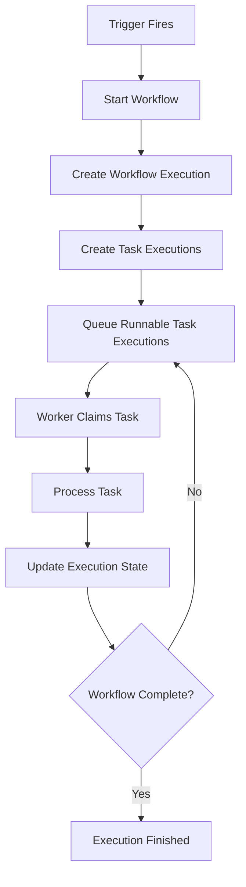
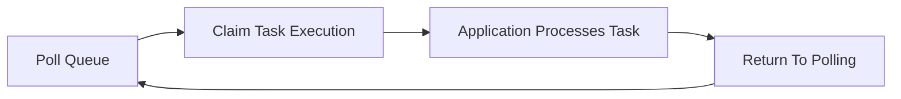

# Workflow Execution Model

## Purpose

This document describes how workflows move through the Automation Platform from creation to completion.

Unlike the Architecture Overview, which focuses on component responsibilities, this document focuses on runtime behavior and the lifecycle of workflow execution.

The goal is to provide a single source of truth for how work progresses through the system while remaining independent of implementation details.

---

# Design Goals

The execution model is designed to satisfy the following goals.

- Separate orchestration from execution.
- Support asynchronous execution.
- Keep workers stateless and interchangeable.
- Preserve complete execution history.
- Support multiple concurrent executions of the same workflow.
- Enable future support for retries, parallel execution, and DAG workflows without fundamental architectural changes.

---

# Definitions

## Workflow Definition

A reusable automation template describing:

- Trigger configuration
- Task definitions
- Workflow structure

Workflow definitions are immutable and may be executed many times.

---

## Workflow Execution

A runtime instance of a workflow.

Each execution maintains independent runtime state including:

- Status
- Start and finish timestamps
- Runtime progress
- Execution history

Multiple executions may exist simultaneously for the same workflow definition.

---

## Task Definition

Describes a unit of work within a workflow.

Task definitions specify:

- Task type
- Configuration
- Parameters

Task definitions contain no runtime state.

---

## Task Execution

Represents the runtime state of a task during a specific workflow execution.

Each Task Execution maintains execution-specific information such as:

- Current status
- Runtime timestamps
- Retry information
- Runtime metadata

Task Executions are created whenever a Workflow Execution begins.

---

# High-Level Execution Flow

---

# Workflow Startup

When a workflow is started, the application layer performs the following steps.

1. Load the Workflow Definition.
2. Create a new Workflow Execution.
3. Create a Task Execution for every Task Definition.
4. Initialize execution state.
5. Identify the initial runnable tasks.
6. Place runnable Task Executions onto the execution queue.

The API, scheduler, or any future runtime process may initiate this sequence by invoking the same application capability.

---

# Queue Model

The execution queue contains runnable Task Executions rather than entire workflows.

Each queue entry references a single Task Execution.

Workers claim runnable Task Executions independently.

The queue acts as an architectural abstraction.

The initial implementation uses PostgreSQL, allowing future replacement without changing orchestration logic.

---

# Worker Lifecycle

Workers continuously poll the execution queue for runnable work.

When work is available, the worker:

1. Claims a Task Execution.
2. Invokes the application layer.
3. Executes the appropriate Task Plugin.
4. Records the execution result.
5. Returns to polling.

Workers intentionally contain no workflow orchestration logic.

---

# Task Processing

Task processing is coordinated by the application layer.

For each claimed Task Execution:

1. Load execution state.
2. Resolve the appropriate Task Plugin.
3. Execute the task.
4. Record the result.
5. Determine newly runnable Task Executions.
6. Queue newly runnable work.
7. Complete the Workflow Execution if all work has finished.

Workers never determine workflow progression.

Task Plugins never determine workflow progression.

Only the application layer advances workflow state.

---

# Responsibility Boundaries

The execution model intentionally separates responsibilities.

| Component | Responsibility |
|-----------|----------------|
| Runtime Processes | Decide **when** to invoke application capabilities. |
| Application Layer | Decide **how** workflow state progresses. |
| Workers | Execute assigned work. |
| Task Plugins | Perform business logic. |
| Trigger Plugins | Determine when workflows begin. |
| Persistence | Store execution state. |
| Queue | Distribute runnable work. |

No single component owns both orchestration and execution.

---

# Execution State

The platform distinguishes between immutable definitions and mutable runtime state.

Immutable:

- Workflow Definition
- Task Definition

Mutable:

- Workflow Execution
- Task Execution

This separation allows workflow definitions to be reused while preserving complete execution history.

---

# Failure Handling

Task failures are isolated to the current Task Execution.

The application layer determines how failures affect overall workflow progression.

Future enhancements may include:

- Retry policies
- Configurable retry limits
- Exponential backoff
- Dead-letter queues
- Failure notifications

These capabilities intentionally remain outside the initial implementation.

---

# Future Evolution

The execution model is intentionally designed to support future enhancements without significant architectural change.

Potential future capabilities include:

- Parallel task execution
- Directed acyclic graph (DAG) workflows
- Distributed workers
- Alternative queue implementations
- Workflow cancellation
- Priority scheduling
- Rate limiting
- Heartbeats and worker recovery

The core execution lifecycle remains unchanged as these capabilities are introduced.
