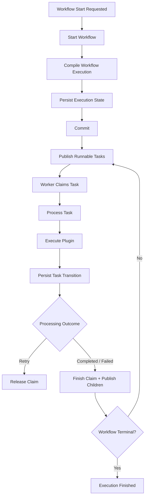

# Workflow Execution Model

## Purpose

This document describes how workflows move through the Automation Platform from definition to completion.

Unlike the Architecture Overview, which defines component responsibilities, this document describes the **end-to-end runtime lifecycle**:

- How Workflow Executions are created.
- How definitions become execution-specific state.
- How runnable tasks reach Workers.
- How dependencies progress.
- How retries and failures affect execution.
- How concurrent Workers and Schedulers operate safely.
- How the platform recovers from process failures and Persistence → Queue consistency gaps.

Detailed repository behavior, SQL, Queue internals, plugin contracts, and individual Application services are documented separately.

## Design Goals

The execution model is designed to:

- Separate reusable definitions from mutable execution state.
- Separate orchestration from task implementation.
- Support asynchronous DAG execution.
- Allow independent tasks and workflow executions to run concurrently.
- Allow multiple Workers and Schedulers to operate safely.
- Preserve execution history.
- Prevent stale Workers from corrupting durable or Queue state.
- Recover runnable work after process failures.
- Keep the Execution Queue replaceable.
- Keep Runtime processes thin.
- Maintain explicit transaction and concurrency boundaries.

## Core Model

Workflow execution separates reusable configuration from runtime state.

| Definition              | Runtime Execution    |
| ----------------------- | -------------------- |
| `WorkflowDefinition`    | `WorkflowExecution`  |
| `TaskDefinition`        | `TaskExecution`      |
| Reusable                | Created for each run |
| Stable during execution | Mutable              |
| Describes structure     | Tracks progress      |

Definitions answer:

> **What should happen?**

Executions answer:

> **What is happening, or what happened, during this run?**

A `WorkflowDefinition` contains reusable Task Definitions, Trigger Definitions, dependencies, plugin configuration, retry configuration, and workflow metadata.

A `WorkflowExecution` represents one independent run of that definition and owns its Task Executions, status, timestamps, and execution progress.

A `TaskDefinition` describes one reusable unit of work. A `TaskExecution` contains the corresponding execution-specific status, timestamps, dependency state, retry state, output, and runtime task relationships.

Multiple Workflow Executions can run concurrently from the same Workflow Definition without modifying it.

## Compiling a Workflow Execution

Workflow execution does not repeatedly interpret the reusable definition while tasks run.

When a workflow starts, Application compiles its definition into execution-specific state:

```text
WorkflowDefinition
│
├── TaskDefinition A
├── TaskDefinition B
├── TaskDefinition C
└── TaskDefinition D

        │
        │ start
        ▼

WorkflowExecution
│
├── TaskExecution A
├── TaskExecution B
├── TaskExecution C
└── TaskExecution D
```

Definition-level dependencies become runtime dependency state.

For:

```text
      A
     / \
    B   C
     \ /
      D
```

the initial execution state is:

```text
A.remaining_dependencies = 0
B.remaining_dependencies = 1
C.remaining_dependencies = 1
D.remaining_dependencies = 2
```

Retry policy and runtime task relationships are likewise snapshotted into Task Execution state.

Each Workflow Execution therefore owns a self-contained runtime task graph that can advance independently of its reusable definition.

## End-to-End Execution Flow


```mermaid
flowchart TD

    Trigger["Workflow Start Requested"]
    Start["Start Workflow"]
    Compile["Compile Workflow Execution"]
    Persist["Persist Execution State"]
    Commit["Commit"]
    Queue["Publish Runnable Tasks"]
    Claim["Worker Claims Task"]
    Process["Process Task"]
    Plugin["Execute Plugin"]
    Transition["Persist Task Transition"]
    Disposition{"Processing Outcome"}
    Release["Release Claim"]
    Finish["Finish Claim + Publish Children"]
    Terminal{"Workflow Terminal?"}

    Trigger --> Start
    Start --> Compile
    Compile --> Persist
    Persist --> Commit
    Commit --> Queue
    Queue --> Claim
    Claim --> Process
    Process --> Plugin
    Plugin --> Transition
    Transition --> Disposition

    Disposition -->|Retry| Release
    Disposition -->|Completed / Failed| Finish

    Finish --> Terminal
    Terminal -->|No| Queue
    Terminal -->|Yes| End["Execution Finished"]
```

The fundamental ordering is:

> **Durable execution state commits before the corresponding Queue disposition or publication occurs.**

This transaction boundary is central to both normal processing and failure recovery.

## Starting a Workflow

Workflow start is a shared Application capability and may be invoked by:

- API requests.
- Chronological triggers.
- Future trigger mechanisms.

Regardless of the source, the same workflow-start behavior is reused:

```text
start workflow
    ↓
load WorkflowDefinition
    ↓
compile WorkflowExecution
    ↓
create TaskExecutions
    ↓
identify root tasks
    ↓
persist execution
    ↓
COMMIT
    ↓
publish root tasks
```

The caller does not need to know how the execution graph is compiled or which tasks are initially runnable.

A Task Execution is durably runnable when:

```text
status = PENDING
AND
remaining_dependencies = 0
```

Root tasks satisfy this condition when the Workflow Execution is first created.

They are published to the Execution Queue only after the Persistence transaction commits.

## Execution Queue

The Execution Queue contains runnable **Task Execution identifiers**, not entire workflows.

Each entry represents one unit of runnable work.

The Queue owns:

- Publishing runnable Task Executions.
- Leasing work to Workers.
- Temporary Worker ownership.
- Lease heartbeats.
- Releasing work for another attempt.
- Removing finished work.
- Atomically finishing a claim while publishing newly runnable work.

The Queue does **not** determine task dependencies, retry policy, Task Execution status, Workflow Execution status, or workflow completion.

Those decisions derive from durable execution state and Application behavior.

## Worker Claims and Leases

Workers do not permanently own tasks. Claiming a Queue entry creates a renewable lease:

```text
Queue Entry
    │
    ▼
Worker claims
    │
    ├── worker identifier
    ├── claim token
    ├── claim timestamp
    └── heartbeat timestamp
```

The claim token identifies the current lease incarnation.

Queue operations that modify ownership validate this token, preventing a Worker holding an old claim from modifying Queue state after another Worker has reclaimed the task.

The PostgreSQL Queue selects claimable entries using:

```sql
FOR UPDATE SKIP LOCKED
```

Multiple Workers can therefore claim different tasks concurrently without coordinating directly:

```text
Worker A ──► Task B
Worker B ──► Task C
Worker C ──► Task E
```

PostgreSQL and the Queue lease protocol provide the concurrency boundary.

## Worker Lifecycle

A Worker is a thin Runtime process:

```text
claim Task Execution
    ↓
maintain heartbeat
    ↓
invoke TaskProcessingService
    ↓
receive durable processing outcome
    ↓
stop heartbeat
    ↓
verify claim remains trusted
    ↓
release OR finish claim
    ↓
return to polling
```

The Worker coordinates Queue ownership with Application processing. It does not implement workflow progression rules.

### Claim Trust

While processing, the Worker periodically renews its lease:

```text
queue.heartbeat(claim)
```

If the heartbeat returns false, the Worker no longer owns the current claim.

If the heartbeat fails unexpectedly, ownership cannot safely be confirmed.

In either case, the claim becomes **untrusted** and the Worker performs no Queue disposition using it.

This prevents stale Workers from interfering with a newer owner.

## Task Processing

The Worker delegates durable processing behavior to Application:

```text
Worker
    │
    ▼
TaskProcessingService
    │
    ├── load execution state
    ├── verify task is processable
    ├── construct TaskContext
    ├── resolve Task Plugin
    ├── execute plugin
    ├── persist resulting transition
    └── return processing outcome
```

Application constructs a `TaskContext` and invokes the configured Task Plugin:

```text
Application
    │
    │ TaskContext
    ▼
Task Plugin
    │
    │ TaskResult
    ▼
Application
```

Plugins do not directly access Persistence, the Execution Queue, workflow orchestration, or Worker leases.

The Worker likewise does not determine dependencies or mutate Workflow Execution state itself.

## Task Lifecycle

The primary durable lifecycle is:

```text
PENDING
   │
   ▼
RUNNING
   │
   ├────────► COMPLETED
   │
   ├────────► FAILED
   │
   └────────► additional attempt while RUNNING
```

Starting a task is an atomic persistence transition.

A `PENDING` task transitions to `RUNNING`; a logical task that is already `RUNNING` may also be resumed after redelivery or lease recovery according to Persistence start semantics.

The original `started_at` remains the beginning of the logical Task Execution rather than the start of every physical Worker attempt.

Completed, failed, cancelled, or otherwise nonprocessable tasks do not execute their plugins.

Queue ownership provides temporary delivery protection, while durable state transitions determine whether processing remains valid.

## Transition-Oriented Persistence

Runtime processing uses explicit persistence transitions rather than arbitrary load-modify-save of the entire Workflow Execution graph.

Examples include:

```text
start_task(...)
complete_task(...)
retry_task(...)
```

Conditional SQL enforces transition invariants atomically.

For example, completion succeeds only if the Task Execution remains:

```text
RUNNING
```

Stale or duplicate processing attempts therefore cannot overwrite a terminal durable state.

## Successful Completion

When a Task Plugin succeeds:

```text
RUNNING
    ↓
COMPLETED
```

the same Persistence transaction:

- Stores task output.
- Records completion time.
- Atomically updates child dependency counts.
- Determines which children became runnable.
- Determines whether the Workflow Execution completed.

Only after this durable transaction commits does the Worker perform the corresponding Queue disposition.

## Dependency Progression

Dependencies use execution-specific counters.

When a parent completes, Persistence atomically decrements the remaining dependency count of its unfinished children:

```text
remaining_dependencies =
    remaining_dependencies - 1
```

The update occurs in PostgreSQL rather than through Python read-modify-write logic.

For:

```text
      A
     / \
    B   C
     \ /
      D
```

`B` and `C` may complete concurrently. Each safely contributes one dependency completion toward `D`.

When:

```text
D.remaining_dependencies = 0
```

`D` becomes durably runnable.

This allows independent Task Executions to execute concurrently without a workflow-wide lock.

## Workflow Completion

The platform does not maintain a shared `remaining_tasks` counter.

Persistence determines whether any unfinished Task Executions remain. If none do, the Workflow Execution transitions to:

```text
COMPLETED
```

This avoids another shared mutable counter that concurrent task completions would need to synchronize.

## Retry Processing

Retry policy is snapshotted into Task Execution state when the Workflow Execution is compiled.

Workers therefore do not reload the Workflow Definition to determine whether another attempt remains.

When plugin execution fails, Application invokes the retry transition. Persistence atomically:

- Verifies the task remains `RUNNING`.
- Consumes the appropriate retry allowance.
- Determines whether another attempt remains.
- Performs terminal failure if attempts are exhausted.

If another attempt is allowed:

```text
Persistence COMMIT
    ↓
Worker queue.release(claim)
    ↓
existing Queue entry becomes claimable again
```

The logical Task Execution remains `RUNNING`.

A retry does not require a new Queue entry.

## Terminal Failure

When retries are exhausted:

```text
TaskExecution
    RUNNING → FAILED

WorkflowExecution
    RUNNING → FAILED

remaining nonterminal TaskExecutions
    → CANCELLED
```

Workflow failure and cancellation of remaining work occur durably according to the execution policy.

Stale Queue entries may still exist for tasks that have since been cancelled. They are harmless: if claimed, Application observes that the durable Task Execution is no longer processable and does not execute its plugin.

The stale Queue entry can then be removed safely.

## Queue Disposition

Application returns a **durable processing outcome** to the Worker.

The Worker translates that outcome into Queue behavior:

```text
Application outcome
        │
        ├── retry required
        │       ↓
        │   queue.release(claim)
        │
        └── no retry
                ↓
            queue.finish(
                claim,
                enqueue_task_ids,
            )
```

`queue.finish()` validates the claim token before removing the current entry and publishing newly runnable Task Executions.

A stale Worker therefore cannot finish a Queue entry owned by a newer claim.

## Persistence → Queue Boundary

Persistence and the Execution Queue intentionally do not participate in one distributed transaction.

Normal processing follows:

```text
process task
    ↓
Persistence transaction
    ↓
COMMIT
    ↓
Queue disposition
```

Likewise, workflow start follows:

```text
create WorkflowExecution
    ↓
create TaskExecutions
    ↓
COMMIT
    ↓
publish runnable roots
```

This separation keeps the Queue replaceable.

A PostgreSQL-backed Queue could later be replaced by another implementation without requiring it to participate in the Persistence Unit of Work.

## Cross-System Failure Window

Separate Persistence and Queue transactions create an intentional consistency window.

For example:

```text
Task B completes
    ↓
Persistence COMMIT
    │
    ├── B = COMPLETED
    └── D becomes runnable
    ↓
process crashes
    ↓
queue.finish() never occurs
```

Persistence is correct, but `D` may never have been published.

The architecture repairs this gap through **reconciliation**, not distributed transactions.

## Reconciliation

The Reconciler periodically finds Task Executions that are durably runnable:

```text
status = PENDING
AND
remaining_dependencies = 0
```

and idempotently republishes their identifiers:

```text
Persistence
    │
    │ runnable IDs
    ▼
Reconciler
    │
    ▼
Execution Queue
```

It does not need to determine which runnable tasks are actually missing from the Queue.

It republishes all durably runnable work.

Queue insertion is idempotent, so existing entries are ignored. Workers, reconciliation, recovery paths, and concurrent enqueue attempts may therefore safely publish the same Task Execution identifier.

This provides eventual recovery for Persistence → Queue propagation failures.

## Two Concurrency Boundaries

Worker safety comes from two complementary mechanisms:

```text
Queue
    protects temporary delivery ownership

Persistence
    protects durable execution state
```

### Queue Ownership

Claim tokens prevent stale Workers from modifying Queue ownership after another Worker has reclaimed an entry.

### Durable Execution State

Conditional Persistence transitions prevent stale or duplicate Workers from applying invalid state transitions after another attempt has already advanced the Task Execution.

Neither mechanism needs to expose its ownership model to the other layer.

## Chronological Workflow Start

The currently implemented automated start mechanism is chronological scheduling:

```text
chronological occurrence becomes due
    ↓
Scheduler
    ↓
ChronologicalTriggerService
    ↓
advance chronological schedule
    +
create WorkflowExecution
    ↓
COMMIT
    ↓
publish root tasks
```

Multiple Scheduler processes may operate concurrently.

Persistence selects due chronological state using:

```sql
FOR UPDATE SKIP LOCKED
```

The selected row remains locked while Application:

- Resolves the trigger.
- Calculates the next occurrence.
- Advances or removes scheduling state.
- Creates the corresponding Workflow Execution.

> **Chronological schedule advancement and Workflow Execution creation commit atomically.**

If the transaction fails or the Scheduler crashes before commit, PostgreSQL rolls it back and releases the lock. The occurrence remains due.

Scheduler coordination therefore uses short PostgreSQL row locks rather than Worker-style renewable leases.

Once a Workflow Execution exists, its task lifecycle is identical regardless of how it was started.

## Failure Recovery

The execution model is designed so process failures leave recoverable durable state.

| Failure                                                              | Recovery                                                                                                          |
| -------------------------------------------------------------------- | ----------------------------------------------------------------------------------------------------------------- |
| Worker dies during plugin execution                                  | Queue lease expires and the task can be reclaimed.                                                                |
| Worker loses claim ownership                                         | Claim-token validation blocks stale Queue disposition; conditional Persistence transitions protect durable state. |
| Worker crashes after Persistence commit but before Queue disposition | Persistence remains correct; reconciliation republishes runnable work.                                            |
| Scheduler crashes before commit                                      | PostgreSQL rolls back and releases the row lock; the occurrence remains due.                                      |
| Scheduler commits but root publication fails                         | The Workflow Execution exists durably; reconciliation republishes its runnable roots.                             |

## Responsibility Boundaries

No single component owns the entire lifecycle.

| Component                 | Responsibility                                               |
| ------------------------- | ------------------------------------------------------------ |
| **Trigger Runtime**       | Detect when a workflow should start.                         |
| **Application**           | Orchestrate workflow and task use cases.                     |
| **WorkflowStartService**  | Compile and persist new Workflow Executions.                 |
| **TaskProcessingService** | Coordinate plugin execution and durable processing outcomes. |
| **Task Plugins**          | Perform task-specific behavior.                              |
| **Persistence**           | Own durable transitions and database concurrency.            |
| **Execution Queue**       | Deliver runnable work and manage temporary Worker ownership. |
| **Worker**                | Coordinate Queue claims with Application processing.         |
| **Reconciler**            | Repair missing Persistence → Queue publication.              |
| **Scheduler**             | Drive chronological Application processing.                  |

Runtime processes remain thin; business and persistence rules stay in their owning layers.

## Execution Guarantees

The combined execution model provides these properties:

- A Workflow Definition may execute many times independently.
- Each Workflow Execution owns independent runtime task state.
- Independent Task Executions may execute concurrently.
- Dependency counters are updated atomically.
- Stale Workers cannot overwrite terminal durable state.
- Stale Workers cannot modify Queue entries owned by newer claims.
- Queue publication is idempotent.
- Missing runnable Queue work is eventually repaired.
- Scheduler processes can operate concurrently without leader election.
- Chronological schedule advancement and Workflow Execution creation commit atomically.
- Queue implementation details remain outside durable workflow execution state.

These guarantees emerge from Application orchestration, conditional Persistence transitions, PostgreSQL concurrency primitives, Queue leases, claim tokens, idempotent publication, and reconciliation.

## Future Evolution

Potential additions include:

- Workflow cancellation.
- Retry backoff policies.
- Priority scheduling.
- Rate limiting.
- Additional trigger mechanisms.
- Alternative Queue implementations such as RabbitMQ.
- Workflow versioning.
- Metrics and distributed tracing.
- More advanced failure policies.

These capabilities should extend the existing lifecycle without moving responsibilities across established architectural boundaries.

The central model remains:

```text
Trigger or request
    ↓
Application starts Workflow Execution
    ↓
Runnable Task Executions enter Queue
    ↓
Workers claim individual tasks
    ↓
Application executes and persists transitions
    ↓
Workers dispose Queue claims
    ↓
Newly runnable work is published
    ↓
Reconciliation repairs missed publication
    ↓
Workflow reaches terminal state
```
