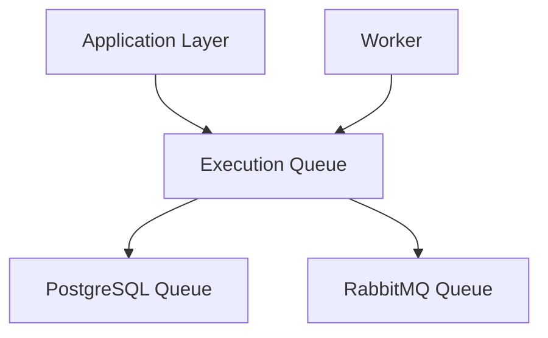
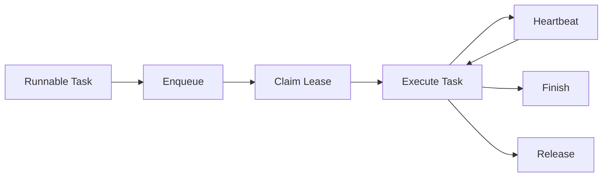

# Execution Queue Architecture

## Purpose

The Execution Queue subsystem coordinates the execution of runnable task executions.

It provides a technology-independent abstraction over the underlying queue implementation while ensuring that runnable work is distributed safely between workers.

The queue is **not** responsible for workflow progression, dependency resolution, retry policies, or task execution. It is solely responsible for scheduling runnable work.

---

# Responsibilities

The Execution Queue subsystem is responsible for:

* Enqueuing runnable task executions
* Leasing runnable work to workers
* Preventing concurrent execution of the same task
* Renewing worker leases
* Releasing abandoned work
* Removing completed work from the queue
* Scheduling newly runnable task executions
* Providing an implementation-independent queue interface

The Execution Queue subsystem is **not** responsible for:

* Workflow execution
* Dependency resolution
* Retry policies
* Workflow state
* Persistence of workflow data

These responsibilities belong to the Application and Persistence layers.

---

# Design Principles

The Execution Queue follows several principles.

* Keep queue responsibilities minimal.
* Store only scheduling metadata.
* Use leases rather than permanent ownership.
* Prefer idempotent operations.
* Isolate queue implementations behind a common interface.
* Allow queue implementations to evolve independently.

---

# High-Level Architecture



Neither the Worker nor the Application Layer depends on a concrete queue implementation.

The implementation is selected during application startup.

---

# Queue Model

The queue intentionally stores only scheduling information.

Each queue entry represents a runnable task execution.

Queue metadata includes:

* Task Execution Identifier
* Lease Token
* Claiming Worker
* Queue Timestamp
* Claim Timestamp
* Last Heartbeat

Task execution state remains in the Persistence subsystem.

---

# Lease-Based Execution

Workers do not permanently own queue entries.

Instead, claiming work creates a temporary lease represented by a unique claim token.

While executing a task a worker periodically renews its lease through heartbeats.

If heartbeats stop, another worker may safely reclaim the task.

This allows the system to recover automatically from worker crashes without requiring manual intervention.

---

# Queue Operations

The queue exposes a minimal public interface.

* `enqueue(...)`
* `claim(...)`
* `heartbeat(...)`
* `release(...)`
* `finish(...)`

These operations represent the complete lifecycle of a leased task execution.

---

# Execution Lifecycle



Successful execution consumes the lease and removes the task from the queue.

Retrying releases the lease while leaving the task available for future workers.

---

# Atomicity

Queue operations are designed to remain safe under concurrent execution.

Important guarantees include:

* A task may only be claimed by one worker at a time.
* Queue operations validate lease ownership using claim tokens.
* Queue insertion is idempotent.
* Finishing a task atomically removes the completed task and schedules newly runnable work.
* Releasing a lease immediately makes work available to other workers.

The queue coordinates scheduling only.

Persistence remains responsible for transactional workflow updates.

---

# Failure Recovery

The queue is designed to recover from worker failures.

If a worker crashes:

1. Heartbeats stop.
2. The lease expires.
3. Another worker claims the task.
4. Processing resumes.

If persistence commits successfully but queue scheduling fails, a backup scheduler periodically scans for runnable task executions that are not currently queued and enqueues them.

This guarantees eventual scheduling without requiring distributed transactions.

---

# Runtime Initialization

Each runtime process constructs an Execution Queue during startup.

Initialization consists of:

1. Load configuration.
2. Create shared infrastructure.
3. Construct the configured queue implementation.
4. Inject the queue into runtime services.

The remainder of the application remains independent of the selected implementation.

---

# Package Organization

```text
queue/
│
├── bootstrap.py
├── claims.py
├── interface.py
│
└── postgres/
    ├── model.py
    └── queue.py
```

Future implementations will reside in separate packages while implementing the same interface.

---

# Future Evolution

Potential future enhancements include:

* RabbitMQ implementation
* Redis implementation
* Priority scheduling
* Delayed execution
* Dead-letter queues
* Queue metrics
* Distributed tracing
* Rate limiting

These capabilities should extend the queue implementation without affecting the public queue interface.
