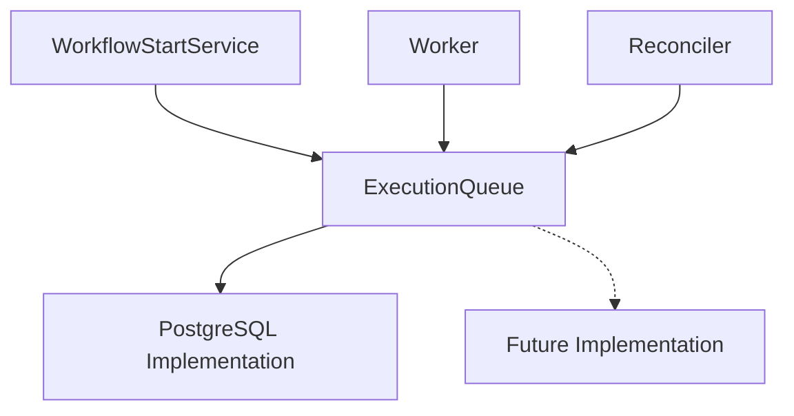

# Execution Queue Architecture

## Purpose

The Execution Queue delivers runnable Task Executions to Workers.

It provides a technology-independent abstraction over work delivery and allows multiple Workers to safely process independent tasks concurrently.

The Queue owns only **temporary delivery state**:

```text
Persistence
    owns durable execution state

Execution Queue
    owns which Worker currently has delivery rights
    to runnable work
```

The current implementation uses PostgreSQL, but consumers depend on the `ExecutionQueue` abstraction rather than PostgreSQL-specific behavior.

## Responsibilities

The Execution Queue owns:

- Idempotent publication of runnable Task Execution identifiers.
- Worker claims.
- Temporary lease-based ownership.
- Claim heartbeats and expiration.
- Reclaiming abandoned work.
- Releasing work for another attempt.
- Removing finished work.
- Atomically finishing a claim while publishing newly runnable work.
- Protection against stale claim holders.
- Isolation of implementation-specific Queue behavior.

It does **not** own:

- Workflow progression.
- Dependency resolution.
- Task execution.
- Task or Workflow Execution status.
- Retry policy.
- Determining whether a task is durably runnable.
- Workflow persistence.
- Trigger scheduling.

Those responsibilities remain with Application, Persistence, Plugins, and the relevant Runtime processes.

## Design Principles

- Keep work-delivery responsibilities narrow.
- Separate temporary delivery ownership from durable execution state.
- Use renewable leases rather than permanent Worker ownership.
- Identify each lease incarnation with a unique claim token.
- Make publication idempotent.
- Support concurrent Workers without direct coordination.
- Use implementation-level concurrency primitives rather than process-local locks.
- Keep Queue implementations behind a stable interface.
- Avoid distributed transactions between Queue and Persistence.
- Repair cross-system publication gaps through reconciliation.

## Architecture



Different consumers use the same abstraction:

- `WorkflowStartService` publishes initially runnable root tasks.
- Workers claim work and later release or finish claims.
- Reconciliation republishes durably runnable tasks for recovery.

None depends directly on PostgreSQL Queue internals.

## Queue State

Each Queue entry represents one runnable Task Execution.

Conceptually, it contains delivery metadata:

```text
task_execution_id
claimed_by
claim_token
claimed_at
last_heartbeat
```

It does **not** duplicate durable Task Execution state such as:

```text
status
dependencies
retry state
timestamps
output
```

That state remains in Persistence.

> **The Queue is a delivery mechanism, not a second source of truth for workflow execution.**

## Claim Model

A successful claim is represented externally by an immutable value:

```text
Claim
├── task_execution_id
└── claim_token
```

The Task Execution identifier identifies the work.

The claim token identifies the **specific lease incarnation**.

This distinction matters because one Task Execution may be claimed repeatedly:

```text
Worker A claims Task X
    ↓
token = 123
    ↓
heartbeats stop
    ↓
lease expires
    ↓
Worker B reclaims Task X
    ↓
token = 456
```

Worker A may still exist, but token `123` no longer represents current Queue ownership.

Ownership-sensitive operations therefore validate both the Task Execution identifier and claim token.

## Public Interface

The Queue exposes a small lifecycle-oriented API:

```text
enqueue(...)
claim(...)
heartbeat(...)
release(...)
finish(...)
```

Each operation corresponds to one part of runnable-work delivery.

## Enqueue

`enqueue(...)` ensures that Task Execution identifiers are present in the Queue:

```text
runnable Task Execution IDs
    ↓
enqueue(...)
    ↓
Queue entries
```

Publication is **idempotent**.

Enqueueing an identifier that is already present does not create another entry. The PostgreSQL implementation enforces this through conflict handling on the Task Execution identifier.

Idempotency allows workflow start, Workers, reconciliation, recovery paths, and concurrent publishers to safely publish the same runnable task.

## Claim

`claim(worker_id)` attempts to obtain one claimable entry.

An entry is claimable when it is:

- Unclaimed, or
- Owned by an expired lease.

A successful claim establishes new ownership:

```text
unclaimed / expired entry
    ↓
claim(worker_id)
    ↓
worker ownership
+
new claim token
+
lease timestamps
```

If no work is claimable, no claim is returned.

### Concurrent Claiming

The PostgreSQL implementation selects claimable work using:

```sql
FOR UPDATE SKIP LOCKED
```

This allows Workers to claim different entries concurrently:

```text
Queue
├── Task A  ← Worker 1
├── Task B  ← Worker 2
└── Task C  ← Worker 3
```

A Worker skips entries currently locked by another claim transaction and continues to available work.

Workers therefore require no global mutex, leader election, direct communication, or process-local coordination.

## Lease Ownership

Queue ownership is temporary.

A Worker maintains ownership by periodically renewing its lease:

```text
claim
  │
  ▼
lease active
  │
  ├── heartbeat ──► lease renewed
  │
  └── no heartbeat
          ↓
      lease expires
          ↓
      work reclaimable
```

This allows abandoned work to recover automatically after Worker failure.

### Heartbeat

While processing, a Worker periodically calls:

```text
heartbeat(claim)
```

The heartbeat succeeds only if the supplied:

```text
task_execution_id
+
claim_token
```

still identify the current lease.

A successful heartbeat confirms current ownership.

A false result means the claim is no longer current.

If heartbeat fails unexpectedly, the Worker cannot know whether ownership is still valid and must conservatively treat the claim as **untrusted**.

### Claim Trust

There is an important distinction between:

```text
claim definitely lost
```

and:

```text
claim can no longer be trusted
```

For example, a network or database failure may prevent a Worker from knowing whether a heartbeat succeeded.

Once a claim becomes untrusted, the Worker must not use it for:

```text
release(...)
finish(...)
```

Another Worker may already own a newer lease.

This conservative rule prevents stale Workers from interfering with current Queue ownership.

## Release

`release(claim)` gives up the current lease while preserving the Queue entry:

```text
claimed entry
    ↓
release(claim)
    ↓
unclaimed entry
    ↓
immediately claimable
```

Release validates the claim token before modifying ownership.

It is primarily used when durable task processing determines that another attempt should occur.

The task does not need to be enqueued again; its existing Queue entry becomes available for the next attempt.

Retry policy itself remains outside the Queue.

## Finish

`finish(claim, runnable_task_ids)` completes the current delivery lifecycle.

It atomically:

1. Validates that the supplied claim still owns the current entry.
2. Removes that entry.
3. Idempotently publishes the supplied runnable Task Execution identifiers.

Conceptually:

```text
current claimed task
        +
newly runnable task IDs
        ↓
      finish(...)
        ↓
remove current entry
        +
publish new work
```

These Queue changes occur in one Queue transaction.

A successful finish therefore cannot remove the current entry without also publishing the child work supplied to the operation.

If the claim token is stale, the operation cannot modify the newer owner's Queue state.

## Worker Lifecycle

The Worker owns Queue/Application coordination:

```text
claim
  ↓
start heartbeat
  ↓
TaskProcessingService
  ↓
Persistence commits processing outcome
  ↓
stop heartbeat
  ↓
verify claim remains trusted
  ↓
release OR finish
```

Application determines the durable processing outcome.

The Worker translates that outcome into Queue disposition:

```text
retry required
    ↓
queue.release(claim)
```

or:

```text
no retry
    ↓
queue.finish(
    claim,
    runnable_task_ids,
)
```

Queue ownership mechanics therefore remain outside Application business logic.

## Queue Ownership vs. Durable State

Queue ownership and Persistence protect different things:

```text
Execution Queue
    protects temporary delivery ownership

Persistence
    protects durable execution state
```

A valid Queue lease does not itself prove that the corresponding Task Execution may still execute.

For example, a Worker might claim an old Queue entry after the Task Execution has already been cancelled because its workflow failed.

Application checks durable state before invoking the plugin. If the task is no longer processable, the Queue entry is harmless and can be finished without executing the task.

Likewise, conditional Persistence transitions prevent an outdated processing attempt from overwriting a durable state already advanced by another Worker.

The two concurrency boundaries are complementary:

- **Claim tokens** protect Queue ownership.
- **Conditional Persistence transitions** protect durable workflow state.

Neither subsystem needs to expose its internal ownership model to the other.

## Retry Delivery

When another task attempt is allowed:

```text
Worker owns claim
    ↓
Application persists retry transition
    ↓
Persistence COMMIT
    ↓
Worker releases claim
    ↓
same Queue entry becomes claimable
```

A retry does not create another Queue entry.

The existing entry remains the delivery mechanism for the unresolved logical Task Execution.

## Successful Delivery Progression

When processing does not require another attempt:

```text
Worker owns claim
    ↓
Application persists task transition
    ↓
newly runnable Task IDs determined
    ↓
Persistence COMMIT
    ↓
Worker finish(...)
    ↓
current Queue entry removed
+
new runnable IDs published
```

Persistence always commits before Queue disposition.

This ensures the Queue does not intentionally publish downstream work before the durable state making that work runnable exists.

## Persistence → Queue Boundary

Persistence and the Execution Queue intentionally use separate transactions:

```text
Task processing
    ↓
Persistence transaction
    ↓
COMMIT
    ↓
Queue disposition
```

The platform does not use a distributed transaction spanning Persistence and Queue.

This preserves the Queue abstraction: a future implementation may use technology other than PostgreSQL and should not need to participate in the Persistence Unit of Work.

The tradeoff is a small cross-system consistency window.

## Reconciliation

Consider:

```text
Task A completes
    ↓
Persistence COMMIT
    │
    └── Task B becomes runnable
    ↓
Worker crashes
    ↓
queue.finish() never occurs
```

Durable state is correct:

```text
Task A = COMPLETED
Task B = PENDING
Task B.remaining_dependencies = 0
```

but Task B may be missing from the Queue.

The Reconciler repairs this condition by periodically asking Persistence for **all durably runnable Task Executions**:

```text
status = PENDING
AND
remaining_dependencies = 0
```

and publishing the complete result:

```text
Persistence
    │
    │ runnable IDs
    ▼
Reconciler
    │
    │ idempotent enqueue
    ▼
Execution Queue
```

The Reconciler does not inspect Queue contents or calculate which entries are missing.

Because enqueue is idempotent:

- Existing entries remain unchanged.
- Missing entries are restored.

This provides eventual recovery for Persistence → Queue publication failures without synchronizing the two stores.

## Worker Failure and Stale Claims

Lease expiration provides automatic Worker crash recovery:

```text
Worker claims task
    ↓
Worker crashes
    ↓
heartbeats stop
    ↓
lease expires
    ↓
another Worker reclaims task
```

No explicit cleanup process is required.

If the original Worker later resumes, its old claim token no longer matches the current lease:

```text
heartbeat(old_claim)
release(old_claim)
finish(old_claim, ...)
```

cannot modify the newer owner's Queue state.

Durable Persistence transitions provide the additional protection required if the original processing attempt had already changed execution state.

## Queue Guarantees

Within the Queue subsystem:

- Enqueue is idempotent.
- Concurrent Workers can claim independent work.
- Each successful claim creates a new lease incarnation.
- Ownership-sensitive operations validate the claim token.
- Expired work can be reclaimed.
- Release preserves the Queue entry and makes it claimable again.
- Finish atomically removes the owned entry and publishes supplied runnable work.
- Stale claims cannot modify newer ownership.

These guarantees apply only to Queue state.

Durable workflow correctness remains the responsibility of Application and Persistence.

## Runtime Initialization

Runtime processes receive an `ExecutionQueue` through bootstrap/composition:

```text
load Settings
    ↓
build Infrastructure
    ↓
construct configured ExecutionQueue
    ↓
inject into consumers
```

Consumers such as:

```text
Worker
WorkflowStartService
Reconciler
```

depend only on the Queue interface.

## Package Organization

```text
queue/
│
├── bootstrap.py
├── claims.py
├── interface.py
│
└── postgres/
    ├── model.py
    └── queue.py
```

The public package defines the Queue contract and claim representation.

PostgreSQL-specific storage and concurrency behavior remain inside `postgres/`.

Future implementations can live in separate packages while implementing the same public interface.

## Component Relationships

```text
WorkflowStartService
        │
        │ enqueue roots
        ▼
Execution Queue
        │
        │ claim
        ▼
      Worker
        │
        ▼
TaskProcessingService
        │
        │ durable transition
        ▼
   Persistence
        │
        │ processing outcome
        ▼
      Worker
        │
        ├── release
        │
        └── finish + publish children
        ▼
Execution Queue


RECOVERY

Persistence
    │
    │ durably runnable IDs
    ▼
Reconciler
    │
    │ idempotent enqueue
    ▼
Execution Queue
```

This keeps work delivery, durable execution state, and orchestration as separate responsibilities.

## Future Evolution

Potential additions include:

- Alternative implementations such as RabbitMQ.
- Priority scheduling.
- Delayed delivery.
- Queue metrics.
- Distributed tracing.
- Rate limiting.
- More advanced delivery policies.

These capabilities should be introduced only when required.

Different Queue implementations may use different internal storage, claiming, and ownership mechanisms, but should preserve the architectural boundary:

> **The Execution Queue distributes runnable work. Persistence remains the source of truth for workflow execution state.**
