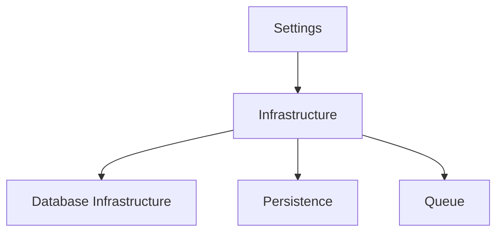
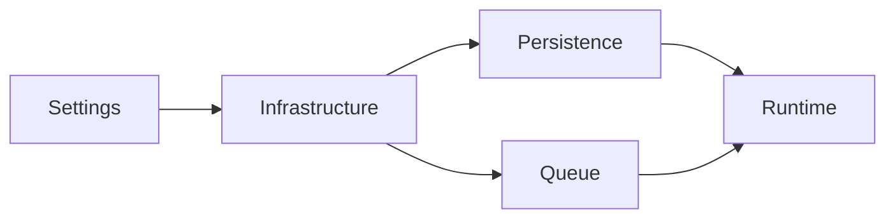

# Infrastructure Architecture

## Purpose

The Infrastructure subsystem is responsible for creating and owning shared runtime resources used throughout the application.

Infrastructure contains implementation details that are common across multiple subsystems while remaining independent of any specific business capability.

The primary goal of this package is to centralize resource creation so that components such as Persistence and Queue can remain independent while sharing common infrastructure.

---

# Responsibilities

Infrastructure is responsible for:

* Loading application configuration.
* Creating shared runtime resources.
* Managing database infrastructure.
* Constructing SQLAlchemy engines and session factories.
* Providing a common declarative model base.
* Supplying shared infrastructure to subsystem bootstraps.

Infrastructure is **not** responsible for:

* Workflow execution.
* Business logic.
* Queue behavior.
* Persistence logic.
* Runtime orchestration.

---

# Design Principles

The Infrastructure subsystem follows several principles.

* Create shared resources only once.
* Keep configuration separate from runtime objects.
* Avoid coupling independent subsystems.
* Centralize framework-specific initialization.
* Allow infrastructure implementations to evolve independently.

---

# Architecture



Infrastructure owns the application's shared runtime resources.

Subsystems receive these resources through dependency injection rather than constructing them themselves.

---

# Database Infrastructure

Database infrastructure is shared by all PostgreSQL-backed subsystems.

It is responsible for creating:

* SQLAlchemy Engine
* SQLAlchemy Session Factory
* Declarative Base

Neither Persistence nor Queue owns these objects.

Both consume the same shared database infrastructure.

---

# Infrastructure Object

The Infrastructure object represents the application's shared runtime resources.

Typical resources include:

* Application settings
* SQLAlchemy engine
* SQLAlchemy session factory

Future shared resources may include:

* Logging
* Metrics
* Tracing
* Clocks
* Message bus connections

---

# Bootstrap Process

Application startup follows a layered initialization process.



The application composition root first creates shared infrastructure.

Subsystem bootstraps then receive the infrastructure object and construct their own implementations.

This keeps subsystem initialization independent while allowing shared resources to be reused.

---

# Dependency Direction

Infrastructure sits below application subsystems.

Dependencies always flow toward Infrastructure.

```text
Runtime
    │
Application
    │
Persistence   Queue
      │       │
      └──┬────┘
         ▼
Infrastructure
```

Infrastructure never depends on Persistence or Queue.

Persistence and Queue remain independent of one another and communicate only through the Application Layer.

---

# Future Evolution

The Infrastructure package is expected to grow as additional shared resources are introduced.

Potential future additions include:

* Logging infrastructure
* Metrics collection
* Distributed tracing
* RabbitMQ connection management
* Redis connection management
* Configuration providers

These additions should remain isolated from business logic and reusable across application subsystems.
