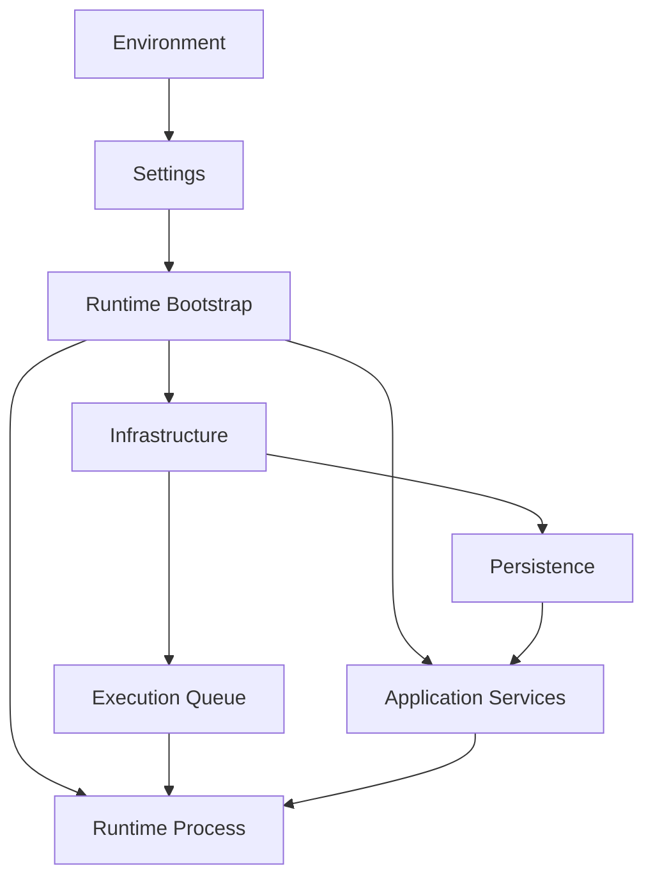

# Infrastructure Architecture

## Purpose

Infrastructure owns technical resources that are genuinely shared across multiple Automation Platform subsystems.

Its primary responsibility is the database infrastructure shared by PostgreSQL-backed components such as Persistence and the Execution Queue.

```text
Infrastructure
    │
    ├── SQLAlchemy Engine
    ├── SessionFactory
    └── Declarative Base
```

Infrastructure allows these resources to be created once and reused without making Persistence or the Queue responsible for constructing shared technical dependencies.

It contains no workflow, scheduling, Queue, or Runtime business behavior.

> **Infrastructure owns shared technical resources. It does not orchestrate the components that consume them.**

## Responsibilities

Infrastructure owns:

- The shared SQLAlchemy Engine.
- The shared SQLAlchemy SessionFactory.
- The shared SQLAlchemy declarative Base.
- Process-level technical resources genuinely required by multiple subsystems.
- Exposure of those resources to composition roots.

It does **not** own:

- Environment configuration loading.
- Logging configuration.
- Workflow orchestration.
- Task or trigger processing.
- Queue behavior.
- Repository behavior.
- Runtime loops.
- Application services.
- Construction of the complete process dependency graph.

Those responsibilities remain with Configuration, Observability, subsystem implementations, Application, Runtime, and bootstrap.

## Design Principles

- Centralize genuinely shared technical resources.
- Construct expensive process-level resources once.
- Pass dependencies explicitly.
- Avoid global infrastructure state.
- Keep independently owned subsystems independent.
- Prevent Persistence and Queue from duplicating shared database infrastructure.
- Keep framework initialization outside business logic.
- Do not use Infrastructure as a service locator.
- Add resources only when they are genuinely shared.

## Architecture



Runtime bootstrap is the composition root.

It loads configuration, configures process-level concerns, creates Infrastructure, constructs the required subsystem implementations and Application services, and finally constructs the Runtime process.

Infrastructure provides resources used during that composition; it does not perform the composition itself.

## Infrastructure Object

Shared process-level resources are represented by a small `Infrastructure` object.

Conceptually:

```python
@dataclass(slots=True)
class Infrastructure:
    settings: Settings
    engine: Engine
    session_factory: sessionmaker
```

It is created through:

```python
build_infrastructure(settings)
```

Conceptually:

```text
Settings
    ↓
build_infrastructure()
    ↓
Infrastructure
    ├── Settings
    ├── SQLAlchemy Engine
    └── SessionFactory
```

The object is intentionally small.

It should not become a container for every repository, service, registry, Queue, or Runtime dependency in the application.

## Configuration Boundary

Runtime configuration is represented by an immutable `Settings` object.

Configuration is loaded once near process startup:

```text
Environment Variables
        ↓
load_settings()
        ↓
Settings
        ↓
Runtime Bootstrap
```

Components receive Settings or derived configuration explicitly rather than independently reading environment variables.

This creates a clear boundary:

```text
external runtime configuration
            ↓
          Settings
            ↓
constructed application objects
```

Environment interpretation therefore remains near startup instead of spreading throughout the codebase.

Configuration itself is **not** owned by Infrastructure.

## Shared Database Infrastructure

PostgreSQL-backed subsystems require common SQLAlchemy resources:

- Engine.
- SessionFactory.
- Declarative Base.

These are centralized rather than independently constructed by Persistence and the PostgreSQL Execution Queue.

```text
               SQLAlchemy Engine
                      │
                SessionFactory
                   ↙      ↘
          Persistence     PostgreSQL Queue
```

Sharing these resources does not merge the two subsystems.

Persistence and Queue continue to own independent behavior, models, operations, and transaction boundaries.

### Declarative Base

SQLAlchemy models across PostgreSQL-backed subsystems use the same declarative Base:

```text
Shared Declarative Base
        │
        ├── Persistence models
        └── Queue models
```

The Base belongs to shared database infrastructure rather than either subsystem.

This allows application-managed PostgreSQL tables to participate in common SQLAlchemy metadata without making Persistence responsible for Queue models or Queue responsible for Persistence models.

## Persistence Relationship

Persistence consumes the shared SessionFactory:

```text
Infrastructure
    │
    │ SessionFactory
    ▼
UnitOfWorkFactory
    │
    ▼
UnitOfWork
    │
    ▼
Repositories
```

Persistence owns:

- Units of Work.
- Repository implementations.
- Persistence models.
- SQL for durable business state.
- Domain reconstruction.
- Atomic durable state transitions.
- Persistence-specific concurrency behavior.

Infrastructure owns only the lower-level shared resources required to implement those capabilities.

## Execution Queue Relationship

The PostgreSQL Execution Queue also consumes shared database infrastructure:

```text
Infrastructure
    │
    │ SessionFactory
    ▼
PostgreSQL Execution Queue
```

The Queue owns:

- Its Queue model.
- Queue SQL operations.
- Claim semantics.
- Lease management.
- Heartbeats.
- Queue-specific concurrency behavior.

Infrastructure understands none of those concepts.

This distinction preserves the Execution Queue abstraction. A future Queue implementation such as RabbitMQ may use completely different infrastructure while preserving the same public Queue contract.

## Shared Resources Do Not Imply Shared Ownership

Persistence and Queue both depend on Infrastructure:

```text
              Infrastructure
               ↙          ↘
      Persistence          Queue
```

but they remain independent subsystems.

```text
Persistence
    owns durable workflow and execution state

Execution Queue
    owns temporary runnable-work delivery state
```

Neither owns the other.

They may participate in the same higher-level operation:

```text
Worker
    ├── Execution Queue
    └── Application
            └── Persistence

Reconciler
    ├── Persistence
    └── Execution Queue
```

but coordination occurs through higher-level components.

Sharing an Engine, SessionFactory, or declarative Base is **resource reuse, not architectural coupling**.

## Resource Lifetime

Infrastructure resources generally live for the lifetime of a process:

```text
Process starts
    ↓
Engine created once
    ↓
SessionFactory created once
    ↓
many short-lived Sessions / UoWs
    ↓
Process exits
```

The Engine and SessionFactory are long-lived factories/resources.

Individual Sessions and Units of Work remain short-lived and operation-specific.

Long-lived transactional state must therefore not be stored in the process-level Infrastructure object.

## Runtime Composition

Each independently executable Runtime has its own bootstrap module.

Current processes include:

```text
Worker
Reconciler
Scheduler
```

Each bootstrap constructs only the dependency graph required by that process.

A typical startup sequence is:

```text
load Settings
    ↓
configure logging
    ↓
build Infrastructure
    ↓
construct required subsystem dependencies
    ↓
construct required Application services
    ↓
construct Runtime
    ↓
register signal handlers
    ↓
run
```

The bootstrap module is therefore the **composition root**.

Runtime classes receive already-constructed dependencies rather than constructing their own infrastructure or services.

### Worker

Conceptually:

```text
Settings
    ↓
Infrastructure
    ├── Persistence / UoW
    └── Execution Queue
             │
Task Registry│
      ↓      │
TaskProcessingService
      │      │
      └──┬───┘
         ▼
       Worker
```

The Worker does not construct Persistence, the Queue, registries, or Application services.

### Reconciler

The Reconciler requires a smaller dependency graph:

```text
Settings
    ↓
Infrastructure
    ├── UnitOfWorkFactory
    └── Execution Queue
             │
             ▼
         Reconciler
```

It coordinates Persistence and Queue abstractions without depending on their database internals.

### Scheduler

Chronological scheduling requires additional Application capabilities:

```text
Infrastructure
    │
    ├── UnitOfWorkFactory
    └── Execution Queue
             │
             ▼
     WorkflowStartService
             │
TriggerRegistry
      │      │
      └──┬───┘
         ▼
ChronologicalTriggerService
         │
         ▼
      Scheduler
```

The Scheduler receives the Application capability it requires rather than raw database infrastructure.

## Infrastructure vs. Bootstrap

Infrastructure and bootstrap have deliberately different responsibilities.

| Infrastructure                     | Bootstrap                        |
| ---------------------------------- | -------------------------------- |
| Creates shared technical resources | Composes an executable process   |
| Engine                             | Loads configuration              |
| SessionFactory                     | Configures logging               |
| Declarative Base                   | Builds Infrastructure            |
| Shared process resources           | Constructs registries            |
|                                    | Constructs Queue implementations |
|                                    | Constructs Application services  |
|                                    | Constructs Runtime               |
|                                    | Registers process signals        |

Keeping this boundary explicit prevents Infrastructure from becoming an application-wide dependency container.

## Dependency Injection

Dependencies are passed explicitly through constructors and bootstrap functions.

The architecture avoids:

```text
global Settings
global Engine
global Session
global service registry
```

Instead:

```text
bootstrap
    ↓
construct dependency
    ↓
inject dependency
```

Explicit dependencies make component requirements visible, improve testability, and prevent hidden coupling.

## Observability

Logging remains separate from Infrastructure.

Process-wide logging is configured during bootstrap through the Observability package:

```text
Settings
    ↓
configure_logging()
    ↓
Python logging hierarchy
```

Individual modules obtain their logger normally:

```python
logging.getLogger(__name__)
```

They do not configure logging or load Settings themselves.

Keeping Observability separate also leaves room for future metrics and tracing without turning Infrastructure into a collection of unrelated cross-cutting concerns.

## Dependency Direction

Infrastructure is a low-level technical dependency.

Higher-level components may consume its resources, but Infrastructure does not depend on their behavior.

Conceptually:

```text
Runtime / Bootstrap
        │
        ├───────────────┐
        ▼               ▼
   Application         Queue
        │
        ▼
   Persistence
        │
        └────────┐
                 ▼
          Infrastructure
```

The exact dependency graph varies by process, but the rule does not:

> **Infrastructure provides technical resources; higher-level components decide how those resources are used.**

## Package Organization

Infrastructure should remain small:

```text
infrastructure/
├── database.py
└── infrastructure.py
```

Configuration and Observability remain separate packages:

```text
config/
observability/
infrastructure/
```

Exact filenames may evolve, but unrelated technical concerns should not accumulate in a generic Infrastructure package.

## Architectural Guarantees

The design provides several useful properties:

- **Shared resource ownership** — Persistence and PostgreSQL Queue reuse database infrastructure without owning one another.
- **Explicit dependencies** — dependencies are visible during construction rather than retrieved from global state.
- **Process-level reuse** — expensive resources such as the Engine are created once per process.
- **Independent subsystems** — shared database resources do not imply shared repositories, transactions, or responsibilities.
- **Testability** — components can receive test-specific dependencies without modifying global state.
- **Replaceability** — higher-level abstractions can adopt different implementations without changing business logic.
- **Focused composition** — each Runtime bootstrap builds only the graph required by that process.

## Future Evolution

Infrastructure should grow only when a technical resource is genuinely shared across architectural components.

Potential future shared infrastructure may include connection management for technologies such as:

- RabbitMQ.
- Redis.

New technical capabilities should not automatically be added to the central `Infrastructure` object.

For example:

```text
Logging
    → Observability

Runtime configuration
    → Configuration

Application services
    → Application

Queue-specific resources
    → concrete Queue implementation
```

The guiding principle remains:

> **Infrastructure owns genuinely shared technical resources, bootstrap owns composition, and higher-level subsystems retain responsibility for their own behavior.**
