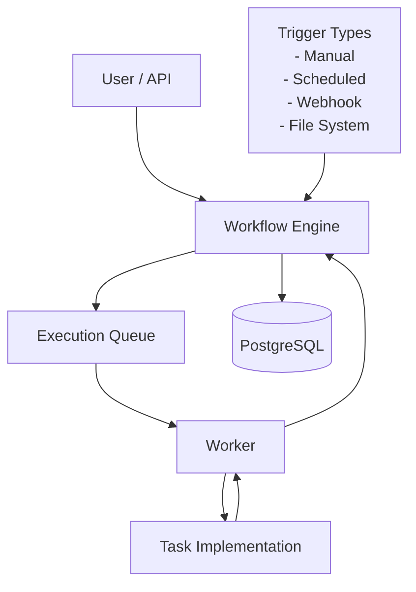
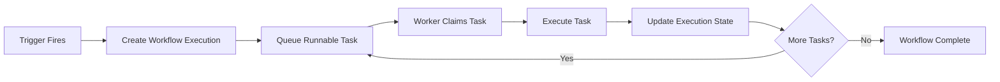

# Architecture Overview

## Purpose

The Automation Platform is a production-style backend application for defining and executing automated workflows.

The project is designed to demonstrate software engineering practices commonly used in backend and infrastructure systems, including modular architecture, asynchronous execution, dependency inversion, REST APIs, background workers, database persistence, testing, and documentation.

The emphasis is on maintainability, extensibility, and architectural clarity rather than feature count.

---

# Design Principles

The architecture is guided by the following principles:

- Favor modularity over monolithic business logic.
- Prefer composition over inheritance.
- Depend on abstractions rather than concrete implementations.
- Keep responsibilities clearly defined.
- Separate orchestration from execution.
- Introduce complexity only when it solves a real problem.
- Design for extensibility without over-engineering.

---

# High-Level Architecture

The Workflow Engine is the central orchestrator of the platform.

Trigger implementations determine **when** workflows begin.

Workers execute tasks but never determine workflow order.

Task implementations perform business logic without knowledge of the overall workflow.

---

# Execution Model

The platform distinguishes between **workflow definitions** and **workflow executions**.

A **workflow definition** describes *what* should happen.

A **workflow execution** represents a single runtime instance of that workflow.

Each execution maintains its own state, timestamps, logs, retry history, and outcome independently of the workflow definition.

This separation allows a workflow to be executed repeatedly while preserving complete execution history.

---

# Core Concepts

## Workflow

A reusable automation definition consisting of an ordered sequence of tasks and one or more trigger configurations.

A workflow is immutable during execution and may be executed many times.

---

## Workflow Execution

A runtime instance of a workflow.

The Workflow Engine creates a new execution whenever a workflow begins.

Each execution progresses independently through its own lifecycle.

---

## Task

A unit of work within a workflow.

Tasks describe **what** should be executed rather than **how** it is executed.

Examples include:

- HTTP Request
- Generate CSV
- Send Email
- Delay
- Run Python Script

---

## Trigger

Defines the condition under which a workflow begins.

Examples include:

- Manual
- Scheduled
- Webhook
- File System Event

Triggers initiate workflow execution but contain no workflow business logic.

---

## Execution Queue

The Workflow Engine never executes tasks directly.

Instead, it places runnable work onto an execution queue.

Workers independently claim queued work and execute it asynchronously.

The execution queue is an architectural abstraction. The initial implementation is backed by PostgreSQL, allowing the implementation to evolve without changing workflow orchestration.

---

## Worker

A background process responsible for executing queued work.

Workers execute tasks, report results, and return control to the Workflow Engine.

Workers intentionally remain unaware of workflow structure and execution order.

---

# Workflow Execution Lifecycle

The Workflow Engine continually evaluates workflow state and determines which task should execute next.

Workers simply execute the work assigned to them and report the results.

---

# Component Responsibilities

## Workflow Engine

The Workflow Engine is the central coordinator of the platform.

Responsibilities include:

- Creating workflow executions
- Tracking execution state
- Determining runnable tasks
- Scheduling work
- Handling completion and failure
- Orchestrating workflow progression

The Workflow Engine never performs business logic itself.

---

## Trigger System

Responsible for determining when workflows begin.

Trigger implementations are isolated from workflow execution logic.

New trigger types can be introduced without modifying the Workflow Engine.

---

## Worker

Responsible for:

- Claiming queued work
- Executing task implementations
- Recording execution results
- Reporting completion or failure

Workers intentionally contain no orchestration logic.

---

## Task Implementations

Each task type implements a common interface.

Task implementations encapsulate business logic while remaining independent of the Workflow Engine and Worker.

New task types can be introduced without modifying orchestration code.

---

## Persistence Layer

Responsible for storing:

- Workflow definitions
- Workflow executions
- Execution state
- Task definitions
- Execution history
- Queue state

Persistence is isolated from business logic through repository abstractions.

---

# Extensibility

The platform provides interface-based extension points for both trigger types and task types.

Rather than relying on conditional logic, the Workflow Engine and Workers depend on abstractions that allow new implementations to be introduced without modifying existing orchestration code.

This approach follows the Open/Closed Principle by allowing the system to grow through extension rather than modification.

---

# Key Design Decisions

The following Architecture Decision Records (ADRs) document the major architectural decisions for the platform.

- [**ADR-001**: Modular Monolith](../adr/ADR-001-modular-monolith.md)
- [**ADR-002:** Queue-Driven Execution](../adr/ADR-002-queue-driven-execution.md)
- [**ADR-003:** Interface-Based Extension Points](../adr/ADR-003-interface-based-extension-points.md)

See the corresponding ADRs for the decision context, alternatives considered, tradeoffs, and consequences.

---

# Future Evolution

The architecture intentionally supports future enhancements without requiring major redesign.

Potential future additions include:

- Retry policies
- Additional trigger types
- Parallel task execution
- Workflow versioning
- Directed acyclic graph (DAG) workflows
- Distributed workers
- RabbitMQ or Redis-backed queues
- Metrics and observability
- AI-assisted workflow creation

These features are intentionally deferred until they solve a real engineering problem.
