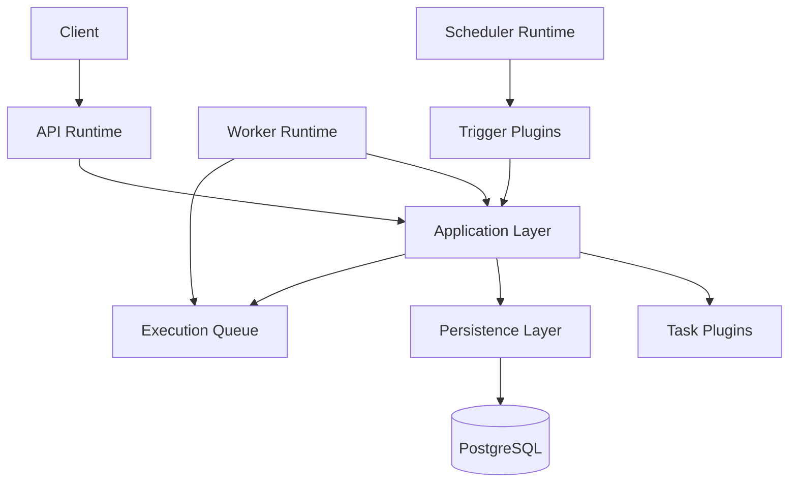

# Architecture Overview

## Purpose

The Automation Platform is a production-style backend application for defining and executing automated workflows.

The project is designed to demonstrate backend software engineering practices commonly found in modern infrastructure systems, including clean architecture, asynchronous execution, modular design, background workers, persistence, testing, dependency inversion, extensibility, and production-oriented engineering practices.

Rather than optimizing for feature count, the project prioritizes maintainability, clear architectural boundaries, and thoughtful engineering decisions that can be discussed and defended during technical interviews.

---

# Design Principles

The architecture is guided by the following principles.

- Favor modularity over monolithic business logic.
- Separate runtime concerns from business logic.
- Depend on abstractions rather than concrete implementations.
- Prefer composition over inheritance.
- Keep responsibilities small and well-defined.
- Build incrementally while preserving architectural quality.
- Introduce complexity only when it solves a real engineering problem.
- Design for extensibility without over-engineering.

---

# Architectural Philosophy

The platform follows a modular monolith architecture.

Although deployed as a single application, the system is organized into independent modules with clearly defined responsibilities and dependency boundaries.

The architecture separates:

- Runtime processes responsible for reacting to external events.
- Application services responsible for workflow orchestration.
- Domain models representing business concepts.
- Persistence responsible for durable storage.
- Plugin systems that extend supported triggers and task types.

This separation allows each concern to evolve independently while maintaining a simple deployment model.

---

# High-Level Architecture

The runtime processes provide different entry points into the system.

The application layer contains the business rules that orchestrate workflow execution.

Workers never determine workflow progression, task implementations never understand workflow structure, and trigger implementations never understand execution.

Each component has a single responsibility.

---

# Runtime Processes

The platform consists of multiple independent runtime processes.

## API Runtime

Receives HTTP requests, validates user input, and invokes application capabilities.

The API contains minimal business logic and acts primarily as a transport layer.

---

## Scheduler Runtime

Continuously evaluates trigger definitions.

When a trigger condition is satisfied, the scheduler invokes the application layer to begin a new workflow execution.

The scheduler understands *when* workflows begin but not *how* they execute.

---

## Worker Runtime

Continuously claims runnable task executions from the execution queue.

Workers invoke the application layer to process claimed tasks.

Workers intentionally contain no workflow orchestration logic.

---

# Application Layer

The application layer contains the orchestration logic for the platform.

It is responsible for implementing business capabilities such as:

- Starting workflow executions
- Processing task executions
- Advancing workflow state
- Determining newly runnable work
- Completing workflow executions
- Handling failures and retries (future)

The application layer is intentionally independent from HTTP, background workers, and scheduling.

Every runtime process invokes the same application capabilities.

---

# Domain Model

The platform distinguishes between immutable workflow definitions and mutable execution state.

## Workflow Definition

A reusable automation template describing:

- Trigger configuration
- Task definitions
- Workflow structure

Workflow definitions are immutable during execution and may be executed many times.

---

## Workflow Execution

Represents a single runtime instance of a workflow.

Each execution tracks its own:

- Status
- Timestamps
- Execution history
- Runtime progress

Multiple executions may exist simultaneously for the same workflow definition.

---

## Task Definition

Describes a unit of work within a workflow.

Task definitions specify:

- Task type
- Configuration
- Parameters

Task definitions contain no runtime state.

---

## Task Execution

Represents the runtime state of an individual task.

Task executions maintain execution-specific information such as:

- Current status
- Execution timestamps
- Retry information
- Runtime metadata

Task executions are created whenever a workflow execution begins.

---

# Plugin Architecture

The platform provides two primary extension points.

## Trigger Plugins

Trigger plugins determine **when** workflows should begin.

Examples include:

- Manual
- Scheduled
- Webhook
- File System

New trigger types can be introduced without modifying workflow orchestration.

---

## Task Plugins

Task plugins perform individual units of work.

Examples include:

- HTTP Request
- Generate CSV
- Send Email
- Delay
- Execute Python Script

Task implementations remain completely independent from workflow orchestration.

New task types can be introduced without modifying the worker or application layer.

---

# Execution Model

Workflow execution is asynchronous.

When a workflow begins:

1. A new Workflow Execution is created.
2. Runtime Task Executions are created.
3. Runnable task executions are placed onto the execution queue.
4. Workers claim queued task executions.
5. The application layer processes completed tasks.
6. Newly runnable task executions are queued.
7. The workflow completes when all task executions have finished.

The execution queue stores runnable task executions rather than entire workflows.

This allows multiple workers to process independent work while the application layer remains responsible for orchestration.

---

# Component Responsibilities

| Component | Responsibility |
|-----------|----------------|
| Runtime Processes | React to external events and invoke application capabilities. |
| Application Layer | Implement workflow orchestration and business rules. |
| Domain | Represent business concepts and execution state. |
| Persistence | Store and retrieve durable system state. |
| Execution Queue | Distribute runnable work between workers. |
| Trigger Plugins | Determine when workflows begin. |
| Task Plugins | Execute individual units of work. |

---

# Extensibility

The architecture intentionally favors extension over modification.

New capabilities should be introduced by adding new implementations rather than modifying existing orchestration logic.

Examples include:

- New trigger plugins
- New task plugins
- Alternative queue implementations
- Additional runtime processes
- Alternative persistence implementations

This approach follows the Open/Closed Principle while keeping the core architecture stable.

---

# Major Architectural Decisions

Significant architectural decisions are documented using Architecture Decision Records (ADRs).

- [**ADR-001:** Modular Monolith](../adr/ADR-001-modular-monolith.md)
- [**ADR-002:** Queue-Driven Execution](../adr/ADR-002-queue-driven-execution.md)
- [**ADR-003:** Interface-Based Extension Points](../adr/ADR-003-interface-based-extension-points.md)
- [**ADR-004:** Runtime Processes and Application Services](../adr/ADR-004-runtime-processes-and-application-services.md)
- [**ADR-005:** Immutable Workflow Definition](../adr/ADR-005-Immutable-Workflow-Definitions.md)

These documents explain the context, alternatives considered, tradeoffs, and consequences behind each decision.

---

# Future Evolution

The architecture intentionally supports future enhancements without requiring fundamental redesign.

Potential future capabilities include:

- Parallel task execution
- Directed acyclic graph (DAG) workflows
- Retry policies
- Workflow versioning
- Distributed workers
- RabbitMQ-backed queues
- Redis integration
- Metrics and observability
- AI-assisted workflow creation

These features are intentionally deferred until they solve meaningful engineering problems.
