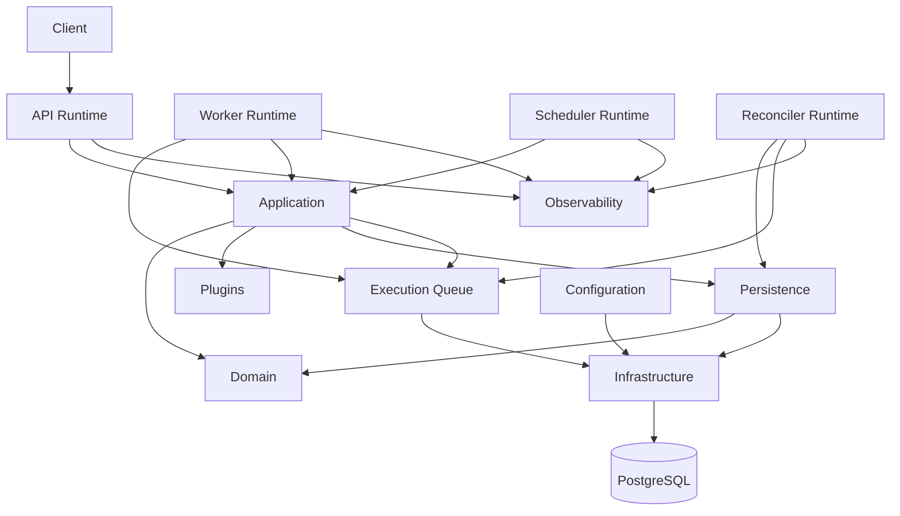

# Architecture Overview

## Purpose

The Automation Platform is a backend system for defining and executing automated workflows.

It supports:

- Reusable workflow definitions.
- Dependency-based DAG execution.
- Asynchronous task processing.
- Concurrent Workers.
- Durable execution state.
- Queue-based work distribution.
- Chronological workflow scheduling.
- Failure recovery and reconciliation.
- Extensible task and trigger plugins.

The architecture prioritizes **correctness, recoverability, maintainability, and explicit responsibility boundaries-  over premature distribution or abstraction.

This document is the entry point to the architecture documentation. It explains the overall system, its major guarantees, and where to continue reading.

---

# Architectural Style

The platform is a **modular monolith with independently executable Runtime processes**.

The system uses one codebase and one architectural model while exposing multiple process entry points:

```text
Automation Platform

├── API
├── Worker
├── Scheduler
└── Reconciler
```

These processes share the platform's:

```text
Application
Domain
Persistence
Execution Queue
Plugins
Configuration
Infrastructure
Observability
```

They are not independent services with duplicated business logic.

Each Runtime drives capabilities provided by the shared application.

---

# High-Level Architecture


```mermaid
flowchart TD

    Client["Client"]

    API["API Runtime"]
    Worker["Worker Runtime"]
    Scheduler["Scheduler Runtime"]
    Reconciler["Reconciler Runtime"]

    Application["Application"]

    Domain["Domain"]
    Plugins["Plugins"]
    Persistence["Persistence"]
    Queue["Execution Queue"]

    Config["Configuration"]
    Infrastructure["Infrastructure"]
    Observability["Observability"]

    DB[(PostgreSQL)]

    Client --> API

    API --> Application

    Worker --> Queue
    Worker --> Application

    Scheduler --> Application

    Reconciler --> Persistence
    Reconciler --> Queue

    Application --> Domain
    Application --> Plugins
    Application --> Persistence
    Application --> Queue

    Persistence --> Domain
    Persistence --> Infrastructure

    Queue --> Infrastructure

    Config --> Infrastructure

    API --> Observability
    Worker --> Observability
    Scheduler --> Observability
    Reconciler --> Observability

    Infrastructure --> DB
```

Not every Runtime directly depends on every subsystem.

Each executable process has its own composition root and constructs only the dependencies it requires.

---

# Core Responsibilities

| Component           | Responsibility                                                       |
| ------------------- | -------------------------------------------------------------------- |
| **Runtime-          | Drive platform capabilities as independently executable processes.   |
| **Application-      | Implement use cases and business orchestration.                      |
| **Domain-           | Represent core workflow and execution concepts.                      |
| **Persistence-      | Store durable state and enforce concurrency-safe transitions.        |
| **Execution Queue-  | Deliver runnable work and manage temporary Worker ownership.         |
| **Plugins-          | Provide extensible task and trigger behavior.                        |
| **Configuration-    | Convert external configuration into typed immutable settings.        |
| **Infrastructure-   | Construct shared technical resources.                                |
| **Observability-    | Provide operational visibility without participating in correctness. |

The broad dependency direction is:

```text
Runtime
    ↓
Application
    ↓
Domain / Persistence / Plugins / Queue

Persistence / Queue
    ↓
Infrastructure
    ↓
PostgreSQL
```

The Reconciler intentionally coordinates Persistence and Queue directly because its current responsibility contains little Application policy.

---

# Core Model

The platform separates **reusable definitions-  from **independent execution state**.

```text
DEFINITIONS

WorkflowDefinition
├── TriggerDefinitions
└── TaskDefinitions
        │
        │ compile
        ▼

EXECUTIONS

WorkflowExecution
└── TaskExecutions
```

Definitions describe reusable structure and configuration.

Executions represent one particular workflow run and contain its mutable runtime state.

Multiple Workflow Executions may therefore use the same Workflow Definition concurrently without sharing execution state.

See:

- [Domain Architecture](domain.md)
- [Data Model](data-model.md)
- [Execution Model](execution-model.md)

---

# Workflow Execution

Task Definitions form a directed acyclic graph.

For example:

```text
       A
      / \
     B   C
      \ /
       D
```

When a workflow begins, its definition is compiled into execution-specific state:

```text
WorkflowDefinition
        ↓
WorkflowExecution
        ↓
TaskExecutions
```

Runtime scheduling information is snapshotted into Task Executions, including information such as:

```text
remaining_dependencies
parent task execution IDs
child task execution IDs
retry state
```

A Task Execution is durably runnable when:

```text
status = PENDING
AND
remaining_dependencies = 0
```

After `A` completes, `B` and `C` may progress independently.

`D` becomes runnable only after both of its dependencies complete.

This compiled representation allows concurrent workflow progression without repeatedly traversing the reusable definition graph.

Detailed execution behavior belongs in [Execution Model](execution-model.md).

---

# Application

Application owns the platform's use cases and orchestration.

Important capabilities include:

- Creating and validating Workflow Definitions.
- Initializing trigger state.
- Starting Workflow Executions.
- Compiling definitions into execution state.
- Processing Task Executions.
- Resolving Plugins.
- Constructing task execution context.
- Interpreting task results.
- Managing retries and failures.
- Progressing workflow dependencies.
- Completing Workflow Executions.
- Processing chronological trigger occurrences.

Runtime processes invoke these capabilities rather than reimplementing them.

```text
Runtime
    ↓
Application
    ↓
Domain / Persistence / Plugins / Queue
```

See [Application Architecture](application/README.md).

---

# Domain

Domain contains the platform's core business concepts.

Examples include:

```text
WorkflowDefinition
TaskDefinition
TriggerDefinition

WorkflowExecution
TaskExecution

TaskContext
TaskResult
TaskOutput
```

Domain remains independent of:

```text
PostgreSQL
SQLAlchemy
Queue implementations
Runtime processes
HTTP
```

Not every persisted record is a Domain concept. Infrastructure-specific operational state may remain entirely within the subsystem that owns it.

See [Domain Architecture](domain.md).

---

# Persistence

Persistence is the source of truth for durable workflow and execution state.

It owns:

- SQLAlchemy persistence models.
- Repositories.
- Units of Work.
- Domain reconstruction.
- Database transactions.
- Explicit execution transitions.
- PostgreSQL-specific concurrency behavior.
- Mechanism-specific durable state where appropriate.

Execution persistence favors explicit transitions such as:

```text
start task
complete task
retry task
```

over arbitrary load-modify-save behavior.

This allows Persistence to enforce valid transitions and concurrency guarantees atomically.

See [Persistence Architecture](persistence/README.md).

---

# Execution Queue

The Execution Queue distributes runnable Task Execution identifiers to Workers.

It owns:

- Idempotent publication.
- Claims.
- Claim tokens.
- Renewable leases.
- Heartbeats.
- Lease reclamation.
- Release.
- Finish.

The Queue does not own workflow truth.

```text
Persistence
    = durable execution state

Execution Queue
    = temporary work-delivery state
```

The current implementation uses PostgreSQL, but consumers depend on the Queue abstraction rather than its concrete implementation.

See [Execution Queue Architecture](execution-queue.md).

---

# Persistence → Queue Consistency

Persistence and Queue intentionally use separate transactional boundaries.

Normal processing follows:

```text
durable execution transition
        ↓
Persistence COMMIT
        ↓
Queue disposition / publication
```

A process can fail between those operations.

The architecture therefore relies on:

```text
immediate publication
        +
idempotent Queue operations
        +
eventual reconciliation
```

rather than a distributed transaction.

The Reconciler periodically republishes Task Executions that Persistence says are durably runnable.

If the Queue entry already exists, idempotent enqueueing leaves it unchanged.

This allows Persistence and Queue to remain independent while ensuring stranded runnable work can recover.

See:

- [Execution Queue Architecture](execution-queue.md)
- [Reconciler Runtime](runtime/reconciler.md)

---

# Plugins

Plugins provide extensible behavior without moving workflow orchestration into plugin implementations.

```text
Plugins
├── Task Plugins
└── Trigger Plugins
```

Shared Plugin infrastructure provides discovery, registration, configuration validation, and lookup by stable plugin type.

## Task Plugins

Task Plugins implement units of executable behavior:

```text
TaskContext
    ↓
Task Plugin
    ↓
TaskResult
```

Application surrounds that behavior with workflow execution semantics.

Task Plugins do not own:

```text
workflow progression
Persistence transactions
Queue ownership
Worker lifecycle
```

## Trigger Plugins

Trigger Plugins implement behavior associated with mechanisms that can start workflows.

The first implemented mechanism is chronological scheduling:

```text
Trigger
└── ChronologicalTrigger
    └── IntervalTrigger
```

Future chronological plugins may include cron or one-time schedules.

Fundamentally different trigger mechanisms may require different hosting infrastructure rather than being forced through a generic scheduling abstraction.

See [Plugin Architecture](plugins/README.md).

---

# Chronological Scheduling

Chronological scheduling separates reusable trigger configuration from mutable scheduling progress.

```text
TriggerDefinition
    reusable configuration

ChronologicalTriggerState
    durable scheduling progress
```

Due occurrences are processed transactionally:

```text
lock due state
    ↓
calculate next occurrence
    ↓
advance or remove scheduling state
    ↓
create Workflow Execution
    ↓
commit
```

Multiple Scheduler processes coordinate through short-lived PostgreSQL row locks.

Recurring schedules advance relative to their persisted scheduled occurrence, allowing deterministic catch-up without silently skipping occurrences.

The Scheduler remains a thin Runtime around the chronological Application capability.

Detailed scheduling behavior is documented in:

- [Chronological Trigger Application](application/chronological-triggers.md)
- [Chronological Trigger Persistence](persistence/chronological-triggers.md)
- [Trigger Plugins](plugins/triggers.md)
- [Scheduler Runtime](runtime/scheduler.md)

---

# Runtime Processes

Runtime processes determine **when and how platform capabilities are driven**.

They intentionally contain little business logic.

```text
Runtime
├── API
├── Worker
├── Scheduler
└── Reconciler
```

## API

The API provides the external HTTP boundary and translates requests into Application capabilities.

## Worker

The Worker executes runnable Task Executions:

```text
Execution Queue
      ↓
    Worker
      ↓
TaskProcessingService
```

Task execution may involve long-running arbitrary Plugin behavior, so Queue ownership uses claim tokens, renewable leases, and heartbeats.

## Scheduler

The Scheduler drives chronological processing:

```text
Scheduler
    ↓
ChronologicalTriggerService
```

Scheduling work is bounded and transactional, so concurrent Schedulers coordinate through PostgreSQL row locks rather than renewable leases.

## Reconciler

The Reconciler repairs the Persistence → Queue consistency boundary:

```text
Persistence
    ↓
durably runnable tasks
    ↓
Reconciler
    ↓
Execution Queue
```

See [Runtime Architecture](runtime/README.md).

---

# Concurrency and Recovery

The platform deliberately uses different concurrency mechanisms for different problems.

| Problem                    | Mechanism                                 |
| -------------------------- | ----------------------------------------- |
| Durable task transitions   | Conditional atomic Persistence operations |
| Dependency progression     | Atomic dependency updates                 |
| Worker ownership           | Queue claim token + renewable lease       |
| Queue claiming             | `FOR UPDATE SKIP LOCKED`                  |
| Chronological processing   | Short-lived PostgreSQL row locks          |
| Persistence → Queue repair | Idempotency + reconciliation              |

These mechanisms solve different ownership problems and are intentionally not unified behind one generic abstraction.

The overall recovery model combines:

```text
conditional state transitions
+
atomic database operations
+
transaction rollback
+
claim-token validation
+
idempotent publication
+
reconciliation
```

The architecture assumes processes can fail and designs state transitions so work can recover safely afterward.

---

# Configuration

Configuration defines how external runtime values enter the platform.

```text
Environment
    ↓
load_settings()
    ↓
typed immutable Settings
    ↓
Runtime bootstrap
```

Components receive configuration explicitly rather than independently reading environment variables.

See [Configuration Architecture](configuration.md).

---

# Infrastructure

Infrastructure constructs technical resources genuinely shared across architectural subsystems.

Current shared resources primarily include:

```text
SQLAlchemy Engine
SessionFactory
Declarative Base
```

For example, Persistence and the PostgreSQL Queue may share the same Engine without becoming architecturally coupled.

See [Infrastructure Architecture](infrastructure.md).

---

# Observability

Observability provides process-wide operational visibility.

The current implementation focuses on application logging.

Observability may describe:

```text
Runtime lifecycle
task processing
claim failures
scheduling failures
reconciliation failures
```

but never becomes a source of workflow truth or a synchronization mechanism.

Future metrics and tracing can extend this boundary when required.

See [Observability Architecture](observability.md).

---

# Bootstrap and Composition

Each executable Runtime owns a bootstrap module acting as its composition root.

Startup generally follows:

```text
Environment
    ↓
Settings
    ↓
configure logging
    ↓
build Infrastructure
    ↓
construct required subsystems
    ↓
construct Application services
    ↓
construct Runtime
    ↓
run
```

Runtime classes receive already-constructed dependencies.

There is no globally accessible service container or Settings object.

Each executable process constructs only the dependencies it requires.

See [Project Structure](project-structure.md).

---

# Testing Strategy

Tests are placed according to the architectural guarantee being verified.

## Unit Tests

Unit tests cover isolated behavior such as:

- Domain behavior.
- Application orchestration.
- Plugin behavior.
- Runtime loops.
- Failure handling.
- Shutdown behavior.

## PostgreSQL Integration Tests

Integration tests verify database-dependent guarantees such as:

- Atomic execution transitions.
- Dependency updates.
- Queue claims and leases.
- Claim-token validation.
- Row locking.
- `FOR UPDATE SKIP LOCKED`.
- Idempotent Queue publication.
- Chronological state transitions.
- Concurrent Scheduler behavior.

## System Tests

System tests verify important cross-layer behavior such as:

- DAG execution.
- Fan-out and fan-in.
- Dependency output propagation.
- Retries and terminal failures.
- Multiple concurrent Workers.
- Recovery of stranded runnable work.
- Scheduled workflow execution.

Concurrency guarantees should be tested at the architectural boundary that provides them.

---

# Documentation Structure

Architecture documentation follows two patterns.

Small cross-cutting concerns remain individual architecture-level documents:

```text
architecture/
├── overview.md
├── project-structure.md
├── domain.md
├── data-model.md
├── execution-model.md
├── execution-queue.md
├── configuration.md
├── infrastructure.md
└── observability.md
```

Substantial subsystems use folders with their own README:

```text
architecture/
├── application/
│   ├── README.md
│   └── ...
│
├── persistence/
│   ├── README.md
│   └── ...
│
├── plugins/
│   ├── README.md
│   └── ...
│
└── runtime/
    ├── README.md
    ├── worker.md
    ├── reconciler.md
    └── scheduler.md
```

Top-level documentation explains architectural relationships.

Subsystem README files explain local responsibilities and provide navigation into their detailed documents.

---

# Recommended Reading Order

For a complete understanding of the architecture, read the documentation in this order.

## 1. Architecture Overview

```text
architecture/overview.md
```

Establish the overall system, responsibilities, execution model, and major correctness guarantees.

## 2. Project Structure

```text
architecture/project-structure.md
```

Understand where those responsibilities live in the codebase and how dependencies flow between packages.

## 3. Domain

```text
architecture/domain.md
```

Understand the core business objects and the behavior that belongs to them.

## 4. Data Model

```text
architecture/data-model.md
```

Understand how definitions, executions, and operational state relate conceptually.

## 5. Execution Model

```text
architecture/execution-model.md
```

Understand how Workflow Definitions are compiled and how Task Executions progress through a workflow DAG.

These first five documents establish the platform's core conceptual model.

## 6. Application

```text
architecture/application/README.md
```

Application explains how the core model is orchestrated into concrete use cases.

Follow its local reading order into detailed Application capabilities.

## 7. Plugins

```text
architecture/plugins/README.md
```

Understand how Application delegates extensible task and trigger behavior.

Then follow the Plugin README into task and trigger specific documentation.

## 8. Persistence

```text
architecture/persistence/README.md
```

Persistence is best understood after Domain, Data Model, Execution Model, and Application because it implements their durable representation and concurrency guarantees.

Follow the Persistence README's local reading order into its detailed documents.

## 9. Execution Queue

```text
architecture/execution-queue.md
```

With Persistence understood, the distinction between durable execution truth and temporary work delivery becomes clear.

## 10. Runtime

```text
architecture/runtime/README.md
```

Runtime comes after Application, Persistence, Plugins, and Queue because Runtime processes primarily host and coordinate capabilities defined by those components.

Then read:

```text
runtime/worker.md
runtime/reconciler.md
runtime/scheduler.md
```

## 11. Configuration

```text
architecture/configuration.md
```

Understand how external runtime values become typed immutable Settings.

## 12. Infrastructure

```text
architecture/infrastructure.md
```

Understand how those settings are used to construct shared technical resources.

Configuration comes first because Infrastructure consumes configuration values.

## 13. Observability

```text
architecture/observability.md
```

Observability is easiest to understand after the executable architecture because it surrounds those processes operationally without participating in their correctness.

---

# Architecture Decisions

This documentation describes the architecture as it currently exists.

The reasoning, alternatives, and tradeoffs behind significant architectural choices are recorded separately in the [Architecture Decision Records](../adr/README.md).

---

# Reading by Topic

The complete sequence is useful for onboarding. For targeted work, use a shorter path.

| Topic                                | Reading Path                                                                                                |
| ------------------------------------ | ----------------------------------------------------------------------------------------------------------- |
| **Core model**                        | Overview → Domain → Data Model → Execution Model                                                            |
| **Task execution**                    | Execution Model → Application task processing → Persistence workflow executions → Execution Queue → Worker  |
| **Chronological scheduling**          | Trigger Plugins → Application chronological triggers → Persistence chronological triggers → Scheduler       |
| **Failure recovery**                  | Execution Model → Persistence workflow executions → Execution Queue → Worker → Reconciler                   |
| **New Task Plugin**                   | Project Structure → Domain → Plugin README → Task Plugins                                                 |
| **New chronological Trigger Plugin**  | Trigger Plugins → Application chronological triggers → Persistence chronological triggers → Scheduler       |
| **New trigger mechanism**             | Trigger Plugins → Project Structure → mechanism-specific Application/Persistence/Runtime design as required |

---

# Future Evolution

The architecture can support future capabilities such as:

- Cron and one-time chronological triggers.
- New trigger mechanisms such as webhooks.
- Additional Task Plugins.
- Workflow versioning.
- Conditional workflow branches.
- Alternative Queue implementations.
- Transactional Outbox if stronger cross-system delivery guarantees become necessary.
- Metrics and distributed tracing.
- Richer API capabilities.
- Operational workflow inspection.

These capabilities should be introduced when concrete requirements justify them.

New features should extend existing responsibility boundaries where possible rather than introducing new layers or abstractions by default.

---

# Summary

The platform combines:

```text
reusable workflow definitions
        ↓
compiled independent executions
        ↓
Application orchestration
        ↓
durable Persistence state
        +
extensible Plugin behavior
        +
Queue-based task delivery
        ↓
thin Runtime processes
        ↓
concurrency-safe execution
        +
failure recovery
```

The architecture's central principles are:

> **Definitions remain reusable. Executions remain independent. Persistence owns durable truth. The Queue owns temporary delivery. Application owns orchestration. Plugins own extensible behavior. Runtime processes remain thin.**

And across those boundaries:

> **Design state transitions so the system remains correct and recoverable when concurrent processes race, ownership changes, or a process fails between operations.**
