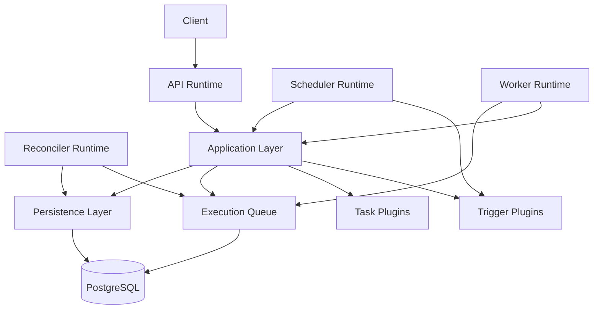

# Architecture Overview

## Purpose

The Automation Platform is a backend system for defining and executing automated workflows.

The project is designed around production-oriented backend engineering practices, including:

- Asynchronous workflow execution
- Dependency-based DAG scheduling
- Concurrent background workers
- Durable execution state
- Queue-based work distribution
- Failure recovery
- Extensible task and trigger plugins
- Explicit architectural boundaries
- Automated testing and CI

The project prioritizes correctness, maintainability, and well-defined responsibilities over maximizing feature count.

---

# Architectural Style

The platform is a **modular monolith with independently executable runtime processes**.

The system remains a single application and codebase, but its internal modules have explicit responsibilities and dependency boundaries.

Several runtime processes provide independent entry points into the application:

- API
- Worker
- Scheduler
- Reconciler

These processes share the same Domain, Application, Persistence, Queue, and Plugin infrastructure rather than operating as independent services.

This provides many of the organizational benefits of service-oriented systems while retaining the deployment and development simplicity of a modular monolith.

---

# Design Principles

The architecture follows several guiding principles:

- Separate business state from scheduling state.
- Keep runtime processes thin.
- Centralize business orchestration in the Application Layer.
- Keep infrastructure concerns outside the Domain Layer.
- Depend on abstractions rather than concrete implementations.
- Prefer explicit state transitions over generic persistence operations.
- Make concurrent operations safe at their persistence boundaries.
- Use idempotency and reconciliation to recover from partial failures.
- Introduce abstractions only when they solve a concrete problem.
- Design for extension without prematurely introducing distributed-system complexity.

---

# High-Level Architecture


```mermaid
flowchart TD

    Client["Client"]

    API["API Runtime"]
    Scheduler["Scheduler Runtime"]
    Worker["Worker Runtime"]
    Reconciler["Reconciler Runtime"]

    Application["Application Layer"]

    Queue["Execution Queue"]

    Tasks["Task Plugins"]
    Triggers["Trigger Plugins"]

    Persistence["Persistence Layer"]

    DB[(PostgreSQL)]

    Client --> API

    API --> Application

    Scheduler --> Application
    Scheduler --> Triggers

    Worker --> Queue
    Worker --> Application

    Reconciler --> Persistence
    Reconciler --> Queue

    Application --> Persistence
    Application --> Queue
    Application --> Tasks
    Application --> Triggers

    Persistence --> DB
    Queue --> DB
```

The major responsibility split is:

| Component | Responsibility |
|---|---|
| Runtime Processes | React to external events and coordinate existing application boundaries |
| Application | Implement business capabilities and workflow orchestration |
| Domain | Represent core workflow and execution concepts |
| Persistence | Store durable state and enforce concurrency-safe transitions |
| Execution Queue | Distribute runnable work and manage temporary worker ownership |
| Task Plugins | Implement extensible units of executable behavior |
| Trigger Plugins | Implement extensible trigger behavior |

---

# Workflow Model

The platform separates reusable workflow definitions from runtime execution state.

## Definitions

A `WorkflowDefinition` describes a reusable workflow template.

It owns:

- Task definitions
- Trigger definitions
- Workflow metadata

Each `TaskDefinition` describes:

- A stable task key
- Plugin type
- Configuration
- Dependencies
- Retry policy

Definitions describe **what should happen** and contain no execution-specific state.

## Executions

Starting a workflow creates an independent `WorkflowExecution`.

Each workflow execution owns a set of `TaskExecution` objects representing the runtime state of its tasks.

Task executions track information such as:

- Status
- Execution timestamps
- Remaining retry state
- Unmet dependency count
- Runtime graph relationships
- Task output

Multiple executions of the same workflow definition may run concurrently without modifying the original definition.

---

# Compiled Workflow Executions

Workflow definitions and workflow executions intentionally use different representations of the workflow graph.

Definitions represent the logical workflow structure.

When execution begins, that structure is **compiled into execution-oriented state**.

For example, a Task Execution contains runtime information such as:

```text
unmet dependency count
child Task Execution IDs
retry state
execution status
task output
```

Workers therefore do not need to repeatedly reconstruct the workflow graph from its reusable definition.

The definition representation is optimized for authoring and reuse, while the execution representation is optimized for runtime progression.

---

# Dependency-Based Execution

Workflows are modeled as directed acyclic graphs.

For example:

```text
        A
       / \
      B   C
       \ /
        D
```

After A completes, B and C may execute concurrently.

D becomes runnable only after both dependencies complete.

Each Task Execution stores an unmet dependency count.

When a task completes, Persistence atomically decrements the dependency counts of its children. A child becomes runnable when its count reaches zero.

This supports both fan-out and fan-in while allowing independent tasks to execute concurrently.

---

# Application Layer

The Application Layer implements the platform's business capabilities.

Runtime processes invoke Application services rather than implementing workflow rules themselves.

Important capabilities include:

- Creating and validating Workflow Definitions
- Starting Workflow Executions
- Compiling definitions into runtime Task Executions
- Processing Task Executions
- Constructing task execution context
- Resolving task plugins
- Handling task results
- Managing retries and failures
- Determining newly runnable work
- Completing Workflow Executions

The Application Layer decides **what should happen**.

Persistence, Queue, and Plugins provide the mechanisms used to carry out those decisions.

---

# Task Execution and Data Flow

Task plugins receive execution information through a `TaskContext`.

A context contains the task's configuration together with outputs from its completed dependencies.

Plugins return a `TaskResult`, which the Application Layer interprets and persists.

Conceptually:

```text
TaskDefinition configuration
          +
dependency outputs
          │
          ▼
     TaskContext
          │
          ▼
      Task Plugin
          │
          ▼
      TaskResult
          │
          ▼
Application / Persistence
```

Plugins therefore remain independent of workflow persistence and orchestration.

Outputs are associated with stable task keys, allowing workflows to contain multiple tasks using the same plugin type without ambiguity.

---

# Persistence and Concurrency

Persistence is the authoritative source of workflow execution state.

The execution repositories are **transition-oriented** rather than generic CRUD repositories.

Instead of:

```text
load aggregate
    ↓
modify arbitrary state
    ↓
save entire aggregate
```

Persistence exposes explicit lifecycle transitions such as:

```text
start task
complete task
retry task
```

These transitions are implemented using conditional SQL operations that verify the expected current state before making changes.

This prevents stale or duplicate Workers from blindly overwriting execution state.

---

## Concurrent Workflow Progression

Concurrency correctness is handled at the database boundary rather than through workflow-wide application locks.

When multiple parent tasks complete concurrently, child dependency counts are decremented atomically in PostgreSQL.

For example:

```text
B ──┐
    ├──► D
C ──┘
```

B and C may complete simultaneously without losing either dependency update.

Workflow completion is similarly derived from durable Task Execution state rather than maintained through a shared mutable task counter.

This allows independent tasks within the same workflow to progress concurrently.

---

# Execution Queue

The Execution Queue contains runnable Task Execution IDs.

It deliberately does not duplicate workflow business state.

The Queue owns:

- Enqueueing runnable work
- Claiming work
- Worker leases
- Heartbeats
- Lease expiration and reclamation
- Releasing retryable work
- Finishing claimed work

Persistence remains authoritative for:

- Task status
- Workflow status
- Dependencies
- Retries
- Outputs

This separation keeps the Queue focused on **work delivery**, while Persistence owns **execution correctness**.

---

# Lease-Based Worker Coordination

Workers temporarily own queued work through renewable leases.

A claim contains a unique claim token identifying the current ownership instance.

While processing a task, the Worker periodically renews its lease through heartbeats.

If the lease expires, another Worker may reclaim the work.

Queue mutations validate the current claim token, preventing stale Workers from modifying Queue state after ownership has changed.

PostgreSQL queue claiming uses:

```sql
FOR UPDATE SKIP LOCKED
```

allowing multiple Workers to claim independent work concurrently without blocking one another.

---

# Failure Recovery and Reconciliation

Persistence and the Execution Queue intentionally use separate transactional boundaries.

A successful task normally follows:

```text
execute task
    ↓
commit durable state transition
    ↓
finish Queue claim
    ↓
enqueue newly runnable work
```

This creates a narrow failure window:

```text
Persistence commits
    ↓
process crashes
    ↓
Queue update never occurs
```

The durable state remains correct, but newly runnable work may temporarily be absent from the Queue.

The platform repairs this through a dedicated **Reconciler Runtime**.

The Reconciler periodically finds tasks that are durably runnable:

```text
PENDING
AND
unmet dependencies = 0
```

and idempotently enqueues them.

Because Queue insertion is idempotent, normal execution and reconciliation may safely attempt to enqueue the same task.

This provides eventual recovery without requiring Persistence and Queue to participate in a distributed transaction.

---

# Plugin Architecture

Tasks and triggers are extensible through a generic plugin system.

The plugin infrastructure provides:

```text
generic discovery
        ↓
generic registry
        ↓
typed task / trigger registries
        ↓
plugin implementations
```

Each plugin exposes a stable type identifier and configuration validation contract.

Application code resolves implementations through registries rather than containing conditional dispatch logic for every supported type.

## Task Plugins

Task plugins execute units of workflow behavior.

Their contract is conceptually:

```python
execute(context: TaskContext) -> TaskResult
```

They do not directly manipulate:

- Workflow state
- Task Execution persistence
- Execution Queue state
- Application orchestration

## Trigger Plugins

Trigger plugins provide extensible behavior for determining when workflows should begin.

Mechanism-specific runtime infrastructure, such as durable chronological scheduling state, remains separate from the reusable trigger implementation.

---

# Runtime Processes

## Worker

The Worker:

1. Claims runnable work from the Queue.
2. Maintains the claim through heartbeats.
3. Invokes the Application Layer to process the task.
4. Releases retryable work or finishes completed work.
5. Repeats.

If claim ownership can no longer be trusted, the Worker avoids modifying Queue state using the potentially stale claim.

## Reconciler

The Reconciler periodically repairs runnable tasks that are missing from the Queue.

It coordinates Persistence and Queue abstractions without implementing workflow business logic.

## Scheduler

The Scheduler processes durable trigger state and initiates workflows when trigger conditions become satisfied.

Scheduling state is designed to remain durable and safe under multiple Scheduler processes rather than existing only in memory.

## API

The API provides the external HTTP boundary and delegates business operations to the Application Layer.

---

# Runtime Infrastructure

Each independently executable runtime has its own bootstrap module that acts as a composition root.

Startup follows the general pattern:

```text
environment
    ↓
Settings
    ↓
logging configuration
    ↓
shared infrastructure
    ↓
Persistence / Queue / Plugins
    ↓
Application services
    ↓
Runtime
```

Configuration is loaded from environment variables into an immutable Settings object and passed explicitly during dependency construction rather than exposed through global application state.

Long-running runtimes support graceful shutdown through stop events and OS signal handling.

---

# Testing Strategy

Testing is divided according to architectural responsibility.

**Unit tests** verify isolated application behavior, plugins, runtime lifecycle logic, heartbeat handling, and failure paths.

**PostgreSQL integration tests** verify database-dependent behavior such as atomic state transitions, queue claims, leases, row locking, dependency updates, and idempotency.

**System tests** verify important cross-layer properties using real components, including:

- DAG execution
- Fan-out and fan-in
- Dependency output propagation
- Retries and terminal failures
- Multiple Workers
- Recovery of stranded runnable work

The goal is to test concurrency and reliability properties at the layer where those guarantees are actually implemented.

---

# Major Architectural Decisions

Significant architectural decisions are documented through Architecture Decision Records.

- [**ADR-001:** Modular Monolith](../adr/ADR-001-modular-monolith.md)
- [**ADR-002:** Queue-Driven Execution](../adr/ADR-002-queue-driven-execution.md)
- [**ADR-003:** Interface-Based Extension Points](../adr/ADR-003-interface-based-extension-points.md)
- [**ADR-004:** Runtime Processes and Application Services](../adr/ADR-004-runtime-processes-and-application-services.md)
- [**ADR-005:** Separate Definitions from Execution State](../adr/ADR-005-separate-definitions-from-execution-state.md)
- [**ADR-006:** Dependency Based Workflow Scheduling](../adr/ADR-006-dependency-based-workflow-scheduling.md)
- [**ADR-010:** Compiled Workflow Executions](../adr/ADR-010-compiled-workflow-executions.md)
- [**ADR-011:** Transition Oriented Persistence](../adr/ADR-011-transition-oriented-persistence.md)
- [**ADR-012:** Lease Based Queue Ownership](../adr/ADR-012-lease-based-queue-ownership.md)
- [**ADR-013:** Eventual Queue Consistency Through Reconciliation](../adr/ADR-013-eventual-queue-consistency-through-reconciliation.md)

ADRs preserve the context, alternatives, tradeoffs, and consequences behind decisions that would otherwise be difficult to infer from the final implementation.

---

# Future Evolution

The architecture leaves room for additional capabilities without requiring fundamental redesign.

Potential future additions include:

- Workflow versioning
- Conditional workflow branches
- Additional task and trigger plugins
- Alternative Queue implementations such as RabbitMQ
- Transactional Outbox for stronger cross-system delivery guarantees
- Metrics and distributed tracing
- Operational workflow inspection
- Richer API capabilities

These features are intentionally deferred until they solve concrete requirements.

---

# Summary

The Automation Platform combines:

```text
reusable workflow definitions
        +
compiled DAG executions
        +
asynchronous task processing
        +
concurrent background workers
        +
lease-based queue ownership
        +
atomic persistence transitions
        +
idempotent scheduling
        +
failure reconciliation
        +
extensible task and trigger behavior
```

The system remains a modular monolith, but its internal boundaries and independently executable runtimes allow execution, scheduling, recovery, persistence, and extensibility to evolve independently.

The architecture is designed around explicit correctness, concurrency, recoverability, and maintainability while avoiding distributed-system complexity that the current requirements do not justify.
