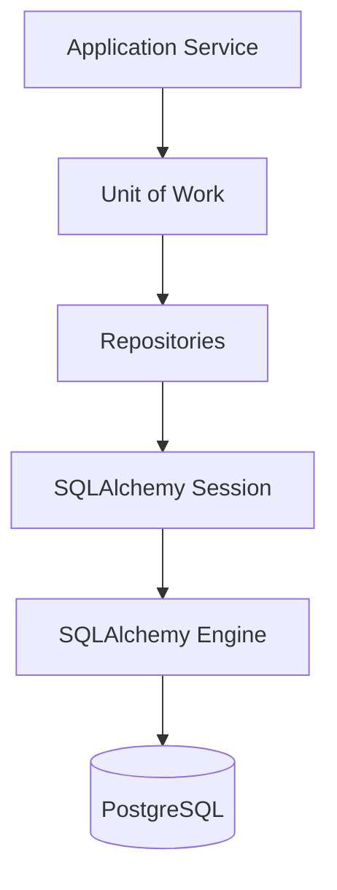

# Persistence Architecture

## Purpose

The Persistence Layer is responsible for storing and reconstructing the platform's domain objects while hiding all database implementation details from the rest of the application.

The Application Layer never performs SQL queries directly and remains unaware of SQLAlchemy, PostgreSQL, transactions, or database sessions.

Persistence exposes repository interfaces that operate on domain objects rather than database rows.

---

# Responsibilities

The Persistence Layer is responsible for:

- Persisting workflow definitions
- Persisting workflow executions
- Persisting task executions
- Reconstructing domain objects from stored data
- Managing database sessions
- Defining transactional boundaries through the Unit of Work
- Isolating SQLAlchemy and PostgreSQL from the rest of the application

The Persistence Layer is **not** responsible for:

- Business logic
- Workflow orchestration
- Queue management
- Trigger evaluation
- Task execution

---

# Design Principles

The Persistence Layer follows several architectural principles.

- Business logic remains outside the persistence layer.
- Database implementation details are hidden behind repositories.
- Domain objects remain independent of SQLAlchemy.
- Repository APIs operate on domain objects rather than SQL rows.
- Transactions are scoped to business operations.
- SQLAlchemy models are implementation details.

---

# High-Level Architecture



---

# Database Lifecycle

Each runtime process owns its own SQLAlchemy Engine.

The Engine is created once during process startup using the configured database connection string.

The Engine maintains a pool of reusable database connections throughout the lifetime of the process.

Each business operation creates a new Unit of Work.

The Unit of Work creates a SQLAlchemy Session.

The Session borrows a connection from the Engine's connection pool, performs the required database operations, commits or rolls back the transaction, and then returns the connection to the pool before closing.

---

# Repository Pattern

Repositories provide the public persistence API.

Each repository owns the persistence responsibilities for a single domain concept.

Example repositories include:

- WorkflowDefinitionRepository
- WorkflowExecutionRepository
- TaskExecutionRepository

Repositories expose persistence operations such as:

- get(...)
- save(...)
- delete(...)

Repositories never expose SQLAlchemy models to the Application Layer.

---

# Object Mapping

Persistence distinguishes between three representations of data.

## Domain Object

Represents business concepts used throughout the Application Layer.

Example:

- WorkflowExecution
- TaskExecution

Domain objects contain business state and lightweight domain behavior.

They have no knowledge of SQLAlchemy or PostgreSQL.

---

## SQLAlchemy Model

Represents how data is stored within PostgreSQL.

Models define:

- Tables
- Columns
- Relationships
- Constraints

These models exist solely within the Persistence Layer.

---

## Mapper

Mappers translate between:

- Domain Objects
- SQLAlchemy Models

This translation remains completely hidden from the Application Layer.

Task definition configuration and task execution outputs are stored as JSONB documents because their structure is plugin-defined.

---

# Unit of Work

The Unit of Work defines the transactional boundary for a single business operation.

Rather than allowing individual repositories to manage transactions independently, repositories participating in the same business operation share a single SQLAlchemy Session.

This ensures that either all database changes succeed together or all changes are rolled back together.

Example business operations include:

- Start Workflow
- Process Task
- Cancel Workflow

Each operation creates a fresh Unit of Work.

---

# Runtime Initialization

During startup each runtime process performs the following initialization:

1. Load configuration
2. Create SQLAlchemy Engine
3. Create Session Factory
4. Create Unit of Work Factory
5. Construct application services
6. Begin runtime loop

Each process maintains its own Engine and connection pool while communicating with the same PostgreSQL database.

---

# Package Organization

```text
persistence/
│
├── database/
│   ├── engine.py
│   ├── session.py
│   └── unit_of_work.py
│
├── workflow_definitions/
│   ├── repository.py
│   ├── _model.py
│   └── _mapper.py
│
├── workflow_executions/
│   ├── repository.py
│   ├── _model.py
│   └── _mapper.py
│
└── task_executions/
    ├── repository.py
    ├── _model.py
    └── _mapper.py
```

---

# Testing Strategy

The Persistence Layer is tested independently from business logic.

Unit tests validate:

- Repository behavior
- Object mapping
- Transaction handling

Integration tests validate:

- SQLAlchemy behavior
- PostgreSQL interaction
- Database schema
- Query correctness

The Application Layer is tested separately using mocked or fake persistence implementations.

---

# Future Evolution

Potential future improvements include:

- Optimized repository queries
- Bulk operations
- Read/write separation
- Database migrations
- Alternative persistence implementations
- Distributed transaction support (if ever required)

The Persistence Layer intentionally hides these implementation details so they can evolve without affecting the Application Layer.
