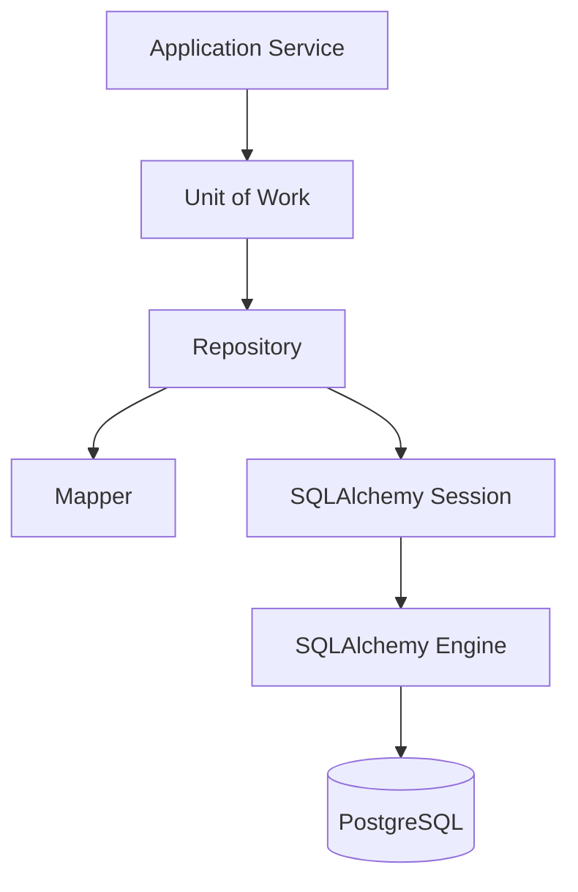

# Persistence Architecture

## Purpose

The Persistence Layer stores and reconstructs the platform's domain objects while hiding all database implementation details from the rest of the application.

The Application Layer never performs SQL queries directly and remains unaware of SQLAlchemy, PostgreSQL, transactions, or database sessions.

Persistence exposes repository interfaces that operate on domain objects and aggregate state transitions rather than database rows.

---

# Responsibilities

The Persistence Layer is responsible for:

- Persisting workflow definitions
- Persisting workflow executions
- Reconstructing domain objects from stored data
- Performing atomic state transitions
- Managing database sessions
- Defining transactional boundaries through the Unit of Work
- Isolating SQLAlchemy and PostgreSQL from the rest of the application

The Persistence Layer is **not** responsible for:

- Business logic
- Workflow orchestration
- Queue management
- Trigger evaluation
- Task execution
- Scheduling

---

# Design Principles

The Persistence Layer follows several architectural principles.

- Business logic remains outside the Persistence Layer.
- Database implementation details are hidden behind repositories.
- Domain objects remain independent of SQLAlchemy.
- Repository APIs operate on domain objects rather than database rows.
- Repositories persist aggregate roots rather than individual entities.
- Aggregate state transitions are performed atomically.
- Transactions are scoped to business operations.
- SQLAlchemy models are implementation details.

---

# High-Level Architecture


```mermaid
flowchart TD

Application["Application Service"]

UOW["Unit of Work"]

Repository["Repository"]

Mapper["Mapper"]

Session["SQLAlchemy Session"]

Engine["SQLAlchemy Engine"]

DB[(PostgreSQL)]

Application --> UOW
UOW --> Repository
Repository --> Mapper
Repository --> Session
Session --> Engine
Engine --> DB
```

---

# Aggregate Persistence

Repositories own persistence for aggregate roots.

Workflow definitions own:

- Task Definitions
- Trigger Definitions

Workflow executions own:

- Task Executions

Repositories reconstruct complete aggregates before returning them to the Application Layer.

Child entities are never loaded independently.

---

# Database Lifecycle

Each runtime process owns its own SQLAlchemy Engine.

The Engine is created once during process startup using the configured connection string.

The Engine maintains a pool of reusable database connections throughout the lifetime of the process.

Each business operation creates a Unit of Work.

The Unit of Work creates a SQLAlchemy Session.

The Session borrows a database connection from the Engine, performs all required persistence operations, commits or rolls back the transaction, returns the connection to the pool, and then closes.

---

# Repository Pattern

Repositories expose the public persistence API.

Each repository owns persistence for a single aggregate.

Current repositories include:

- WorkflowDefinitionRepository
- WorkflowExecutionRepository

Repositories expose aggregate-specific operations rather than generic CRUD.

Examples include:

### WorkflowDefinitionRepository

- create(...)
- load(...)
- delete(...)

### WorkflowExecutionRepository

- create(...)
- load(...)
- delete(...)
- find_workflow_execution(...)
- start_task(...)
- complete_task(...)
- retry_task(...)

Repositories encapsulate:

- SQLAlchemy
- SQL
- database concurrency
- aggregate reconstruction

Repositories never expose SQLAlchemy models.

---

# Atomic State Transitions

Workflow executions evolve through atomic repository operations.

Examples include:

- starting a task
- completing a task
- retrying a task
- failing a workflow

Each transition is implemented as a single conditional SQL statement whenever possible.

Conditional updates ensure transitions only occur from valid states.

For example:

```
PENDING
    ↓
RUNNING
   ├──► COMPLETED
   ├──► PENDING (retry)
   └──► FAILED
```

This approach prevents race conditions between multiple workers while avoiding explicit locking in application code.

---

# Object Mapping

Persistence distinguishes between three representations.

## Domain Objects

Business concepts used throughout the application.

Examples include:

- WorkflowDefinition
- TaskDefinition
- TriggerDefinition
- WorkflowExecution
- TaskExecution

Domain objects contain business state but remain independent of SQLAlchemy.

---

## SQLAlchemy Models

Represent database tables.

Models define:

- tables
- columns
- relationships
- constraints

Models exist solely inside the Persistence Layer.

---

## Mapper

Mappers translate between:

- Domain Objects
- SQLAlchemy Models

Repositories coordinate persistence operations while mappers perform only object translation.

Mappers never execute SQL.

Task configuration, trigger configuration, and task outputs are stored without interpretation.

---

# Unit of Work

The Unit of Work defines the transactional boundary for a business operation.

Repositories participating in the same operation share a SQLAlchemy Session.

This ensures either every persistence operation succeeds together or the transaction is rolled back.

Typical business operations include:

- Start Workflow
- Start Task
- Complete Task
- Retry Task
- Cancel Workflow

Each business operation creates a fresh Unit of Work.

---

# Concurrency

The Persistence Layer is responsible for correctness under concurrent access.

Repository transition methods use conditional SQL updates rather than read-modify-write sequences.

This allows multiple workers to safely operate on the same workflow execution without application-level locking.

Examples include:

- only starting pending tasks
- only completing running tasks
- decrementing dependency counters atomically
- computing workflow completion directly within SQL

Concurrency concerns remain entirely inside the Persistence Layer.

---

# Runtime Initialization

Each runtime process performs the following startup sequence:

1. Load configuration
2. Create SQLAlchemy Engine
3. Create Session Factory
4. Create Unit of Work Factory
5. Construct repositories
6. Construct application services
7. Begin runtime loop

Each process maintains its own Engine and connection pool while communicating with the same PostgreSQL database.

---

# Package Organization

```text
persistence/
│
├── database/
│   ├── __init__.py
│   ├── sqlalchemy_uow.py
│   └── unit_of_work.py
│
├── workflow_definitions/
│   ├── __init__.py
│   ├── repository.py
│   ├── _mapper.py
│   └── _model.py
│
├── workflow_executions/
│   ├── __init__.py
│   ├── repository.py
│   ├── operations.py
│   ├── _mapper.py
│   └── _model.py
│
└── __init__.py
```

---

# Testing Strategy

The Persistence Layer is tested independently of the Application Layer.

## Unit Tests

Unit tests validate:

- object mapping
- repository helper methods
- Unit of Work behavior

## Integration Tests

Integration tests validate:

- aggregate persistence
- repository transitions
- SQLAlchemy mappings
- PostgreSQL behavior
- transaction handling
- concurrency-safe state transitions

The Application Layer is tested separately using fake persistence implementations where appropriate.

---

# Future Evolution

Possible future improvements include:

- optimized read queries
- bulk operations
- query optimization
- database migrations
- read/write separation
- additional repository implementations
- partitioning
- distributed persistence

Because the Application Layer depends only on repository interfaces, these implementation details can evolve without affecting the rest of the system.
