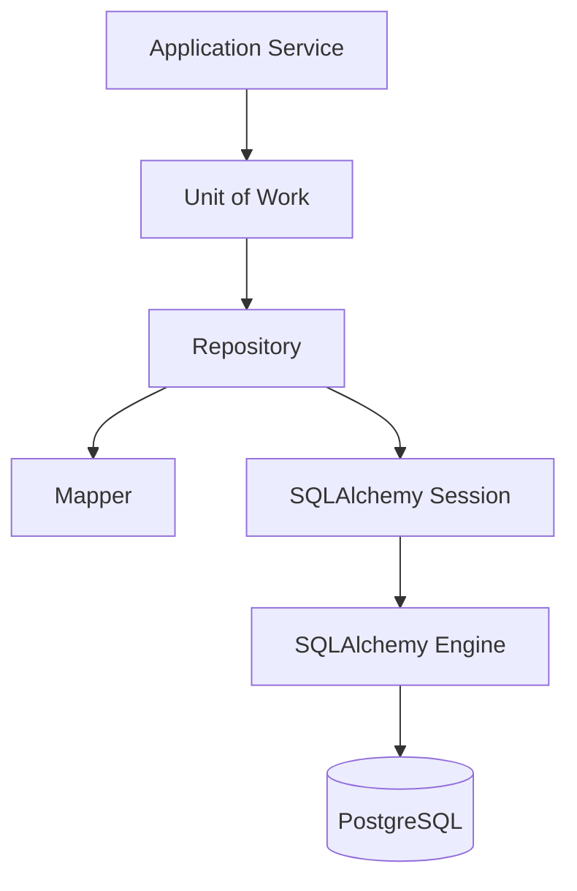

# Persistence Architecture

## Purpose

The Persistence Layer stores and reconstructs platform state while hiding database implementation details from the rest of the system.

The Application Layer does not perform SQL queries directly and remains unaware of SQLAlchemy models, PostgreSQL-specific queries, database sessions, or connection management.

Persistence exposes repositories and transactional operations that work with domain objects or narrowly scoped operation models rather than database rows.

The Persistence Layer answers the question:

> **How is application state stored, retrieved, and transitioned safely?**

---

# Responsibilities

The Persistence Layer is responsible for:

* Persisting workflow definitions.
* Persisting workflow executions.
* Persisting chronological trigger scheduling state.
* Reconstructing domain objects from stored data.
* Providing targeted persistence operations needed by Application use cases.
* Performing concurrency-sensitive state transitions.
* Providing database locking required by Application operations.
* Maintaining execution dependency state.
* Managing database sessions.
* Defining transactional boundaries through the Unit of Work.
* Mapping between domain objects and SQLAlchemy models.
* Isolating SQLAlchemy and PostgreSQL from the rest of the system.

The Persistence Layer is not responsible for:

* Workflow orchestration.
* Task plugin execution.
* Trigger plugin execution.
* Calculating trigger occurrences.
* Constructing `TaskContext`.
* Interpreting `TaskResult`.
* Queue claims or leases.
* Queue heartbeats.
* Worker lifecycle.
* Scheduler lifecycle.
* Scheduler polling.
* HTTP handling.

Persistence provides the durable state and concurrency primitives required by these systems without implementing their business behavior.

---

# Design Principles

## Infrastructure Encapsulation

SQLAlchemy models, database sessions, SQL expressions, and PostgreSQL-specific behavior remain internal to Persistence.

Other layers interact with persistence abstractions rather than database implementation details.

For example, Application code can ask Persistence for the next due chronological trigger without knowing that PostgreSQL uses `FOR UPDATE SKIP LOCKED` to safely select it.

---

## Domain Independence

Domain models remain independent of SQLAlchemy.

Persistence translates between domain representations and database representations rather than attaching persistence behavior directly to domain objects.

Not every persisted table requires a corresponding Domain object.

For example, chronological trigger scheduling state exists to support durable scheduling and is used primarily by Persistence and Application. It therefore does not need to become part of the core workflow Domain.

---

## Aggregate Persistence

Repositories own persistence for major aggregate roots.

Workflow definitions contain:

* Task Definitions.
* Trigger Definitions.

Workflow executions contain:

* Task Executions.

Repositories may persist and reconstruct these complete aggregates when a use case requires them.

However, not every operation loads an entire aggregate.

Execution and scheduling operations may expose targeted persistence methods that retrieve or modify only the state required by a particular Application use case.

This prevents unnecessary aggregate reconstruction during frequent runtime operations.

---

## Atomic State Transitions

Concurrency-sensitive changes are implemented using database operations and PostgreSQL concurrency primitives.

Persistence is responsible for ensuring that persisted state is changed safely under concurrency.

Examples include:

* Conditional task state transitions.
* Atomic dependency-counter updates.
* Workflow failure and task cancellation.
* Row locking when claiming a due chronological trigger.

Application code coordinates what should happen but does not implement database locking or SQL read-modify-write concurrency logic.

---

## Transactional Composition

A business transition may require multiple persistence operations.

Atomicity does not require every repository operation to consist of exactly one SQL statement.

Operations executed through the same Unit of Work share the same database transaction and become durable together when committed.

For example, chronological scheduling can perform:

```text
lock due trigger
        ↓
advance scheduling state
        ↓
create WorkflowExecution
        ↓
commit
```

Although multiple repositories participate, these persistence changes form one atomic transaction.

---

# High-Level Architecture


```mermaid
flowchart TD

    Application["Application Service"]

    UOW["Unit of Work"]

    Repository["Repository"]

    Mapper["Mapper"]

    Session["SQLAlchemy Session"]

    Engine["SQLAlchemy Engine"]

    DB[(PostgreSQL)]

    Application --> UOW
    UOW --> Repository

    Repository --> Mapper
    Repository --> Session

    Session --> Engine
    Engine --> DB
```

Application services define business-level transaction boundaries.

The Unit of Work provides repositories that share one SQLAlchemy Session.

Repositories implement persistence operations within that transaction.

---

# Repository Pattern

Repositories expose the public persistence API.

Current repositories include:

* `WorkflowDefinitionRepository`
* `WorkflowExecutionRepository`
* `ChronologicalTriggerRepository`

Repository APIs are designed around the needs of Application use cases rather than generic table-level CRUD.

---

## Workflow Definition Repository

The workflow definition repository persists the complete reusable workflow definition aggregate.

Responsibilities include:

* Loading workflow definitions.
* Saving workflow definitions.
* Deleting workflow definitions.
* Synchronizing task definitions.
* Synchronizing trigger definitions.
* Persisting task dependency relationships.

Saving a workflow definition synchronizes its child entities with the supplied aggregate state.

---

## Workflow Execution Repository

The workflow execution repository supports both aggregate persistence and targeted execution operations.

Responsibilities include:

* Loading workflow executions.
* Saving workflow executions.
* Starting task executions.
* Completing task executions.
* Recording failed attempts and retries.
* Updating child dependency state.
* Completing workflows.
* Failing workflows.
* Cancelling remaining work after workflow failure.

Task-processing operations intentionally avoid loading the complete workflow execution when only a small subset of execution state is required.

---

## Chronological Trigger Repository

The chronological trigger repository persists the runtime scheduling state required by chronological triggers.

Responsibilities include:

* Creating scheduling state.
* Deleting scheduling state.
* Selecting and locking the earliest due trigger.
* Updating the next scheduled occurrence.

Its API is intentionally narrow:

```text
create(...)
delete(...)
get_next_due(...)
update_next_run(...)
```

It does not calculate when a trigger should run.

That behavior belongs to chronological trigger plugins and is coordinated by the Application Layer.

The repository only stores scheduling state and provides the persistence operations required to process it safely.

---

# Aggregate and Targeted Operations

Persistence uses two complementary access patterns.

## Aggregate Operations

Aggregate operations are appropriate when the Application Layer needs a complete business object.

Examples include:

```text
WorkflowDefinitionRepository.load(...)
WorkflowDefinitionRepository.save(...)

WorkflowExecutionRepository.load(...)
WorkflowExecutionRepository.save(...)
```

These operations reconstruct or persist complete aggregate state.

---

## Targeted Operations

Runtime-heavy operations use narrowly scoped repository methods.

Examples include:

```text
WorkflowExecutionRepository.start_task(...)
WorkflowExecutionRepository.complete_task(...)
WorkflowExecutionRepository.retry_task(...)

ChronologicalTriggerRepository.get_next_due(...)
ChronologicalTriggerRepository.update_next_run(...)
```

These methods perform or expose only the persistence behavior required by the Application operation.

This avoids unnecessarily doing:

```text
load complete aggregate
        ↓
change one small piece of state
        ↓
save complete aggregate
```

when the operation can be expressed more efficiently and safely through targeted persistence behavior.

---

# Persistence Operation Models

Targeted repository operations may accept or return persistence-specific request and result dataclasses.

Examples include:

* `StartTaskExecutionResult`
* `CompleteTaskExecutionRequest`
* `CompleteTaskExecutionResult`
* `RetryTaskExecutionRequest`
* `RetryTaskExecutionResult`
* `DueChronologicalTrigger`

These models represent persistence operation boundaries.

They are not Domain objects and are not SQLAlchemy models.

They allow Persistence to return exactly the information required by an Application use case without exposing database rows or reconstructing unnecessary aggregates.

For example, `DueChronologicalTrigger` can contain the information needed to process a due occurrence:

```text
trigger definition ID
workflow definition ID
plugin type
plugin configuration
scheduled occurrence
```

The Application Layer receives the information it needs without depending on the chronological SQLAlchemy state model.

---

# Object Mapping

Persistence distinguishes between several representations.

## Domain Objects

Domain objects represent platform concepts independent of persistence technology.

Examples include:

* `WorkflowDefinition`
* `TaskDefinition`
* `TriggerDefinition`
* `WorkflowExecution`
* `TaskExecution`
* `TaskOutput`

---

## SQLAlchemy Models

SQLAlchemy models represent database tables and relationships.

They define:

* Tables.
* Columns.
* Foreign keys.
* Relationships.
* Constraints.
* PostgreSQL-specific storage types.

These models remain internal to Persistence.

Chronological scheduling state is represented by a SQLAlchemy model even though it does not have a corresponding core Domain object.

This is intentional:

> **Database tables do not need to correspond one-to-one with Domain objects.**

---

## Mappers

Mappers translate between Domain objects and SQLAlchemy models.

Repositories coordinate persistence behavior while mappers perform representation conversion.

Mappers do not execute SQL.

Examples of mapped values include:

* Workflow definitions.
* Task definitions.
* Trigger definitions.
* Workflow executions.
* Task executions.
* JSONB task configuration.
* JSONB trigger configuration.
* JSONB task output.

Persistence does not interpret plugin configuration values.

Chronological scheduling state does not require a mapper because it is not reconstructed into a Domain object. Its repository works directly with the internal persistence model and exposes narrowly scoped operation results where necessary.

---

# Unit of Work

The Unit of Work defines a database transaction boundary.

Repositories participating in the same Unit of Work share one SQLAlchemy Session.

Conceptually:

```text
with uow_factory() as uow:

    persistence operation
    persistence operation
    persistence operation

    uow.commit()
```

All operations performed through that Unit of Work participate in the same transaction.

If an exception occurs before commit, the transaction is rolled back.

The session is closed when the Unit of Work exits.

---

## Transaction Ownership

The top-level Application operation owns the Unit of Work for a business transaction.

Nested Application operations may participate in the caller's Unit of Work when multiple operations must commit atomically.

For example:

```text
ChronologicalTriggerService.process_next_due()
        │
        │ owns UoW
        │
        ├── ChronologicalTriggerRepository
        │       updates scheduling state
        │
        └── WorkflowStartService
                creates WorkflowExecution
                using same UoW
```

Persistence does not decide which business operations belong in one transaction. Application makes that decision and composes repository operations through the shared Unit of Work.

---

## Explicit Flushing

The Unit of Work exposes flushing when later persistence operations in the same transaction depend on rows that have already been staged for persistence.

Workflow definition creation provides an example.

Chronological scheduling state references a persisted `TriggerDefinition` through a foreign key.

The creation flow can therefore be:

```text
save WorkflowDefinition
        ↓
save TriggerDefinitions
        ↓
flush
        ↓
create ChronologicalTriggerState
        ↓
commit
```

Flushing sends pending SQL statements to PostgreSQL without committing the transaction.

The transaction remains atomic.

If chronological trigger initialization fails after the flush:

```text
definitions flushed
        ↓
initialization fails
        ↓
ROLLBACK
        ↓
definitions and scheduling state are not persisted
```

Application uses the Unit of Work's public `flush()` operation rather than accessing the underlying SQLAlchemy Session directly.

---

# Database Lifecycle

Each independently running process creates its own SQLAlchemy Engine during startup.

The Engine maintains a pool of reusable database connections for that process.

Application operations create Units of Work as needed.

A Unit of Work uses a SQLAlchemy Session, which obtains a database connection from the Engine's pool when database work is performed.

After the transaction completes and the session closes, the connection becomes available to the pool again.

Long-running runtime processes such as Workers, Reconcilers, and Schedulers should not unnecessarily retain database transactions or connections between operations.

---

# Chronological Trigger State

Chronological triggers require durable scheduling state in addition to their reusable trigger definitions.

These concepts are stored separately.

```text
TriggerDefinition
├── id
├── plugin_type
├── configuration
└── enabled

ChronologicalTriggerState
├── trigger_definition_id
└── next_run_at
```

The `TriggerDefinition` describes **what the trigger is**.

The chronological state records **the next scheduled occurrence that has not yet been processed**.

For example:

```text
TriggerDefinition
    plugin_type = "interval"
    configuration =
        interval_seconds = 3600

ChronologicalTriggerState
    next_run_at = 10:00
```

After the 10:00 occurrence is successfully processed, the state might become:

```text
next_run_at = 11:00
```

The trigger definition remains unchanged.

---

## State Lifecycle

Chronological state is initialized when its trigger definition is created.

Because initialization occurs in the same Unit of Work as workflow definition creation:

```text
WorkflowDefinition
TriggerDefinition
ChronologicalTriggerState
```

are committed atomically.

A successfully persisted chronological trigger therefore has the durable state required by the Scheduler.

For a chronological trigger with no future occurrence, the scheduling state may later be deleted while the reusable trigger definition remains persisted.

---

# Due-Trigger Selection

The Scheduler processes one due chronological occurrence at a time.

Persistence retrieves the earliest enabled chronological trigger whose:

```text
next_run_at <= now
```

Due state is ordered deterministically by scheduled occurrence, with the trigger definition identifier providing a stable secondary ordering.

The selected scheduling-state row is locked using PostgreSQL:

```sql
FOR UPDATE SKIP LOCKED
```

The lock remains held for the surrounding database transaction.

---

## Why `FOR UPDATE`

Without row locking, two Scheduler processes could both observe the same due occurrence:

```text
Scheduler A → reads trigger X
Scheduler B → reads trigger X
```

Both could then attempt to process it.

`FOR UPDATE` gives the transaction exclusive access to that scheduling-state row while the occurrence is being processed.

---

## Why `SKIP LOCKED`

A second Scheduler should not wait for the first Scheduler's occurrence if other work is available.

Suppose:

```text
A
B
C
```

are all due.

Concurrent processing can proceed as:

```text
Scheduler 1
    → locks A

Scheduler 2
    → A is locked
    → skips A
    → locks B

Scheduler 3
    → A and B are locked
    → skips both
    → locks C
```

This allows multiple Scheduler processes to naturally distribute due work.

There is no global Scheduler lock.

---

## Lock Scope

The chronological-state row remains locked while the Application processes the occurrence.

Conceptually:

```text
BEGIN
    │
    ├── select due state
    │       FOR UPDATE SKIP LOCKED
    │
    │       row locked
    │
    ├── calculate next occurrence
    │
    ├── update/delete scheduling state
    │
    ├── create WorkflowExecution
    │
    └── COMMIT

row lock released
```

The trigger calculation occurs while the lock is held.

Chronological trigger plugins are therefore required to calculate occurrences through fast, deterministic, local, I/O-free behavior.

The lock is not held while arbitrary workflow tasks execute.

---

# Atomic Chronological Scheduling

Processing a chronological occurrence modifies two important pieces of persisted state:

```text
chronological scheduling state
        +
WorkflowExecution
```

These changes use the same Unit of Work.

This provides the invariant:

> **Schedule advancement and WorkflowExecution creation commit atomically.**

A successful transaction cannot leave persistence in either of these states:

```text
schedule advanced
but
WorkflowExecution missing
```

or:

```text
WorkflowExecution created
but
schedule not advanced
```

---

## Failure Recovery

The shared transaction also provides straightforward recovery.

### Trigger calculation fails

```text
lock occurrence
        ↓
calculation fails
        ↓
ROLLBACK
        ↓
lock released
        ↓
occurrence remains due
```

### WorkflowExecution creation fails

```text
lock occurrence
        ↓
advance schedule
        ↓
execution creation fails
        ↓
ROLLBACK
        ↓
schedule advancement undone
        ↓
occurrence remains due
```

### Scheduler process crashes

```text
open transaction
        ↓
Scheduler dies
        ↓
connection/transaction terminates
        ↓
PostgreSQL rolls back
        ↓
row lock released
        ↓
occurrence remains due
```

### Successful processing

```text
advance scheduling state
        +
create WorkflowExecution
        ↓
COMMIT
```

Both changes become durable together.

---

## Why Scheduling Does Not Use Leases

The execution queue uses durable claims and leases because workers may execute arbitrary tasks for significant periods of time.

Chronological scheduling performs only short transactional work:

```text
lock row
calculate next occurrence
update scheduling state
create WorkflowExecution
commit
```

PostgreSQL's row lock therefore acts as the temporary claim.

If the Scheduler disappears, PostgreSQL releases that claim by rolling back the transaction.

Chronological scheduling does not require:

* Scheduler claim tokens.
* Scheduler heartbeats.
* Lease expiration.
* Durable Scheduler ownership.

These remain execution-queue concepts rather than general persistence concepts.

---

# Task Start

Task start is a targeted persistence operation.

Its behavior is intentionally idempotent for already-running logical tasks.

```text
PENDING
    -> RUNNING
    -> set started_at
    -> processable

RUNNING
    -> remain RUNNING
    -> preserve started_at
    -> processable

COMPLETED
FAILED
CANCELLED
missing
    -> not processable
```

This supports task recovery after worker lease expiration or redelivery.

A task's `started_at` represents when the logical task execution first began, not the start time of every physical worker attempt.

---

## Start Result

For a processable task, `start_task()` returns the persisted data required to execute its plugin.

This includes:

* Plugin type.
* Configuration.
* Parent task outputs keyed by parent task key.

Parent outputs are loaded directly from the task executions referenced by the task's persisted parent execution identifiers.

Persistence returns this execution data without constructing `TaskContext`.

`TaskContext` belongs to the plugin execution contract and is constructed by the Application Layer.

---

# Task Completion

Successful task completion is a conditional state transition.

Only a task that remains `RUNNING` may successfully transition to `COMPLETED`.

Conceptually:

```text
RUNNING
   |
   v
COMPLETED
   |
   +--> persist output
   |
   +--> set completed_at
   |
   +--> decrement child dependency counts
   |
   +--> identify newly runnable children
   |
   +--> complete workflow if appropriate
```

If another concurrent operation has already moved the task to a terminal state, the completion transition does not overwrite that state.

---

# Dependency Progression

Each task execution stores its remaining dependency count.

When a parent completes successfully, Persistence atomically updates its child tasks.

A child becomes runnable when its remaining dependency count reaches zero.

For a graph such as:

```text
   A
  / \
 B   C
  \ /
   D
```

completion of `B` alone does not make `D` runnable.

Only after both `B` and `C` complete does `D` reach zero remaining dependencies.

Persistence determines which task identifiers became runnable and returns them to the Application Layer.

---

# Retry Semantics

A failed plugin result does not automatically mean the logical task execution has failed.

When another try remains:

```text
RUNNING
    -> RUNNING

remaining tries
    -> decremented
```

The task remains logically unresolved and may be processed again.

`PENDING` is not used to represent retries.

`PENDING` means that the logical task has never begun processing.

This gives task status the following semantics:

```text
PENDING
    = logical task has never begun

RUNNING
    = logical task has begun and remains unresolved

COMPLETED
    = logical task succeeded

FAILED
    = logical task exhausted its allowed tries

CANCELLED
    = logical task was terminated because its workflow could not continue
```

---

# Terminal Failure

When a task exhausts its available tries, Persistence performs the terminal failure transition.

The failing task is first transitioned to `FAILED`.

The workflow is then transitioned:

```text
RUNNING -> FAILED
```

All remaining nonterminal tasks belonging to that workflow are transitioned:

```text
PENDING -> CANCELLED
RUNNING -> CANCELLED
```

The failing task remains `FAILED` because the cancellation operation only targets `PENDING` and `RUNNING` tasks.

Workflow failure and cancellation occur within the same database transaction.

Therefore, once the transaction commits:

> **A failed workflow has no remaining `PENDING` or `RUNNING` task executions.**

Cancelled tasks receive their terminal completion timestamp when cancellation occurs.

---

# Transactional Locking

Repository operations may execute multiple SQL statements within one transaction.

For example, terminal workflow failure may perform:

```text
UPDATE workflow -> FAILED

UPDATE remaining tasks -> CANCELLED

COMMIT
```

Locks acquired by PostgreSQL updates are held until the transaction completes.

They are not released between repository statements.

Chronological scheduling uses the same transactional principle explicitly through row selection with:

```sql
FOR UPDATE SKIP LOCKED
```

In both cases, PostgreSQL locking is contained inside Persistence while Application composes the larger business operation.

---

# Concurrency Model

Persistence provides concurrency safety for persisted platform state.

Important execution guarantees include:

* Only processable tasks may be started or resumed.
* Only `RUNNING` tasks may complete.
* Only `RUNNING` tasks may record failed attempts.
* Dependency counters are updated atomically.
* Terminal task states cannot be overwritten by stale results.
* Workflow failure atomically cancels remaining nonterminal tasks.

Important scheduling guarantees include:

* A due chronological occurrence is locked before processing.
* Concurrent Schedulers skip occurrences already being processed.
* Different due occurrences can be processed concurrently.
* Schedule advancement and WorkflowExecution creation participate in the same transaction.

These guarantees allow Application services to coordinate behavior without implementing database-level concurrency themselves.

---

## Duplicate and Recovered Task Processing

Queue lease expiration can cause another worker to receive a task whose logical execution is already `RUNNING`.

Persistence deliberately allows such a task to be processed again.

The original `started_at` value is preserved.

Whichever valid persistence transition reaches a terminal state first prevents later stale transitions from overwriting that terminal state.

---

## Concurrency Boundaries

Persistence owns concurrency for persisted state but does not own runtime process coordination.

For task execution, queue ownership concepts such as:

* Claim tokens.
* Worker identifiers.
* Heartbeats.
* Lease expiration.
* Claim recovery.

belong to the execution queue.

For chronological scheduling, the PostgreSQL transaction and row lock are sufficient because the protected work is short-lived.

This distinction is intentional:

```text
Long-running task execution
        ↓
durable queue lease

Short scheduling transaction
        ↓
PostgreSQL row lock
```

The two systems should not be forced into the same concurrency model.

---

# Queue Independence

Persistence does not directly enqueue, claim, finish, or remove execution queue entries.

This prevents workflow persistence from depending on a particular queue implementation.

For example:

```text
PostgreSQL-backed queue
        ↓
future replacement
        ↓
RabbitMQ / external broker
```

should not require redesigning `WorkflowExecutionRepository` or chronological scheduling persistence.

Persistence determines durable state.

Application determines business consequences.

Runtime and queue infrastructure manage delivery and worker ownership.

The Scheduler therefore persists its scheduling transition and resulting `WorkflowExecution` through Persistence while existing workflow-start behavior remains responsible for queue interaction after the persistence transaction commits.

---

# Runtime Initialization

A runtime process that requires Persistence generally performs the following initialization:

1. Load configuration.
2. Create the SQLAlchemy Engine.
3. Create the Session Factory.
4. Create the Unit of Work Factory.
5. Construct required Application services.
6. Begin runtime-specific processing.

Repositories themselves are constructed by the Unit of Work around the shared Session used for each transaction.

Each runtime process may maintain its own Engine and connection pool while communicating with the same PostgreSQL database.

This applies independently to runtime processes such as:

```text
Worker
Reconciler
Scheduler
```

---

# Package Organization

```text
persistence/
│
├── database/
│   ├── __init__.py
│   ├── sqlalchemy_uow.py
│   └── unit_of_work.py
│
├── workflow_definitions/
│   ├── __init__.py
│   ├── repository.py
│   ├── _mapper.py
│   └── _model.py
│
├── workflow_executions/
│   ├── __init__.py
│   ├── repository.py
│   ├── operations.py
│   ├── _mapper.py
│   └── _model.py
│
├── chronological_triggers/
│   ├── __init__.py
│   ├── repository.py
│   ├── operations.py
│   └── _model.py
│
└── __init__.py
```

Persistence packages are organized around the aggregates and durable persistence concerns they own.

A package does not imply that its state must be represented as a core Domain concept.

Operation models may be separated from repository implementations where targeted operations require explicit request or result types.

---

# Testing Strategy

Persistence is tested independently from Application orchestration.

## Unit Tests

Unit tests are appropriate for isolated behavior such as:

* Mapper conversions.
* Small deterministic repository helpers.
* Unit of Work behavior.

---

## PostgreSQL Integration Tests

Repository behavior that depends on SQL semantics should be tested against real PostgreSQL.

Important workflow execution scenarios include:

* Workflow definition persistence and reconstruction.
* Workflow execution persistence and reconstruction.
* Task start semantics.
* Preservation of initial `started_at`.
* Task completion.
* Retryable failure.
* Terminal failure.
* Sibling cancellation.
* Dependency counter updates.
* Workflow completion.
* Conditional state transitions.
* Concurrent completion attempts.
* Concurrent failure attempts.

Important chronological scheduling scenarios include:

* Creating chronological scheduling state.
* Retrieving a due trigger.
* Ignoring future triggers.
* Selecting the earliest due trigger.
* Updating the next occurrence.
* Deleting scheduling state.
* Locking selected state.
* Skipping locked state from a concurrent transaction.
* Allowing concurrent transactions to claim different due triggers.

Concurrency behavior involving PostgreSQL row locks must be tested against PostgreSQL rather than inferred from mock behavior.

---

## Cross-Layer Integration Tests

A smaller integration suite should exercise Application services against real Persistence.

These tests validate that:

* Workflow start produces a valid persisted execution graph.
* Task processing correctly consumes targeted persistence results.
* Parent outputs reach dependent plugins.
* Task chains progress correctly.
* Retries work across Application and Persistence boundaries.
* Terminal failure produces the expected persisted workflow state.
* Chronological trigger definitions initialize durable scheduling state.
* Processing a due occurrence advances its schedule and creates a workflow execution atomically.
* Overdue recurring triggers advance according to the platform's catch-up semantics.

Queue and runtime lifecycle integration remains separate from Persistence testing.

---

# What Does Not Belong Here

The Persistence Layer should not contain:

* Application orchestration.
* `TaskContext` construction.
* `TaskResult` interpretation.
* Task plugin resolution.
* Task plugin execution.
* Trigger plugin resolution.
* Trigger plugin execution.
* Trigger occurrence calculation.
* Queue claims.
* Queue leases.
* Queue heartbeats.
* Worker loops.
* Scheduler loops.
* Scheduler polling.
* HTTP routing.
* API schemas.

Persistence should expose the durable state operations and concurrency primitives required by those systems without implementing their responsibilities.

---

# Future Evolution

Possible future Persistence improvements include:

* Alembic database migrations.
* Optimized targeted read operations.
* Bulk execution operations.
* Query profiling and optimization.
* Additional indexes.
* Read/write separation.
* Archival of historical executions.
* Partitioning large execution tables.
* Alternative persistence implementations.
* Execution-attempt or fencing state if stronger task concurrency guarantees become necessary.

Scheduling-specific features should likewise be introduced only when concrete requirements justify them.

The current chronological scheduling design intentionally does not require Scheduler leases, heartbeat state, claim tokens, generic trigger-state JSON, or distributed locks.

Future changes should remain internal to Persistence wherever possible.

The public persistence abstractions should evolve according to concrete Application requirements rather than exposing database implementation details prematurely.
