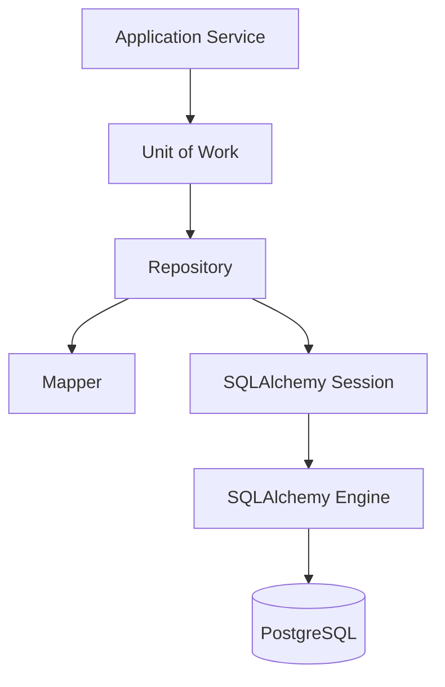

# Persistence Architecture

## Purpose

The Persistence Layer stores and reconstructs platform state while hiding database implementation details from the rest of the system.

The Application Layer does not perform SQL queries directly and remains unaware of SQLAlchemy models, PostgreSQL-specific queries, database sessions, or connection management.

Persistence exposes repositories and transactional operations that work with domain objects or narrowly scoped operation models rather than database rows.

The Persistence Layer answers the question:

> **"How is application state stored, retrieved, and transitioned safely?"**

---

# Responsibilities

The Persistence Layer is responsible for:

* Persisting workflow definitions.
* Persisting workflow executions.
* Reconstructing domain objects from stored data.
* Providing targeted persistence operations needed by application use cases.
* Performing concurrency-sensitive state transitions.
* Maintaining execution dependency state.
* Managing database sessions.
* Defining transactional boundaries through the Unit of Work.
* Mapping between domain objects and SQLAlchemy models.
* Isolating SQLAlchemy and PostgreSQL from the rest of the system.

The Persistence Layer is not responsible for:

* Workflow orchestration.
* Task plugin execution.
* Constructing `TaskContext`.
* Interpreting `TaskResult`.
* Queue claims or leases.
* Queue heartbeats.
* Worker lifecycle.
* Trigger evaluation.
* Scheduling.
* HTTP handling.

---

# Design Principles

The Persistence Layer follows several architectural principles.

## Infrastructure Encapsulation

SQLAlchemy models, database sessions, SQL expressions, and PostgreSQL-specific behavior remain internal to Persistence.

Other layers interact with persistence abstractions rather than database implementation details.

---

## Domain Independence

Domain models remain independent of SQLAlchemy.

Persistence translates between domain representations and database representations rather than attaching persistence behavior directly to domain objects.

---

## Aggregate Persistence

Repositories own persistence for major aggregate roots.

Workflow definitions contain:

* Task Definitions
* Trigger Definitions

Workflow executions contain:

* Task Executions

Repositories may persist and reconstruct these complete aggregates when the use case requires them.

However, not every operation loads an entire aggregate.

Execution-heavy operations may expose targeted persistence methods that retrieve or modify only the state required by a particular application use case.

This prevents unnecessary aggregate reconstruction during frequent task-processing operations.

---

## Atomic State Transitions

Concurrency-sensitive execution changes are implemented as atomic or conditional database operations.

Persistence is responsible for ensuring that state transitions occur only from valid current states.

Application code does not implement database locking or read-modify-write concurrency logic.

---

## Transactional Composition

A business transition may require multiple SQL statements.

Atomicity does not require every repository operation to consist of exactly one SQL statement.

Multiple statements executed through the same Unit of Work participate in the same database transaction and become visible atomically when committed.

---

# High-Level Architecture


```mermaid
flowchart TD

    Application["Application Service"]

    UOW["Unit of Work"]

    Repository["Repository"]

    Mapper["Mapper"]

    Session["SQLAlchemy Session"]

    Engine["SQLAlchemy Engine"]

    DB[(PostgreSQL)]

    Application --> UOW
    UOW --> Repository

    Repository --> Mapper
    Repository --> Session

    Session --> Engine
    Engine --> DB
```

Application services define business-level transaction boundaries.

Repositories implement persistence operations within those boundaries.

---

# Repository Pattern

Repositories expose the public persistence API.

Current repositories include:

* `WorkflowDefinitionRepository`
* `WorkflowExecutionRepository`

Repository APIs are designed around the persistence needs of application use cases rather than generic table-level CRUD.

---

## Workflow Definition Repository

The workflow definition repository persists the complete reusable workflow definition aggregate.

Responsibilities include:

* Loading workflow definitions.
* Saving workflow definitions.
* Deleting workflow definitions.
* Synchronizing task definitions.
* Synchronizing trigger definitions.
* Persisting task dependency relationships.

Saving a workflow definition synchronizes its child entities with the supplied aggregate state.

---

## Workflow Execution Repository

The workflow execution repository supports both aggregate persistence and targeted execution operations.

Responsibilities include:

* Loading workflow executions.
* Saving workflow executions.
* Starting task executions.
* Completing task executions.
* Recording failed attempts and retries.
* Updating child dependency state.
* Completing workflows.
* Failing workflows.
* Cancelling remaining work after workflow failure.

Task-processing operations intentionally avoid loading the complete workflow execution when only a small subset of execution state is required.

---

# Aggregate and Targeted Operations

Persistence uses two complementary access patterns.

## Aggregate Operations

Aggregate operations are appropriate when the Application Layer needs the complete business object.

Examples include:

```text
WorkflowDefinitionRepository.load(...)
WorkflowDefinitionRepository.save(...)

WorkflowExecutionRepository.load(...)
WorkflowExecutionRepository.save(...)
```

These operations reconstruct or persist complete aggregate state.

---

## Targeted Operations

High-frequency execution operations use narrowly scoped repository methods.

Examples include:

```text
start_task(...)
complete_task(...)
retry_task(...)
```

These methods perform the required database transitions directly and return only the information needed by the Application Layer.

This avoids patterns such as:

```text
load entire WorkflowExecution
        ↓
modify one TaskExecution
        ↓
save entire WorkflowExecution
```

for operations that can be expressed more efficiently and safely in SQL.

---

# Persistence Operation Models

Targeted repository operations may accept or return persistence-specific request and result dataclasses.

Examples include:

* `StartTaskExecutionResult`
* `CompleteTaskExecutionRequest`
* `CompleteTaskExecutionResult`
* `RetryTaskExecutionRequest`
* `RetryTaskExecutionResult`

These models represent persistence operation boundaries.

They are not SQLAlchemy models and do not expose database implementation details.

They allow repositories to return exactly the information required by an application use case without reconstructing an unnecessary aggregate.

---

# Object Mapping

Persistence distinguishes between several representations.

## Domain Objects

Domain objects represent platform concepts independent of persistence technology.

Examples include:

* `WorkflowDefinition`
* `TaskDefinition`
* `TriggerDefinition`
* `WorkflowExecution`
* `TaskExecution`
* `TaskOutput`

---

## SQLAlchemy Models

SQLAlchemy models represent database tables and relationships.

They define:

* Tables
* Columns
* Foreign keys
* Relationships
* Constraints
* PostgreSQL-specific storage types

These models remain internal to Persistence.

---

## Mappers

Mappers translate between domain objects and SQLAlchemy models.

Repositories coordinate persistence behavior while mappers perform representation conversion.

Mappers do not execute SQL.

Examples of mapped values include:

* Workflow definitions.
* Task definitions.
* Trigger definitions.
* Workflow executions.
* Task executions.
* JSONB task configuration.
* JSONB trigger configuration.
* JSONB task output.

Persistence does not interpret plugin configuration values.

---

# Unit of Work

The Unit of Work defines a database transaction boundary.

Repositories participating in the same Unit of Work share a SQLAlchemy Session.

Conceptually:

```text
with uow_factory() as uow:

    persistence operation
    persistence operation
    persistence operation

    uow.commit()
```

All operations performed through that Unit of Work participate in the same transaction.

If an exception occurs before commit, the transaction is rolled back.

The session is closed when the Unit of Work exits.

---

# Database Lifecycle

Each independently running process creates its own SQLAlchemy Engine during startup.

The Engine maintains a pool of reusable database connections for that process.

Application operations create Units of Work as needed.

A Unit of Work uses a SQLAlchemy Session, which obtains a database connection from the Engine's pool when database work is performed.

After the transaction completes and the session closes, the connection becomes available to the pool again.

Long-running application work should not unnecessarily retain database transactions or connections.

---

# Task Start

Task start is a targeted persistence operation.

Its behavior is intentionally idempotent for already-running logical tasks.

```text
PENDING
    -> RUNNING
    -> set started_at
    -> processable

RUNNING
    -> remain RUNNING
    -> preserve started_at
    -> processable

COMPLETED
FAILED
CANCELLED
missing
    -> not processable
```

This supports task recovery after worker lease expiration or redelivery.

A task's `started_at` represents when the logical task execution first began, not the start time of every physical worker attempt.

---

## Start Result

For a processable task, `start_task()` returns the persisted data required to execute its plugin.

This includes:

* Plugin type.
* Configuration.
* Parent task outputs keyed by parent task key.

Parent outputs are loaded directly from the task executions referenced by the task's persisted parent execution identifiers.

Persistence returns this execution data without constructing `TaskContext`.

`TaskContext` belongs to the plugin execution contract and is constructed by the Application Layer.

---

# Task Completion

Successful task completion is a conditional state transition.

Only a task that remains `RUNNING` may successfully transition to `COMPLETED`.

Conceptually:

```text
RUNNING
    |
    v
COMPLETED
    |
    +--> persist output
    |
    +--> set completed_at
    |
    +--> decrement child dependency counts
    |
    +--> identify newly runnable children
    |
    +--> complete workflow if appropriate
```

If another concurrent operation has already moved the task to a terminal state, the completion transition does not overwrite that state.

---

# Dependency Progression

Each task execution stores its remaining dependency count.

When a parent completes successfully, persistence atomically updates its child tasks.

A child becomes runnable when its remaining dependency count reaches zero.

For a graph such as:

```text
    A
   / \
  B   C
   \ /
    D
```

completion of `B` alone does not make `D` runnable.

Only after both `B` and `C` complete does `D` reach zero remaining dependencies.

Persistence determines which task identifiers became runnable and returns them to the Application Layer.

---

# Retry Semantics

A failed plugin result does not automatically mean the logical task execution has failed.

When another try remains:

```text
RUNNING
    -> RUNNING

remaining tries
    -> decremented
```

The task remains logically unresolved and may be processed again.

`PENDING` is not used to represent retries.

`PENDING` means that the logical task has never begun processing.

This gives task status the following semantics:

```text
PENDING
    = logical task has never begun

RUNNING
    = logical task has begun and remains unresolved

COMPLETED
    = logical task succeeded

FAILED
    = logical task exhausted its allowed tries

CANCELLED
    = logical task was terminated because its workflow could not continue
```

---

# Terminal Failure

When a task exhausts its available tries, Persistence performs the terminal failure transition.

The failing task is first transitioned to `FAILED`.

The workflow is then transitioned:

```text
RUNNING -> FAILED
```

All remaining nonterminal tasks belonging to that workflow are transitioned:

```text
PENDING -> CANCELLED
RUNNING -> CANCELLED
```

The failing task remains `FAILED` because the cancellation operation only targets `PENDING` and `RUNNING` tasks.

Workflow failure and cancellation occur within the same database transaction.

Therefore, once the transaction commits:

> A failed workflow has no remaining `PENDING` or `RUNNING` task executions.

Cancelled tasks receive their terminal completion timestamp when cancellation occurs.

---

# Transactional Locking

Repository operations may execute multiple SQL statements within one transaction.

For example, terminal workflow failure may perform:

```text
UPDATE workflow -> FAILED

UPDATE remaining tasks -> CANCELLED

COMMIT
```

Locks acquired by PostgreSQL updates are held until the transaction completes.

They are not released between repository statements.

Concurrent transactions that conflict with those rows wait and then re-evaluate their conditional updates against the newly committed state.

This allows multi-statement state transitions to remain transactionally safe without requiring application-level locks.

---

# Concurrency Model

Persistence provides concurrency safety for persisted execution state.

Important transitions are conditional on the current task or workflow status.

Examples include:

* Only processable tasks may be started or resumed.
* Only `RUNNING` tasks may complete.
* Only `RUNNING` tasks may record failed attempts.
* Dependency counters are updated atomically.
* Terminal task states cannot be overwritten by stale results.
* Workflow failure atomically cancels remaining nonterminal tasks.

This allows multiple workers to interact with the same execution state without implementing locks in the Application Layer.

---

## Duplicate and Recovered Processing

Queue lease expiration can cause another worker to receive a task whose logical execution is already `RUNNING`.

Persistence deliberately allows such a task to be processed again.

The original `started_at` value is preserved.

Whichever valid persistence transition reaches a terminal state first prevents later stale transitions from overwriting that terminal state.

---

## Concurrency Boundary

Persistence does not own queue leases or worker ownership.

Therefore, persistence does not know whether the worker attempting a state transition currently owns a queue claim.

This is intentional.

Queue ownership concepts such as:

* Claim tokens
* Worker identifiers
* Heartbeats
* Lease expiration
* Claim recovery

belong to the execution queue and runtime infrastructure rather than workflow persistence.

As a consequence, a narrow race remains possible if two workers concurrently execute the same logical task and one records terminal failure while the other is about to report success. Whichever worker finishes first is considered to be the final attempt, and the other worker does not commit anything.

---

# Queue Independence

Persistence does not directly enqueue, claim, finish, or remove execution queue entries.

This prevents workflow persistence from depending on a particular queue implementation.

For example:

```text
PostgreSQL-backed queue
        ↓
future replacement
        ↓
RabbitMQ / external broker
```

should not require redesigning `WorkflowExecutionRepository`.

Persistence determines state.

Application determines business consequences.

Runtime and queue infrastructure manage delivery and worker ownership.

---

# Runtime Initialization

A runtime process that requires persistence generally performs the following initialization:

1. Load configuration.
2. Create the SQLAlchemy Engine.
3. Create the Session Factory.
4. Create the Unit of Work Factory.
5. Construct application services with the required dependencies.
6. Begin runtime-specific processing.

Repositories themselves are constructed by the Unit of Work around the shared session used for the transaction.

Each runtime process may maintain its own Engine and connection pool while communicating with the same PostgreSQL database.

---

# Package Organization

```text
persistence/
│
├── database/
│   ├── __init__.py
│   ├── sqlalchemy_uow.py
│   └── unit_of_work.py
│
├── workflow_definitions/
│   ├── __init__.py
│   ├── repository.py
│   ├── _mapper.py
│   └── _model.py
│
├── workflow_executions/
│   ├── __init__.py
│   ├── repository.py
│   ├── operations.py
│   ├── _mapper.py
│   └── _model.py
│
└── __init__.py
```

Persistence packages are organized around the aggregates and persistence concerns they own.

Operation models may be separated from repository implementations where targeted operations require explicit request or result types.

---

# Testing Strategy

Persistence is tested independently from Application orchestration.

## Unit Tests

Unit tests are appropriate for isolated behavior such as:

* Mapper conversions.
* Small deterministic repository helpers.
* Unit of Work behavior.

---

## PostgreSQL Integration Tests

Repository behavior that depends on SQL semantics should be tested against real PostgreSQL.

Important integration scenarios include:

* Workflow definition persistence and reconstruction.
* Workflow execution persistence and reconstruction.
* Task start semantics.
* Preservation of initial `started_at`.
* Task completion.
* Retryable failure.
* Terminal failure.
* Sibling cancellation.
* Dependency counter updates.
* Workflow completion.
* Conditional state transitions.
* Concurrent completion attempts.
* Concurrent failure attempts.

Mock-based tests should not be used to claim correctness for database concurrency behavior.

---

## Cross-Layer Integration Tests

A smaller integration suite should exercise Application services against real Persistence.

These tests validate that:

* Workflow start produces a valid persisted execution graph.
* Task processing correctly consumes targeted persistence results.
* Parent outputs reach dependent plugins.
* Task chains progress correctly.
* Retries work across application and persistence boundaries.
* Terminal failure produces the expected persisted workflow state.

Queue and worker lifecycle integration remains separate from persistence testing.

---

# What Does Not Belong Here

The Persistence Layer should not contain:

* Application orchestration.
* `TaskContext` construction.
* `TaskResult` interpretation.
* Task plugin resolution.
* Task plugin execution.
* Trigger plugin execution.
* Queue claims.
* Queue leases.
* Queue heartbeats.
* Worker loops.
* Scheduler loops.
* HTTP routing.
* API schemas.

Persistence should expose the state operations required by those systems without implementing their responsibilities.

---

# Future Evolution

Possible future persistence improvements include:

* Alembic database migrations.
* Optimized targeted read operations.
* Bulk execution operations.
* Query profiling and optimization.
* Additional indexes.
* Read/write separation.
* Archival of historical executions.
* Partitioning large execution tables.
* Alternative persistence implementations.
* Execution-attempt or fencing state if stronger concurrency guarantees become necessary.

These changes should remain internal to Persistence wherever possible.

The public persistence abstractions should evolve according to concrete Application Layer requirements rather than exposing database implementation details prematurely.
