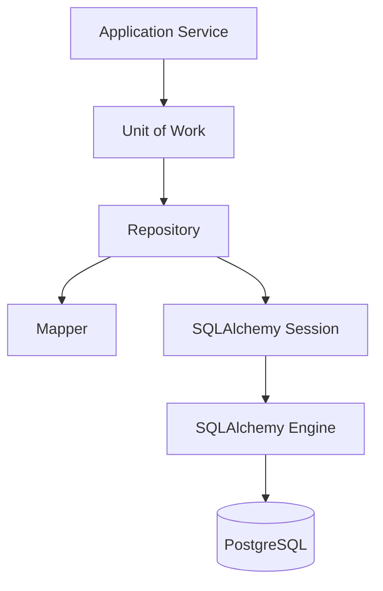

# Persistence Architecture

## Purpose

The Persistence Layer is responsible for storing and reconstructing the platform's domain objects while hiding all database implementation details from the rest of the application.

The Application Layer never performs SQL queries directly and remains unaware of SQLAlchemy, PostgreSQL, transactions, or database sessions.

Persistence exposes repository interfaces that operate on domain objects rather than database rows.

---

# Responsibilities

The Persistence Layer is responsible for:

- Persisting workflow definitions
- Persisting workflow executions
- Reconstructing domain objects from stored data
- Managing database sessions
- Defining transactional boundaries through the Unit of Work
- Isolating SQLAlchemy and PostgreSQL from the rest of the application

The Persistence Layer is **not** responsible for:

- Business logic
- Workflow orchestration
- Queue management
- Trigger evaluation
- Task execution

---

# Design Principles

The Persistence Layer follows several architectural principles.

- Business logic remains outside the Persistence Layer.
- Database implementation details are hidden behind repositories.
- Domain objects remain independent of SQLAlchemy.
- Repository APIs operate on domain objects rather than database rows.
- Repositories persist aggregate roots rather than individual entities.
- Transactions are scoped to business operations.
- SQLAlchemy models are implementation details.

---

# High-Level Architecture


```mermaid
flowchart TD

Application["Application Service"]

UOW["Unit of Work"]

Repository["Repository"]

Mapper["Mapper"]

Session["SQLAlchemy Session"]

Engine["SQLAlchemy Engine"]

DB[(PostgreSQL)]

Application --> UOW
UOW --> Repository
Repository --> Mapper
Repository --> Session
Session --> Engine
Engine --> DB
```

---

# Aggregate Persistence

Repositories persist complete aggregate roots rather than individual entities.

Workflow definitions own:

- Task Definitions
- Trigger Definitions

Workflow executions own:

- Task Executions

Repositories reconstruct complete aggregates before returning them to the Application Layer.

Child entities are never loaded independently.

---

# Database Lifecycle

Each runtime process owns its own SQLAlchemy Engine.

The Engine is created once during process startup using the configured database connection string.

The Engine maintains a pool of reusable database connections throughout the lifetime of the process.

Each business operation creates a new Unit of Work.

The Unit of Work creates a SQLAlchemy Session.

The Session borrows a connection from the Engine's connection pool, performs the required database operations, commits or rolls back the transaction, returns the connection to the pool, and then closes.

---

# Repository Pattern

Repositories provide the public persistence API.

Each repository owns the persistence responsibilities for a single aggregate.

Current repositories include:

- WorkflowDefinitionRepository
- WorkflowExecutionRepository

Repositories expose persistence operations such as:

- load(...)
- save(...)
- delete(...)

Repositories may expose additional aggregate-specific lookup operations when required.

Repositories never expose SQLAlchemy models to the Application Layer.

---

# Object Mapping

Persistence distinguishes between three representations of data.

## Domain Object

Represents business concepts used throughout the Application Layer.

Examples include:

- WorkflowDefinition
- TaskDefinition
- TriggerDefinition
- WorkflowExecution
- TaskExecution

Domain objects contain business state and lightweight domain behavior.

They have no knowledge of SQLAlchemy or PostgreSQL.

---

## SQLAlchemy Model

Represents how data is stored within PostgreSQL.

Models define:

- Tables
- Columns
- Relationships
- Constraints

SQLAlchemy models exist solely within the Persistence Layer.

---

## Mapper

Mappers translate between:

- Domain Objects
- SQLAlchemy Models

Each repository contains dedicated mappers responsible only for object translation.

Repositories coordinate aggregate reconstruction while mappers perform no database operations.

Task and trigger configuration, along with task outputs, are persisted without interpretation by the Persistence Layer.

---

# Unit of Work

The Unit of Work defines the transactional boundary for a single business operation.

Rather than allowing repositories to manage transactions independently, repositories participating in the same business operation share a single SQLAlchemy Session.

This ensures that either all database changes succeed together or all changes are rolled back together.

Example business operations include:

- Start Workflow
- Process Task
- Cancel Workflow

Each business operation creates a fresh Unit of Work.

---

# Runtime Initialization

During startup each runtime process performs the following initialization:

1. Load configuration
2. Create SQLAlchemy Engine
3. Create Session Factory
4. Create Unit of Work Factory
5. Construct application services
6. Begin runtime loop

Each process maintains its own Engine and connection pool while communicating with the same PostgreSQL database.

---

# Package Organization

```text
persistence/
│
├── database/
│   ├── __init__.py
│   ├── engine.py
│   ├── session.py
│   ├── unit_of_work.py
│   └── ...
│
├── workflow_definitions/
│   ├── __init__.py
│   ├── repository.py
│   ├── _mapper.py
│   └── _model.py
│
├── workflow_executions/
│   ├── __init__.py
│   ├── repository.py
│   ├── _mapper.py
│   └── _model.py
│
└── __init__.py
```

---

# Testing Strategy

The Persistence Layer is tested independently from the Application Layer.

## Unit Tests

Unit tests validate:

- Object mapping
- Persistence infrastructure
- Unit of Work behavior

## Integration Tests

Integration tests validate:

- Repository behavior
- SQLAlchemy behavior
- PostgreSQL interaction
- Database schema
- Aggregate persistence
- Transaction handling

The Application Layer is tested separately using fake or mocked persistence implementations when appropriate.

---

# Future Evolution

Potential future improvements include:

- Optimized repository queries
- Bulk operations
- Query optimization through eager loading
- Database migrations
- Read/write separation
- Alternative persistence implementations
- Distributed transaction support (if ever required)

The Persistence Layer intentionally hides these implementation details so they can evolve without affecting the Application Layer.
