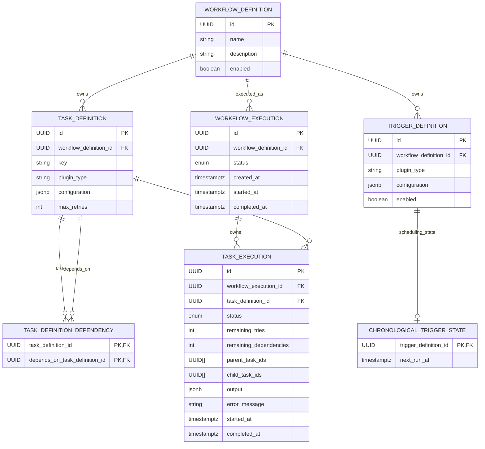

# Database Schema

## Purpose

PostgreSQL stores the Automation Platform's durable state.

The schema represents persistent Domain concepts and supporting runtime state while remaining independent of Application orchestration and runtime implementation details.

It currently stores:

- Workflow, Task, and Trigger Definitions.
- Task dependency relationships.
- Workflow and Task Executions.
- Chronological trigger scheduling state.
- Execution scheduling metadata.

Transient runtime objects such as `TaskContext` are not persisted.

## Design Principles

- UUIDs are used for all entity identifiers.
- Aggregate ownership is represented with foreign keys.
- Reusable workflow definitions are stored separately from execution history.
- Definition relationships are normalized.
- Runtime scheduling state is persisted or cached where required for efficient execution.
- PostgreSQL-native types are used where appropriate.
- Plugin-defined configuration and output use JSONB and remain opaque to Persistence.
- Workflow Executions retain their relationship to the Workflow Definition from which they were created.
- Database tables do not need a one-to-one Domain representation.

## Entity Relationship Diagram



## Definition Tables

### Workflow Definition

Represents a reusable workflow.

| Column        | Description                            |
| ------------- | -------------------------------------- |
| `id`          | Unique workflow identifier.            |
| `name`        | User-visible workflow name.            |
| `description` | Optional workflow description.         |
| `enabled`     | Whether new executions may be started. |

**Primary key:** `id`

Owns Task Definitions and Trigger Definitions and is referenced by Workflow Executions.

### Task Definition

Represents one reusable task within a workflow.

| Column                   | Description                                  |
| ------------------------ | -------------------------------------------- |
| `id`                     | Unique task identifier.                      |
| `workflow_definition_id` | Owning Workflow Definition.                  |
| `key`                    | Workflow-local task key.                     |
| `plugin_type`            | Registered task plugin type.                 |
| `configuration`          | Opaque plugin configuration stored as JSONB. |
| `max_retries`            | Maximum retry attempts.                      |

**Primary key:** `id`

**Foreign key:** `workflow_definition_id → WorkflowDefinition.id`

Task keys are unique within their workflow:

```text
UNIQUE (
    workflow_definition_id,
    key
)
```

### Task Definition Dependency

Represents one directed dependency edge in the reusable workflow graph.

| Column                          | Description                    |
| ------------------------------- | ------------------------------ |
| `task_definition_id`            | Task that owns the dependency. |
| `depends_on_task_definition_id` | Task that must complete first. |

**Primary key:**

```text
(
    task_definition_id,
    depends_on_task_definition_id
)
```

**Foreign keys:**

- `task_definition_id → TaskDefinition.id`
- `depends_on_task_definition_id → TaskDefinition.id`

### Trigger Definition

Represents one trigger capable of starting its owning workflow.

| Column                   | Description                                  |
| ------------------------ | -------------------------------------------- |
| `id`                     | Unique trigger identifier.                   |
| `workflow_definition_id` | Owning Workflow Definition.                  |
| `plugin_type`            | Registered trigger plugin type.              |
| `configuration`          | Opaque plugin configuration stored as JSONB. |
| `enabled`                | Whether the trigger is active.               |

**Primary key:** `id`

**Foreign key:** `workflow_definition_id → WorkflowDefinition.id`

A Trigger Definition belongs exclusively to one Workflow Definition. Workflows with identical trigger configuration therefore maintain independent Trigger Definitions.

## Scheduling State

### Chronological Trigger State

Stores the durable runtime scheduling state for a chronological Trigger Definition.

| Column                  | Description                                                       |
| ----------------------- | ----------------------------------------------------------------- |
| `trigger_definition_id` | Chronological Trigger Definition whose schedule is being tracked. |
| `next_run_at`           | Next scheduled occurrence that has not yet been processed.        |

**Primary key:** `trigger_definition_id`

**Foreign key:**

`trigger_definition_id → TriggerDefinition.id`

The foreign key uses `ON DELETE CASCADE`, so deleting the owning Trigger Definition automatically removes its chronological scheduling state.

`next_run_at` is non-null and indexed because due-trigger selection queries scheduling state by occurrence time.

The Trigger Definition and scheduling state represent different concepts:

```text
TriggerDefinition
    = reusable trigger configuration

ChronologicalTriggerState
    = mutable runtime scheduling position
```

For example:

```text
TriggerDefinition
    plugin_type = "interval"
    configuration =
        interval_seconds = 3600

ChronologicalTriggerState
    next_run_at = 10:00
```

After the 10:00 occurrence is successfully processed:

```text
next_run_at = 11:00
```

The Trigger Definition remains unchanged.

Chronological scheduling state intentionally has no corresponding core Domain object. It is durable state required by the scheduling mechanism rather than part of the reusable workflow Domain.

A Trigger Definition may exist without a chronological scheduling-state row. For example, a chronological trigger with no future occurrence may retain its reusable definition after its scheduling state has been removed.

## Execution Tables

### Workflow Execution

Represents one execution of a Workflow Definition.

| Column                   | Description                         |
| ------------------------ | ----------------------------------- |
| `id`                     | Unique execution identifier.        |
| `workflow_definition_id` | Workflow Definition being executed. |
| `status`                 | Current workflow status.            |
| `created_at`             | Time the execution was created.     |
| `started_at`             | Time execution began.               |
| `completed_at`           | Time execution finished.            |

**Primary key:** `id`

**Foreign key:** `workflow_definition_id → WorkflowDefinition.id`

Workflow Executions retain the identity of the Workflow Definition from which they were created. Their execution state changes over time, but their historical relationship to that definition does not.

### Task Execution

Represents one execution of a Task Definition.

| Column                   | Description                                   |
| ------------------------ | --------------------------------------------- |
| `id`                     | Unique Task Execution identifier.             |
| `workflow_execution_id`  | Owning Workflow Execution.                    |
| `task_definition_id`     | Task Definition being executed.               |
| `status`                 | Current execution state.                      |
| `remaining_tries`        | Retry attempts remaining.                     |
| `remaining_dependencies` | Unfinished parent tasks remaining.            |
| `parent_task_ids`        | Cached parent Task Execution identifiers.     |
| `child_task_ids`         | Cached child Task Execution identifiers.      |
| `output`                 | Serialized task output stored as JSONB.       |
| `error_message`          | Failure information, when present.            |
| `started_at`             | Time logical task execution began.            |
| `completed_at`           | Time task execution reached a terminal state. |

**Primary key:** `id`

**Foreign keys:**

- `workflow_execution_id → WorkflowExecution.id`
- `task_definition_id → TaskDefinition.id`

## Definition Structure vs. Runtime State

Reusable workflow structure is normalized in the definition tables.

When a Workflow Execution is created, scheduling metadata required to process that execution is copied into its Task Executions:

- Parent Task Execution identifiers.
- Child Task Execution identifiers.
- Remaining dependency count.
- Remaining retry count.

Conceptually:

```text
Workflow Definition
    normalized reusable graph
            ↓
     execution created
            ↓
Task Executions
    cached execution graph state
```

The representations serve different purposes:

```text
TaskDefinitionDependency
    = reusable workflow structure

TaskExecution dependency metadata
    = runtime task scheduling state
```

Chronological triggers follow the same general separation between reusable definition and mutable runtime state:

```text
TriggerDefinition
    = reusable trigger structure

ChronologicalTriggerState
    = runtime chronological scheduling state
```

Runtime state is therefore persisted according to the needs of its mechanism rather than forced into the reusable Domain model.

## Workflow Completion

Workflow Executions do not maintain a separate remaining-task counter.

Completion is determined by checking whether any Task Executions remain incomplete.

This avoids maintaining another synchronized counter while allowing completion to be determined atomically from persisted execution state.

## Indexes

Primary keys and unique constraints create their required indexes automatically.

Additional indexes currently exist for:

- `task_definition.workflow_definition_id`
- `trigger_definition.workflow_definition_id`
- `workflow_execution.workflow_definition_id`
- `task_execution.workflow_execution_id`
- `task_execution.task_definition_id`
- `task_execution.status`
- `chronological_trigger_state.next_run_at`

Additional indexes should be introduced in response to concrete query patterns.

## Cascade and Historical Data

A Workflow Definition owns its reusable definition state:

- Task Definitions.
- Trigger Definitions.
- Task Definition Dependency rows.

Chronological scheduling state is owned by its Trigger Definition.

Deleting a Workflow Definition therefore cascades through its owned definition state, including chronological scheduling state belonging to deleted Trigger Definitions.

Conceptually:

```text
WorkflowDefinition deleted
    │
    ├── TaskDefinitions deleted
    │       └── dependency rows deleted
    │
    └── TriggerDefinitions deleted
            └── ChronologicalTriggerState deleted
```

Workflow and Task Executions are historical records and are not deleted with the Workflow Definition.

Existing execution history therefore remains available independently of deletion of the reusable definition.

## PostgreSQL Types

Persistence intentionally targets PostgreSQL.

Current PostgreSQL-specific storage includes:

- `UUID`
- `UUID[]`
- `JSONB`

Timestamp columns requiring timezone awareness use PostgreSQL-compatible timezone-aware timestamp storage.

These types provide strong typing and appropriate storage for the platform's persistence model.

### JSONB

JSONB is currently used for:

- `TaskDefinition.configuration`
- `TriggerDefinition.configuration`
- `TaskExecution.output`

Persistence serializes and deserializes these values but does not interpret plugin-defined structure.

## Runtime Objects

Transient execution objects are not persisted merely because they participate in runtime behavior.

For example, `TaskContext` is constructed by Application from persisted execution state when a task plugin is invoked.

> **Persist durable state, not runtime representations.**

## Future Evolution

Potential schema evolution includes:

- Workflow versioning and archival.
- Soft deletion and auditing.
- Optimistic locking.
- Additional indexes and query optimization.
- Partitioned execution history.
- Read replicas.

These should be introduced in response to concrete persistence requirements rather than anticipated prematurely.
