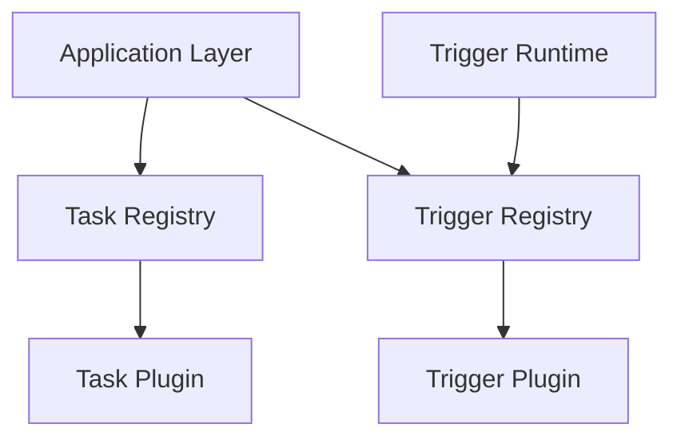

# Plugin Architecture

## Purpose

The Plugin Layer provides the extensibility mechanism of the Automation Platform.

Plugins define pluggable task and trigger behavior while remaining independent of workflow orchestration, persistence, queue management, and runtime process control.

The platform discovers and registers plugin implementations during process startup, allowing new behavior to be introduced without modifying the core Application Layer.

The Plugin Layer answers the question:

> **"What implementation provides this configured behavior?"**

---

# Responsibilities

The Plugin Layer is responsible for:

* Defining plugin interfaces.
* Discovering plugin implementations.
* Registering available plugins.
* Resolving implementations by plugin type.
* Validating plugin configuration.
* Defining task execution behavior.
* Defining trigger-type-specific behavior.

The Plugin Layer is not responsible for:

* Workflow orchestration.
* Workflow execution state.
* Persistence.
* Queue management.
* Queue claims or leases.
* Dependency resolution.
* Worker lifecycle.
* Scheduler loops.
* HTTP routing.
* Starting workflow executions.

---

# Design Principles

The Plugin Layer follows several guiding principles.

## Extensible Behavior

Platform-specific behavior is implemented behind stable plugin interfaces.

Adding a new task or trigger implementation should require minimal or no modification to the core workflow engine.

---

## Infrastructure Independence

Plugins should not depend on internal platform infrastructure such as:

* Persistence repositories.
* SQLAlchemy.
* Execution queues.
* Application services.
* Worker runtimes.
* Scheduler runtimes.

Plugins receive the information required to perform their behavior through explicit interfaces and execution models.

---

## Configuration Validation

Plugin implementations own validation of their plugin-specific configuration.

The core Application Layer understands that a plugin has configuration but should not need to understand the meaning of each plugin's configuration fields.

For example:

```text
Application
    |
    | configuration
    v
Plugin.validate_configuration(...)
    |
    +--> valid
    |
    +--> validation error
```

This keeps plugin-specific rules with the implementation that understands them.

Application services invoke configuration validation when definitions are created or modified.

---

## Shared Plugin Infrastructure

Discovery and registry behavior is shared across plugin categories wherever practical.

Task and trigger plugins define different behavior contracts while reusing common mechanisms for:

* Discovery.
* Registration.
* Duplicate detection.
* Lookup.
* Plugin identifiers.

---

# Architectural Role

Plugins provide extensible behavior consumed by Application services and trigger-specific runtimes.



The surrounding platform determines when behavior is needed.

Plugins provide the implementation of that behavior.

---

# Plugin Base Interface

Plugin categories share common plugin infrastructure.

A plugin implementation has a stable plugin type used to identify it in persisted definitions.

Conceptually:

```text
Plugin
    |
    +--> plugin type
    |
    +--> configuration validation
```

Configuration validation is defined at the implementation class level because validating configuration does not require an executing plugin instance.

This allows workflow definitions to be validated before any execution exists.

---

# Plugin Discovery

Discovery locates available plugin implementations.

Discovery is responsible for:

* Importing implementation modules.
* Identifying concrete implementations of a plugin interface.
* Returning discovered implementation classes.

Discovery does not perform workflow-specific validation or application orchestration.

Discovery normally occurs during runtime initialization rather than repeatedly during normal execution.

---

# Plugin Registries

Registries maintain the implementations available to a running process.

Separate typed registries may be used for different plugin categories while sharing common registry infrastructure.

Examples include:

* `TaskRegistry`
* `TriggerRegistry`

Registries are responsible for:

* Registering implementations.
* Detecting duplicate plugin types.
* Validating plugin identifiers.
* Determining whether a plugin type is registered.
* Resolving implementations by plugin type.
* Reporting supported plugin types.

Conceptually:

```text
"send_email"
      |
      v
TaskRegistry
      |
      v
SendEmailTask
```

Persisted workflow definitions store the plugin type rather than a reference to a Python implementation.

The registry connects that stable persisted identifier to the implementation available in the current process.

---

# Task Plugins

Task plugins implement executable workflow behavior.

A task plugin receives a `TaskContext` and returns a `TaskResult`.


Task plugins do not manage their surrounding workflow execution.

They do not:

* Change task execution state.
* Complete workflows.
* Update dependencies.
* Schedule child tasks.
* Enqueue work.
* Decide whether another task attempt is available.

Those decisions belong to the Application and Persistence layers.

---

# TaskContext

The Application Layer constructs `TaskContext` immediately before plugin execution.

It contains:

* Task configuration.
* Outputs from completed parent tasks.

Conceptually:

```text
TaskContext
    |
    +-- configuration
    |
    +-- inputs
          |
          +-- parent task key -> TaskOutput
```

Parent outputs are keyed by the logical task key rather than persistence identifiers so task implementations do not need knowledge of execution IDs or database structure.

The context represents the information a plugin is allowed to consume from the workflow execution.

---

# TaskResult

A task plugin returns a `TaskResult`.

`TaskResult` contains:

* `succeeded`
* `output`
* Optional failure or informational message

Conceptually:

```text
TaskResult
    |
    +-- succeeded: bool
    |
    +-- output: TaskOutput
    |
    +-- message: str | None
```

`TaskResult` deliberately does not return a `TaskStatus`.

Statuses such as:

* `PENDING`
* `RUNNING`
* `COMPLETED`
* `FAILED`
* `CANCELLED`

describe workflow-engine execution state and are controlled by the platform.

A plugin reports only the outcome of its own execution.

The Application and Persistence layers determine the resulting execution-state transition.

---

# Normal Failure vs Exceptional Failure

Task plugins distinguish between an expected unsuccessful task outcome and an unexpected execution exception.

## Normal Task Failure

A normal task failure is returned explicitly:

```text
TaskResult
    succeeded = false
    message = failure explanation
```

The Application Layer interprets this result and invokes persistence retry handling.

Depending on the task's remaining tries, the platform may retry the task or fail the workflow.

---

## Unexpected Exception

Unexpected exceptions are allowed to propagate from the plugin.

Examples include:

* Programming errors.
* Unexpected internal failures.
* Failures that prevent the plugin from producing a meaningful `TaskResult`.

The Application Layer does not automatically convert arbitrary exceptions into unsuccessful `TaskResult` objects.

This distinction prevents infrastructure or programming failures from automatically consuming normal workflow retry attempts.

Runtime recovery and queue lease mechanisms may recover interrupted processing.

---

# Task Side Effects

Task plugins are not required to be pure or deterministic.

Real task plugins may perform operations such as:

* Calling external APIs.
* Writing files.
* Sending messages.
* Transforming data.
* Invoking external services.

Because queue recovery may cause a `RUNNING` logical task to be executed again, task implementations should consider the possibility of duplicate physical execution.

Where practical, externally visible task operations should be designed to be idempotent or use idempotency mechanisms provided by the external system.

The core plugin interface does not itself guarantee exactly-once execution.

---

# Trigger Plugins

Trigger plugins provide extensible behavior associated with trigger types.

Trigger definitions persist:

* Plugin type.
* Plugin-specific configuration.
* Enabled state.

The plugin type allows persisted trigger definitions to be resolved to their corresponding implementation.

---

# Trigger Runtime Model

Different trigger types may require fundamentally different mechanisms for determining when a workflow should start.

Examples include:

```text
Time-based trigger
    -> scheduler runtime

Webhook trigger
    -> webhook/API runtime

Manual trigger
    -> API runtime

Future event trigger
    -> event-specific runtime
```

For this reason, trigger plugins are not required to conform to a universal polling model such as:

```text
is_ready() -> bool
```

when that model does not naturally represent the trigger type.

Instead:

> Trigger-specific runtimes determine when trigger behavior must be evaluated, while trigger plugins encapsulate reusable behavior and configuration specific to that trigger type.

Once the appropriate runtime determines that a workflow should begin, the workflow-start Application capability is invoked.

Trigger plugins do not directly create workflow executions.

---

# Trigger Configuration

The common persisted trigger definition contains configuration shared by the generic plugin mechanism:

```text
TriggerDefinition
    |
    +-- plugin_type
    |
    +-- configuration
    |
    +-- enabled
```

The configuration itself remains opaque to the workflow engine.

The corresponding trigger plugin understands and validates its contents.

Trigger types that eventually require additional runtime state may introduce persistence structures appropriate to their behavior without forcing unrelated trigger types into the same execution model.

For example, a chronological trigger may eventually require scheduling state that a manual trigger does not.

---

# Plugin Lifecycle

Plugin infrastructure is initialized when a process starts.

Conceptually:

```text
Runtime Startup
        |
        v
Discover Implementations
        |
        v
Construct Registries
        |
        v
Register Implementations
        |
        v
Construct Required Services/Runtimes
        |
        v
Resolve Plugins As Needed
```

Discovery and registry construction occur during startup.

Normal application execution performs registry lookup rather than rediscovering implementations.

---

# Persisted Plugin References

Workflow definitions do not persist Python classes or plugin instances.

Instead, task and trigger definitions persist stable plugin identifiers:

```text
TaskDefinition
    plugin_type = "example_task"

TriggerDefinition
    plugin_type = "example_trigger"
```

At runtime:

```text
Persisted plugin_type
        |
        v
Plugin Registry
        |
        v
Implementation Class
```

This separates persisted workflow configuration from Python implementation details while still allowing the platform to resolve executable behavior.

---

# Package Organization

```text
plugins/
│
├── _discovery.py
├── _registry.py
│
├── tasks/
│   ├── interface.py
│   ├── registry.py
│   └── implementations/
│
└── triggers/
    ├── interface.py
    ├── registry.py
    └── implementations/
```

Shared infrastructure remains at the root of the plugin package.

Each plugin category owns:

* Its behavior interface.
* Its typed registry.
* Its implementations.

Additional files should be introduced only when plugin complexity justifies them.

---

# Interaction with Other Layers

The primary dependency direction is:

```text
Runtime
    |
    v
Application
    |
    +----> Plugin Registry
    |          |
    |          v
    |       Plugin
    |
    v
Domain
```

Trigger-specific runtimes may also consume trigger plugin infrastructure where trigger detection is inherently runtime-specific.

Plugins should not depend back upward on Application or Runtime.

---

# What Does Not Belong Here

The Plugin Layer should not contain:

* SQLAlchemy models.
* SQL queries.
* Repository access.
* Unit of Work management.
* Workflow state transitions.
* Dependency counter updates.
* Workflow completion logic.
* Queue claims.
* Queue leases.
* Queue heartbeats.
* Worker loops.
* Generic scheduler loops.
* FastAPI routes.
* Workflow execution creation.

A plugin implements its configured behavior without owning the platform lifecycle surrounding that behavior.

---

# Testing Strategy

Plugin infrastructure and individual plugins should be tested independently from workflow orchestration.

## Registry and Discovery Tests

Tests should verify:

* Plugin discovery.
* Registration.
* Duplicate detection.
* Lookup.
* Unknown plugin handling.
* Supported plugin types.

---

## Plugin Tests

Each concrete plugin should test its own:

* Configuration validation.
* Execution behavior.
* Successful results.
* Expected failure results.
* Edge cases specific to that plugin.

These tests should not require the Application Layer unless the behavior being tested specifically concerns cross-layer integration.

---

## Application Integration

Application tests verify that plugin infrastructure is used correctly by the surrounding platform.

Examples include:

* Workflow definitions reject unknown plugin types.
* Plugin configuration validation occurs during definition creation.
* Task processing resolves the correct plugin.
* `TaskContext` is constructed correctly.
* `TaskResult` is interpreted correctly.
* Unexpected plugin exceptions propagate appropriately.

This separates testing of plugin behavior from testing of plugin orchestration.

---

# Future Evolution

The plugin architecture intentionally remains small.

Potential future additions include:

* Additional plugin categories.
* Plugin versioning.
* Capability metadata.
* Richer configuration schemas.
* Dependency injection for plugin-specific external clients.
* Trigger-specific execution contexts.
* Plugin compatibility checks.
* Plugin deprecation.
* External plugin packaging or distribution.

These features should be introduced when concrete requirements emerge rather than expanding the plugin abstraction prematurely.

The central architectural rule should remain:

> **Plugins provide extensible behavior; the platform owns orchestration and execution state.**
