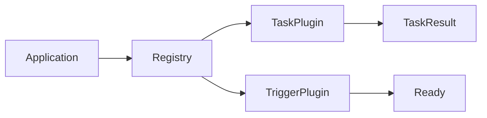
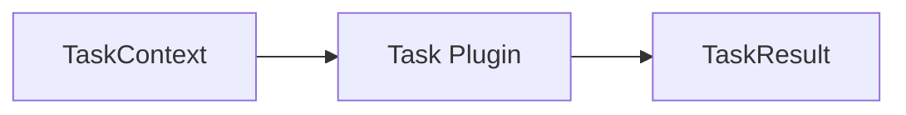

# Plugin Architecture

## Purpose

The Plugin Layer provides the extensibility mechanism of the Automation Platform.

Plugins encapsulate executable business behavior while remaining independent of workflow orchestration, persistence, queue management, and runtime processes.

The platform discovers and registers plugin implementations during process startup, allowing new behavior to be introduced without modifying the surrounding application architecture.

---

# Responsibilities

The Plugin Layer is responsible for:

- Defining plugin interfaces
- Discovering plugin implementations
- Registering available plugins
- Executing task implementations
- Evaluating trigger implementations

The Plugin Layer is **not** responsible for:

- Workflow orchestration
- Persistence
- Queue management
- Runtime scheduling
- Dependency resolution
- Execution state management

---

# Design Principles

The Plugin Layer follows several guiding principles.

- Plugins encapsulate executable business behavior.
- Plugins remain independent of platform infrastructure.
- Plugin discovery is automatic.
- Plugin registration validates available implementations.
- Infrastructure is shared across plugin categories.
- Plugins communicate only through domain execution models.

---

# Architectural Role

The Plugin Layer provides executable behavior used by the Application Layer.



Application services determine **when** plugins execute.

Plugins determine **what** work is performed.

---

# Plugin Categories

The platform currently supports two plugin categories.

## Task Plugins

Task plugins perform executable workflow behavior.

Each task implementation receives a TaskContext and returns a TaskResult.

Task plugins should be deterministic functions of their execution context.

They should not access persistence, queueing, or workflow orchestration.

---

## Trigger Plugins

Trigger plugins determine whether a workflow should begin execution.

They receive trigger configuration and return whether execution should begin.

Trigger plugins do not directly create workflow executions.

---

# Plugin Infrastructure

Plugin infrastructure is shared across all plugin categories.

## Discovery

Discovery automatically locates plugin implementations.

Discovery:

- Imports implementation modules
- Finds subclasses of the plugin interface
- Returns discovered implementations

Discovery performs no validation.

---

## Registry

Registries own plugin validation and lookup.

Responsibilities include:

- Registering implementations
- Detecting duplicate plugin types
- Validating plugin identifiers
- Resolving implementations by plugin type

Registries expose a small public API:

- Get
- Contains
- Supported Types

Registries return implementation classes rather than constructed plugin instances.

---

# Plugin Lifecycle

Plugins are discovered during runtime startup.

```text
Runtime Startup
        │
        ▼
Discovery
        │
        ▼
Registry Construction
        │
        ▼
Application Requests Plugin
        │
        ▼
Plugin Instance Created
        │
        ▼
Plugin Executes
```

Discovery occurs once during process startup.

Plugins are instantiated only when required.

---

# Task Execution Model

Task execution follows a consistent request-response model.



TaskContext contains:

- Task configuration
- Parent task outputs

TaskResult contains:

- Terminal task status
- Task output
- Optional execution message

The Application Layer constructs TaskContext and interprets TaskResult.

---

# Package Organization

```text
plugins/
│
├── _discovery.py
├── _registry.py
│
├── tasks/
│   ├── interface.py
│   ├── registry.py
│   └── implementations/
│
└── triggers/
    ├── interface.py
    ├── registry.py
    └── implementations/
```

Shared infrastructure lives at the plugin package level.

Each plugin category contributes only its interface, implementations, and thin registry wrapper.

---

# Interaction with Other Layers

The Plugin Layer depends only on domain execution models.

```text
Runtime
    │
    ▼
Application
    │
    ▼
Plugins
    │
    ▼
Domain
```

Plugins do not depend upon:

- Persistence
- Queue
- Runtime processes
- Application services

Application remains responsible for orchestration.

---

# Future Evolution

The plugin architecture intentionally remains minimal.

Potential future additions include:

- Additional plugin categories
- Plugin versioning
- Plugin capability metadata
- Plugin configuration validation
- Trigger execution context

These additions extend the plugin system without changing the overall architectural boundaries.
