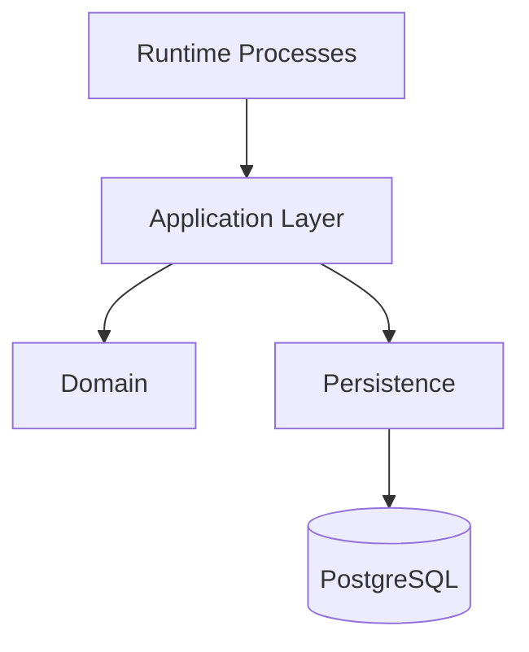

# Project Structure

## Purpose

This document describes the architectural organization of the Automation Platform.

Rather than documenting the exact directory tree, this document explains the responsibility of each major package and the dependency relationships between them.

The goal is to make it clear where new code belongs as the project evolves.

---

# Architectural Layers

The project is organized into several major architectural areas.



Dependencies should generally flow downward.

Lower layers should never depend on higher layers.

---

# Runtime Processes

The runtime layer contains long-running processes that react to external events.

Examples include:

- API
- Scheduler
- Worker

Responsibilities:

- Receive external input.
- Invoke application capabilities.
- Manage process lifecycle.

Runtime processes intentionally contain little or no business logic.

---

# Application Layer

The application layer implements the business capabilities of the platform.

Examples include:

- Starting workflows
- Processing task executions
- Advancing workflow state
- Queueing runnable work
- Completing workflow executions

Responsibilities:

- Workflow orchestration
- Business rules
- Coordination between components

The application layer is independent of HTTP, workers, and scheduling.

---

# Domain

The domain layer contains the core business concepts of the platform.

Examples include:

- Workflow Definition
- Workflow Execution
- Task Definition
- Task Execution

Responsibilities:

- Represent business entities
- Model execution state
- Express business relationships

Domain objects should not contain infrastructure concerns.

---

# Persistence

The persistence layer provides access to durable storage.

Responsibilities:

- Load domain data
- Save domain data
- Query execution state
- Isolate database implementation details

Business logic should not directly access the database.

---

# Task Plugins

Task plugins provide executable units of work.

Responsibilities:

- Execute business actions
- Receive task configuration
- Return execution results

Task implementations never determine workflow progression.

---

# Trigger Plugins

Trigger plugins determine when workflows should begin.

Responsibilities:

- Evaluate trigger conditions
- Answer if workflow is ready to begin

Trigger implementations never execute workflows directly.

---

# Queue

The execution queue distributes runnable Task Executions to workers.

Responsibilities:

- Store runnable work
- Allow workers to claim work
- Decouple orchestration from execution

The queue is treated as an architectural abstraction rather than a specific technology.

---

# Configuration

Configuration centralizes application settings.

Examples include:

- Database connection
- Queue configuration
- Logging configuration
- Runtime settings

Configuration should remain separate from business logic.

---

# Logging

Logging provides structured visibility into system behavior.

Responsibilities include:

- Execution tracing
- Error reporting
- Operational diagnostics
- Audit information

Logging should remain consistent across all runtime processes.

---

# Dependency Rules

The project follows several dependency rules.

Allowed:

```text
Runtime
    ↓
Application
    ↓
Persistence
    ↓
Database
```

```text
Application
    ↓
Domain
```

```text
Application
    ↓
Task Plugins
```

```text
Application
    ↓
Trigger Plugins
```

Avoid:

- Persistence depending on Runtime.
- Domain depending on infrastructure.
- Plugins directly modifying orchestration.
- Runtime processes implementing business rules.

---

# Design Philosophy

Each package should answer a single question.

| Package | Question |
|----------|----------|
| Runtime | *When should something happen?* |
| Application | *What business capability should occur?* |
| Domain | *What business concepts exist?* |
| Persistence | *How is state stored?* |
| Queue | *How is work distributed?* |
| Tasks | *What work can be performed?* |
| Triggers | *When should workflows begin?* |
| Configuration | *How is the system configured?* |
| Logging | *How is system behavior recorded?* |

When adding new functionality, prefer extending an existing responsibility rather than introducing a new architectural layer.
