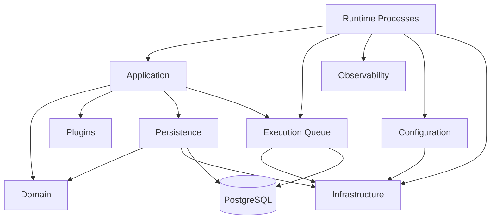

# Project Structure

## Purpose

The Automation Platform is organized as a **modular monolith with multiple independently executable Runtime processes**.

All processes share the same Domain, Application, Persistence, Plugin, Queue, Configuration, Infrastructure, and Observability codebase while exposing different entry points into the platform.

This document explains:

- The major architectural packages.
- Their primary responsibilities.
- Dependency boundaries between them.
- Where new functionality should normally belong.

Detailed behavior belongs in each subsystem's architecture documentation rather than here.

## Architectural Organization


```mermaid
flowchart TD

    Runtime["Runtime Processes"]
    Application["Application"]

    Plugins["Plugins"]
    Persistence["Persistence"]
    Queue["Execution Queue"]
    Domain["Domain"]

    Config["Configuration"]
    Infrastructure["Infrastructure"]
    Observability["Observability"]

    DB[(PostgreSQL)]

    Runtime --> Application
    Runtime --> Queue

    Application --> Domain
    Application --> Plugins
    Application --> Persistence
    Application --> Queue

    Persistence --> Domain
    Persistence --> Infrastructure
    Persistence --> DB

    Queue --> Infrastructure
    Queue --> DB

    Runtime --> Observability
    Runtime --> Config
    Runtime --> Infrastructure

    Config --> Infrastructure
```

Not every Runtime depends directly on every subsystem.

Each executable process has its own bootstrap/composition root, which constructs only the dependencies that process requires.

## Package Responsibilities

### Runtime

`runtime/` contains independently executable processes that drive Application capabilities.

Current processes include:

```text
runtime/
├── worker/
├── reconciler/
└── scheduler/
```

An API Runtime can provide the user-facing HTTP entry point.

Runtime owns:

- Process lifecycle.
- Polling or external input.
- Graceful shutdown and signal handling.
- Invoking Application capabilities.
- Runtime-level operational logging.

Runtime should remain thin and contain little business logic.

Each Runtime generally contains:

```text
runtime behavior
+
bootstrap / composition root
```

### Application

`application/` contains platform use cases and orchestration.

Examples include:

```text
application/
├── workflow_definitions/
├── workflow_start/
├── task_processing/
├── trigger_initialization/
└── chronological_triggers/
```

Application coordinates capabilities such as:

- Workflow Definition creation and validation.
- Workflow Execution creation.
- Compilation of definitions into execution state.
- Task processing and workflow progression.
- Retries and failures.
- Trigger initialization and processing.
- Persistence, Plugin, and Queue interactions.

Application services define meaningful transaction boundaries and remain independent of the Runtime that invokes them.

For example, workflow start can be reused by:

```text
API
Scheduler
future trigger mechanisms
```

without duplicating workflow-start behavior.

### Domain

`domain/` contains the platform's core business concepts.

Conceptually:

```text
domain/
├── common/
├── execution_runtime/
├── workflow_definitions/
└── workflow_executions/
```

Important concepts include:

- `WorkflowDefinition`
- `TaskDefinition`
- `TriggerDefinition`
- `WorkflowExecution`
- `TaskExecution`
- `TaskContext`
- `TaskResult`
- `TaskOutput`
- `WorkflowStatus`
- `TaskStatus`

Domain objects represent business concepts and lightweight behavior derived from their own state.

The Domain does not access PostgreSQL, communicate with the Queue, host triggers, start processes, or perform Application orchestration.

Not every persisted table requires a Domain object. Infrastructure-specific durable state may remain entirely within Persistence when it is not a core business concept.

### Persistence

`persistence/` owns durable application state and database-specific behavior.

It contains:

- SQLAlchemy persistence models.
- Repositories.
- Domain/persistence mapping where appropriate.
- Unit of Work infrastructure.
- Database queries and transactions.
- PostgreSQL-specific concurrency behavior.

Application accesses Persistence through repositories and the Unit of Work:

```text
Application
    ↓
Unit of Work
    ↓
Repositories
    ↓
SQLAlchemy
    ↓
PostgreSQL
```

Database-specific behavior remains inside Persistence.

For example, chronological scheduling may use:

```sql
FOR UPDATE SKIP LOCKED
```

without exposing PostgreSQL locking behavior to Application or Scheduler code.

### Plugins

`plugins/` contains extensible platform behavior.

```text
plugins/
├── tasks/
└── triggers/
```

Shared Plugin infrastructure provides contracts, configuration validation, discovery, registration, and lookup by stable plugin type.

#### Task Plugins

Task Plugins:

- Validate plugin-specific configuration.
- Receive `TaskContext`.
- Perform task-specific behavior.
- Return `TaskResult`.

They do not own workflow progression, dependency changes, Queue claims, durable commits, or Worker behavior.

#### Trigger Plugins

Trigger Plugins define behavior associated with when workflows begin.

Mechanisms are represented through interfaces rather than a generic readiness contract:

```text
Trigger
│
├── ChronologicalTrigger
│   ├── IntervalTrigger
│   ├── CronTrigger       [future]
│   └── OneTimeTrigger    [future]
│
├── WebhookTrigger        [future]
└── FilesystemTrigger     [future]
```

The class hierarchy represents mechanism capabilities; there is no separate trigger-mechanism enum duplicating it.

For example, chronological plugins calculate:

```python
next_occurrence(
    configuration,
    after,
) -> datetime | None
```

Application, Persistence, and Runtime host that behavior.

### Execution Queue

The Execution Queue distributes runnable Task Execution work to Workers.

It owns:

- Idempotent publication.
- Claims and claim tokens.
- Renewable leases and heartbeats.
- Release of retryable work.
- Completion of claimed work.
- Atomic publication of newly runnable task identifiers during Queue completion.

The Queue owns delivery state, not durable workflow state:

```text
Persistence
    = durable execution truth

Execution Queue
    = runnable-work delivery state
```

The current implementation uses PostgreSQL, but consumers depend on the Queue abstraction rather than its concrete implementation.

Queue and Persistence intentionally remain separate transactional boundaries.

### Configuration

Configuration defines how external runtime values enter the application:

```text
Environment
    ↓
load_settings()
    ↓
immutable Settings
    ↓
Runtime Bootstrap
```

It owns parsing, defaults, validation, and typed Settings.

Settings are explicit dependencies. Runtime and Application components do not independently read environment variables.

### Infrastructure

`infrastructure/` constructs technical resources genuinely shared by multiple subsystems.

Current shared resources include:

```text
Settings
SQLAlchemy Engine
SQLAlchemy SessionFactory
Declarative Base
```

Persistence and the PostgreSQL Queue may share database infrastructure while remaining architecturally independent.

Infrastructure does not contain workflow, Queue, or Runtime behavior.

### Observability

`observability/` owns process-wide operational visibility.

The current implementation provides application logging:

```text
Settings.log_level
        ↓
configure_logging()
        ↓
Python logging hierarchy
        ↓
module-level loggers
```

Logging focuses on meaningful operational events and failures rather than every method invocation.

Observability describes system behavior but is never a source of truth for system correctness.

Metrics and tracing may extend the package when concrete requirements justify them.

## Runtime Roles

Some responsibilities are easier to understand as executable processes.

### Worker

The Worker coordinates the Execution Queue with task-processing Application behavior:

```text
Execution Queue
      ↓
    Worker
      ↓
TaskProcessingService
```

It claims work, maintains the Queue lease, delegates processing, and releases or finishes the claim according to the durable Application outcome.

If heartbeat behavior makes ownership uncertain, the claim becomes untrusted and the Worker avoids unsafe Queue disposition.

### Reconciler

The Reconciler repairs the consistency boundary between Persistence and the Execution Queue.

A task is durably runnable when:

```text
status = PENDING
AND
remaining_dependencies = 0
```

The Reconciler periodically republishes all durably runnable Task Execution identifiers:

```text
Persistence
    ↓
runnable task IDs
    ↓
Execution Queue
    ↓
idempotent enqueue
```

It does not calculate which entries are missing from Queue state.

Idempotent publication makes that unnecessary.

### Scheduler

The Scheduler hosts chronological trigger processing:

```text
Scheduler
    ↓
ChronologicalTriggerService.process_next_due()
```

It owns polling, lifecycle, graceful shutdown, and Runtime logging.

Application and Persistence own trigger resolution, scheduling transitions, Workflow Execution creation, and database locking.

Multiple Schedulers may operate concurrently using PostgreSQL:

```sql
FOR UPDATE SKIP LOCKED
```

rather than Scheduler leases, heartbeats, leader election, or global locks.

## Bootstrap and Composition

Each executable Runtime owns a bootstrap module that acts as its **composition root**.

A typical startup sequence is:

```text
load Settings
    ↓
configure logging
    ↓
build Infrastructure
    ↓
construct Persistence / Queue
    ↓
construct registries
    ↓
construct Application services
    ↓
construct Runtime
    ↓
register signal handlers
    ↓
run
```

Dependency construction remains at this boundary.

Runtime classes receive already-constructed dependencies rather than building them internally.

Current executable entry points include:

```text
automation-worker
automation-reconciler
automation-scheduler
```

Additional processes, including an API Runtime, can follow the same composition model.

## Dependency Rules

The architecture favors explicit responsibility boundaries rather than layering for its own sake.

### Domain remains infrastructure-independent

```text
Domain
    ✕ PostgreSQL
    ✕ SQLAlchemy
    ✕ HTTP
    ✕ Queue implementation
    ✕ Runtime
```

Infrastructure may depend on Domain concepts where appropriate. Domain does not depend on infrastructure.

### Runtime delegates business behavior

```text
Runtime
    ↓
Application
```

Runtime processes drive Application capabilities rather than reimplementing their use cases.

### Application coordinates abstractions

```text
             Application
          /      |       \
Persistence   Plugins    Queue
```

Application may coordinate these components when required by a business capability.

### Persistence owns database behavior

```text
Application
    ↓
Persistence abstraction
    ↓
SQLAlchemy / PostgreSQL
```

SQLAlchemy and PostgreSQL-specific behavior do not leak into Runtime or Application orchestration.

### Plugins remain isolated from orchestration

```text
Application
    ↓
Plugin

Plugin
    ✕ workflow progression
    ✕ Queue ownership
    ✕ Persistence orchestration
```

Plugins implement extensible behavior while the platform surrounds them with workflow semantics.

### Queue and Persistence remain distinct

The PostgreSQL implementations may share database Infrastructure, but neither subsystem owns or depends on the other's abstraction.

```text
Persistence
    durable state

Execution Queue
    temporary delivery state
```

Their interaction is coordinated by higher-level components.

## Responsibility Guide

When deciding where new code belongs, ask **what responsibility it owns**.

| Area                | Primary Question                                                              |
| ------------------- | ----------------------------------------------------------------------------- |
| **Runtime**         | How is an Application capability driven as a process or external entry point? |
| **Application**     | What use case or orchestration should occur?                                  |
| **Domain**          | What business concepts and state exist?                                       |
| **Persistence**     | How is durable state stored, queried, and transactionally coordinated?        |
| **Plugins**         | What implementation-specific behavior should be extensible?                   |
| **Execution Queue** | How is runnable work delivered safely to Workers?                             |
| **Configuration**   | How does external runtime configuration enter the process?                    |
| **Infrastructure**  | What shared technical resources must be constructed?                          |
| **Observability**   | How is system behavior made operationally visible?                            |
| **Bootstrap**       | How are process dependencies composed and started?                            |

## Adding New Functionality

New functionality should normally extend an existing responsibility rather than introduce a new architectural layer.

```text
New task type
    → Task Plugin

New chronological schedule type
    → ChronologicalTrigger implementation

New trigger mechanism
    → Trigger mechanism interface
      + mechanism-specific hosting infrastructure if required

New workflow use case
    → Application capability

New database query
    → Persistence repository

New executable background process
    → Runtime + bootstrap

New operational metric
    → Observability
```

A new abstraction should be introduced only when it represents a meaningful responsibility rather than merely eliminating small amounts of duplicated code.

## Design Philosophy

The package structure follows one broad rule:

> **Keep business concepts independent, put orchestration in explicit Application capabilities, isolate infrastructure behind abstractions, and keep Runtime processes thin.**

The architecture intentionally avoids unnecessary generalization.

For example:

- No shared `BaseRuntime` merely because Runtimes have similar lifecycle code.
- No generic trigger readiness interface hiding fundamentally different trigger mechanisms.
- No Scheduler lease system when short PostgreSQL row locks provide the required concurrency guarantee.
- No Domain object merely because a supporting database table exists.
- No thin Application service whose only purpose is forwarding a repository call.
- No globally accessible Settings object.
- No coupling between Persistence and the current PostgreSQL Queue implementation.

The project should continue evolving around **cohesive responsibilities and explicit boundaries**, not around maximizing the number of layers or abstractions.
