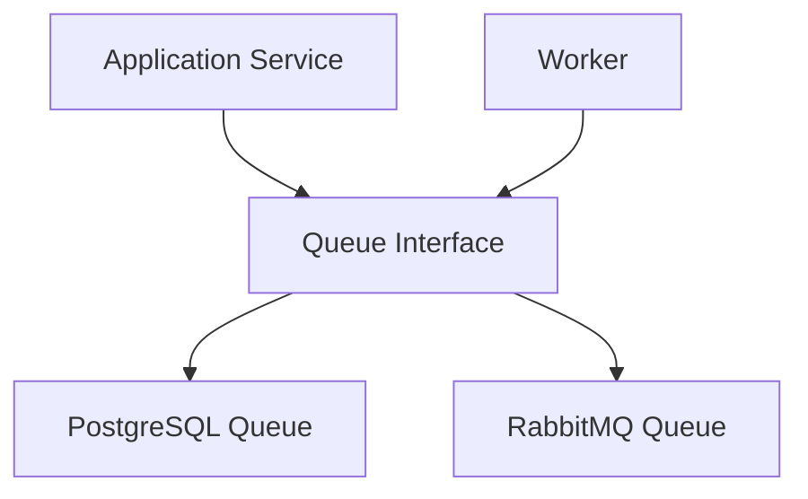
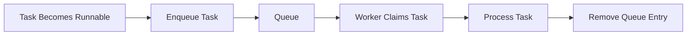

# Queue Architecture

## Purpose

The Queue subsystem is responsible for coordinating the execution of runnable tasks.

It provides a lightweight abstraction over the underlying queue technology while isolating the Application Layer from implementation details such as PostgreSQL or RabbitMQ.

The Queue is **not** responsible for workflow orchestration or task execution. It simply manages runnable work.

---

# Responsibilities

The Queue subsystem is responsible for:

- Enqueuing runnable tasks
- Allowing workers to safely claim work
- Preventing duplicate task execution
- Removing completed work from the queue
- Providing a technology-independent queue interface

The Queue subsystem is **not** responsible for:

- Workflow progression
- Dependency resolution
- Retry policies
- Task execution
- Workflow state
- Persistence of domain objects

Those responsibilities belong to the Application and Persistence layers.

---

# Design Principles

The Queue architecture follows several principles.

- Keep queue responsibilities minimal.
- Treat the queue as a scheduling mechanism rather than persistent storage.
- Depend on abstractions rather than concrete queue technologies.
- Allow queue implementations to evolve independently.
- Keep workers unaware of queue implementation details.

---

# High-Level Architecture



Application services interact only with the Queue interface.

Concrete implementations are selected during process startup.

---

# Execution Flow



The Queue stores references to runnable task executions rather than task data itself.

Workers load full task state from the Persistence Layer after claiming work.

---

# Queue Model

The Queue is intentionally lightweight.

Rather than storing task state, each queue entry references an existing TaskExecution.

Example queue metadata includes:

- Task Execution ID
- Queued Timestamp
- Claimed Worker
- Claimed Timestamp

Future implementations may introduce additional metadata such as priorities or heartbeats.

---

# Queue Interface

The Queue exposes a small set of operations.

Examples include:

- `enqueue(...)`
- `claim(...)`
- `remove(...)`

The Application Layer depends only on this interface.

Individual queue implementations determine how these operations are performed.

---

# Queue Implementations

The Queue subsystem supports multiple interchangeable implementations.

The initial implementation uses PostgreSQL.

Future implementations may include:

- RabbitMQ
- Redis
- Amazon SQS

Implementations are selected through configuration during process startup.

---

# Runtime Initialization

Each runtime process creates its queue implementation during startup.

Initialization consists of:

1. Load configuration
2. Create infrastructure dependencies
3. Construct Queue implementation
4. Inject Queue into application services

The remainder of the application remains independent of the chosen implementation.

---

# Package Organization

```text
queue/
│
├── interface.py
├── factory.py
│
├── postgres/
│   ├── implementation.py
│   └── _model.py
│
└── rabbitmq/
    └── implementation.py
```

The Queue interface defines the public contract.

Concrete implementations remain isolated within their own packages.

---

# Future Evolution

Potential future enhancements include:

- Priority queues
- Worker heartbeats
- Automatic worker recovery
- Delayed task scheduling
- Dead-letter queues
- RabbitMQ implementation
- Queue metrics and monitoring

These features are intentionally deferred until they solve concrete engineering problems.
