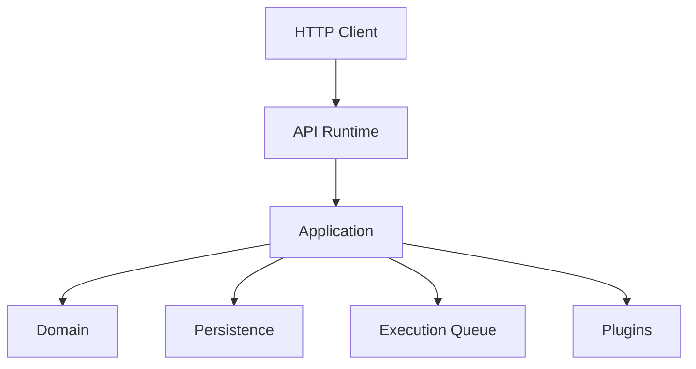

# API Runtime

## Purpose

The API Runtime is the HTTP entry point into the Automation Platform.

It is a thin Runtime over the Application Layer rather than a separate business layer.

```text
HTTP Client
    ↓
API Runtime
    ↓
Application
    ↓
Domain / Persistence / Execution Queue / Plugins
```

The API is independently executable alongside the Worker, Scheduler, and Reconciler.

## Documentation

| Document              | Purpose                                                                        |
| --------------------- | ------------------------------------------------------------------------------ |
| [Runtime](runtime.md) | API process composition, lifecycle, dependencies, and multi-process operation. |
| [HTTP](http.md)       | HTTP routing, schemas, Application interaction, and HTTP failure handling.     |

Consumer-facing API documentation belongs separately in:

```text
docs/api/
```

That documentation answers:

> How does a client use the API?

This documentation answers:

> How is the API Runtime designed and how does it fit into the platform architecture?

## Architectural Boundary

The API owns:

- HTTP transport.
- Request and response representation.
- HTTP routing.
- Transport ↔ Application model conversion.
- Translation of Application failures into HTTP semantics.
- API process composition.

The API does not own:

- Workflow orchestration.
- Domain state transitions.
- Persistence.
- Plugin resolution or execution.
- Scheduling.
- Queue ownership.
- Worker execution.
- Reconciliation.

The central boundary is:

```text
API
    ↓
Application capability
```

Application remains unaware of FastAPI and HTTP concerns.

## Runtime Interaction



The API Runtime receives only the Application capabilities required by its HTTP operations.

There is no requirement for a single global Application object.

## What Does Not Belong Here

The API Runtime should not acquire business responsibilities merely because they are reachable from an HTTP request.

In particular:

- Routers should not access repositories directly.
- Routers should not create Unit of Works.
- API code should not resolve or execute Plugins.
- API code should not manipulate workflow execution state directly.
- API code should not run Scheduler, Worker, or Reconciler loops.
- API process memory should not become authoritative workflow state.

## Testing

API tests verify the HTTP boundary.

Application, Domain, Persistence, Queue, Plugin, and Runtime tests remain responsible for their own guarantees.

The API therefore tests:

- request-to-Application conversion,
- response conversion,
- router/Application interaction,
- HTTP exception mapping,
- API integration through FastAPI.

It does not duplicate:

- DAG execution,
- task retry behavior,
- Queue lease semantics,
- Scheduler locking,
- Plugin behavior.

The API should grow by exposing meaningful Application capabilities rather than by mirroring every internal service or repository method.
